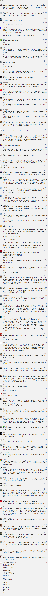

##正文

距离2020年没剩几天了，可北京民航总医院的杨文医生却再也跨不过这个年槛，她被病人家属杀害于自己工作的抢救室。

据官媒报道，事情的经过大概是这样的：

>患者是95岁老年女性，12月4日入院的时候，患者脑梗塞后遗症，纳差、意识不清。当时是杨文医生首诊的，家属签字拒绝一切检查，仅要求输点液，但是输液后病情无改善好转。

>医生一直说服家属让患者接受检查，但家属多次拒绝。医生和家属交代病情，家属无法接受疾病，不接受死亡的可能性。每天都会因为一点点的病情变化和怀疑医生用药而吵闹。

>12月24日早上六点左右，犯罪嫌疑人找到正在值班的杨文医生，双方交流了几分钟，尖刀就扎向了杨文医生的颈部。

 

由于现场过于血腥，政事堂本不想写这件事儿，但是据官媒报道，杨医生遇害后，患者家属没有表现出任何愧疚，没有任何道歉的话。杨医生被害第四天，民航总医院急诊门口竟还有病人扬言“砍人”。

政事堂觉得，还是要说几句的，不过，并不是从刷屏了的精英层面来说，而是从草根利益的角度来分析。

中国的医疗系统的确问题不少，需要大量的改进，但是中国医疗针对穷人的普惠方面已经全球领先，除了仅剩的几个社会主义国家之外，几乎没有什么国家能与我们相提并论。

在人均GDP远超我们的大部分发达国家，穷人不仅很难买得起商业医保，动辄几天十几天的预约挂号能把人彻底逼疯。而在中国，再穷的人也可以不用等待，只需要缴纳微乎其微的挂号费，就能在急诊得到诊治。

医疗系统为有钱人提供优质的医疗服务天经地义，但是为穷人提供及时而又廉价医疗服务是违反人性的。

尤其是全球第一强国的奥巴马和特朗普还为了医保大打出手呢，中国能够做到针对于穷人的普惠，本质是因为政府强行压制了医生群体的利益。

就像美国的奇异博士在电影中开着兰博基尼住着大豪宅那样，在西方发达国家，医生是一个标准的高收入群体，不仅非常受人尊重，而且时间也非常的自由。

 

可是在中国，大部分的年轻医生不仅拿不到高收入，每周工作时间在60小时以上，还要面对庞大的医闹群体。

为啥中国和西方医生的环境差距如此之大？

在西方，医生本身就是一个强大的利益集团，通过控制高校招生门槛以及行业协会等一系列手段，人为改变了供求关系以维护自身的利益，导致医生少而病人多，市场自然而然就为整合行业提供了优厚的薪资福利。

而在中国，随着新中国的建立，国家建立了一大批的公立医科大学，通过国家补贴的方式降低医学上的入学门槛，源源不断的向全国各大医院提供医生的储备军。

正是由于有着庞大的后备军，才填补低收入导致的行业人才流失。

就像数据统计显示2005-2015十年间，中国培养了470万医科毕业生，而从业总数却只增加了75万，也就是说，我们靠的是加大供给侧的供应，人为的强制压低了整个行业的利益。

要知道，中国作为发展中国家，医疗方面的投入占GDP比重并不高，可是由于庞大受过良好教育的医疗从业群体，以及国企化的行政体系等一系列因素，塑造了一批甘于风险牺牲的中国医生群体。

可以说，在中国去医院看个大夫的价格，比看个猴还便宜，这本质是社会主义优越性的体现，而且是不符合市场规律的。

但是，这个机制随着中国目前正在推动的市场化，面临着被市场冲击的风险。

中国目前的医疗体制，本质是”损有余而补不足“，譬如农民只需要缴纳极低的一笔费用就可以享受全民医保，这背后的补贴，是靠着大量有钱人去承担高额的医疗价格。

这也是为啥中国医药价格迟迟压不下来的重要原因。

在这种机制之下，公立医院总体上来说是通过赚取有钱人的钱，来为穷人提供普惠医疗。

但是，有钱人精着呢，在诊疗水平相当的情况下，他们自然会选择去不用排队服务质量更好的私立医院，这也是为何近年来私立医院如雨后春笋般崛起。

只不过，医疗是一个体系，不是砸钱就能砸出来的，还需要招募到大量优秀的医生，成建制的医生们到位了，私立医院才能够开始良性运转。

因此，对普通民众廉价的医疗体系，靠的就是这些在公立医院就职的医生们。

中国的医生们这么多年来能够忍受着高强度的工作和并不高的薪水，靠的是一颗”医者仁心“和行业的荣誉感，可是这些年来，为了维稳而纵容医闹，严重打击了公立医疗体系中医生们的荣誉感。

这也就意味着，老百姓越是搞医闹，越会促使有着生命之忧的医生们加入到私立医疗体系，而随着医生们的加入，也会使得越来越多有钱人选择私立医疗机构消费。

要知道，我们的医疗体系的运行逻辑，是靠赚有钱人的钱来补贴老百姓。

丧失了愿意为医疗和生命支付高额费用的有钱人，公立医疗体系不仅会出现收支不平衡，医疗设备也无法跟上时代。

届时，损失的还是普通老百姓。

所以，在政事堂看来，为了未来中国医疗事业的良性发展，我们必须要打击医闹，尤其是在未来几年国家推动城市化，大量农村人口入城的大背景之下。

那么接下来怎么做，我想其实很简单了，想要震慑住医闹，就要让他们明白医闹的下场，不能继续塑造医生是弱势群体的形象。

譬如杀人偿命的刑事责任交给检察院，咱就不多说了。

从法院判决的角度，国家、学校、医院以及人家里辛辛苦苦十几年才培养了一个合格的公立医院大夫，赔偿绝不应该是一个小数字，在符合法律的情况下，罚得他们倾家荡产卖车卖房并不为过。

徙木立信，例子在这摆着呢，看以后还有多少人敢去公立医院医闹？

我们要明白，自建国以来形成的公立医疗体制如今已经非常脆弱了，维护公立医院的医生以及他们的荣誉感，是维持国家公立医疗机制的关键。

在这个机制的保护下，我们才能够避免未来得了同一种急症，有钱能活，没钱只能等死的局面。

所以，保护医生就是保护我们自己和家人！

##留言区
 

