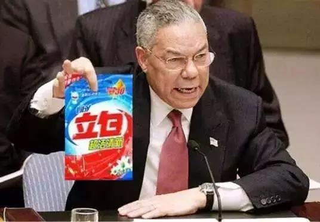

##正文

1962年，为了报复美国在毗邻苏联的土耳其部署核弹，苏联以牙还牙的在古巴境内秘密部署核弹。这一举动被美国发现后，美苏两国针锋相对，相互进行最后通牒。

在13年的危机交涉中，双方多次擦枪走火，拥有核按钮的美苏两个大国使得人类第一次在彻底毁灭的边缘徘徊，但最后，美苏两国相互妥协，结束了这一场危机。

后来，有专家学者根据这一场核博弈中的战争边缘理论，总结出一套胆小鬼博弈(Chicken Game)。

在胆小鬼博弈模型中，假设两名车手驱车相向而行，如果谁也不躲开就将一起撞死，如果有人先让开，则会被另一方耻笑为“胆小鬼”。

在这个博弈模型中，任何一方获取利益最大化的方式，均是向对方展示自己不会退让，逼着对方自甘为“胆小鬼””而退让。

因此，博弈双方往往都愿意摆出把方向盘丢掉的姿态。

譬如当年美国刚发现苏联在古巴部署核弹，就威胁要对苏联全境实施核打击，B-52机队待命随着起飞，数百枚洲际导弹进入发射准备。

面对美国的威慑，苏联则是将大批核潜艇开赴加勒比海，并将核弹发射权限下放到潜艇舰长，造成随时可能对美国全境核打击的局面。

而且在过程中，苏联军方对于入境的美国侦察机直接击落，美国军方更是敢于顶着核报复对苏联的核潜艇丢深水炸弹逼着对方上浮，双方都摆出了一副不要命的态度。

但是，胆小鬼博弈模型之下，由于相互不避让可能导致大家同归于尽，根据纳什均衡，最后时刻，总会有人选择在撞击之前退让。

而古巴危机则是在临撞之前，由苏联撤出核弹，终止了这一场撞车。

前段时间特朗普退出的《中导条约》就是当年古巴危机的产物，由于对核力量相互毁灭的巨大的恐惧，美苏双方为了避免此类局面的再次发生，签署条约控制双方的核打击力量。

当然，回顾历史都是为了现实服务的，最近几年我们会发现，喜欢做交易的特朗普，这位总统就常常令自己处于“胆小鬼”当家的局面。

 

自特朗普上台以来，从朝核到伊核，从叙利亚到委内瑞拉再到阿富汗，甚至全球打了一拳的贸易大棒，特朗普几乎把当年的古巴危机搞了缩小版到处的复制。

而且，就像肯尼迪在最后时刻否决了军方的核打击计划那样，最近几年在朝鲜，在叙利亚，在伊朗，在委内瑞拉，近年来五角大楼每一次的突袭行动和斩首行动，到了特朗普那里，都被他否决了。

 

原因是“胆小鬼博弈”之下，各方为了避免撞车而相互踩刹车吗？

政事堂看来，是，也不是。

这也是要回到当年的古巴危机来看。
 
苏联公开从古巴撤出核弹，**让美国和肯尼迪取得了一场战术性的胜利**，肯尼迪展示了美国强大的国力以及总统的外交手腕，作为作为带领着人类走出核阴影的政治家，他也成为了美国历史上支持率最高的总统。

而作为肯尼迪与赫鲁晓夫的私下交易，美国随后秘密从土耳其撤出核弹，**让苏联与赫鲁晓夫取得了一场战略性胜利**，通过一次导弹部署，不仅解除了自己头上的达摩斯里斯之剑，还迫使美国力量从中东撤离，美国从此深陷十年越战泥潭，确立了苏联冷战期间的优势。

换句话说，**古巴危机中的胆小鬼博弈，实际上是一场双赢的博弈，美国总统和他的对手们各取所需，达成了一笔地下交易。**

所以呢，这一场胆小鬼的博弈之外，还有着一场胆大鬼的博弈，除了对弈双方之外，还有其他的力量。

就像古巴危机的时候，美国舰队将古巴团团围住，美国海军用深水炸弹去炸苏联的核潜艇，美国空军直接闯入布置了核武器的古巴领空等着被击落，美国军队集结在佛罗里达........

对比这几年，美国三大航母舰队集结朝鲜半岛，沙特油轮和炼油设施被炸，美国最先进的无人原型机被伊朗击落，以及博尔顿调兵准备入侵委内瑞拉......

很显然还有一股美国国内的力量蠢蠢欲动。

如果把额特朗普换成老布什和小布什这样的共和党总统，恐怕只要给他们制造点理由，战争就已经开始了。

 

好了，历史回顾完了。

我们会发现，在胆小鬼博弈的过程中，真正能够避免撞车，避免毁灭的背后，不仅仅是核力量的保护，还有两个重要的促成因素。

第一个，是双方能够达成一笔桌子底下的双赢交易。

譬如古巴危机中，肯尼迪赢得了巨大的国际声望，但是赫鲁晓夫赢得了巨大的地缘利益。

而历史对现实的指导，就是想要达成胆小鬼博弈，重点在于双方寻求的利益有差异，**一方面要让美国总统在面子以及利益上大胜，另一方面，丢了面子和利益的一方则能够通过获得地缘利益作为补偿。**

所以我们会发现，最近几年特朗普达成的高难度交易，往往都是跟俄罗斯直接完成的。

从美国撤军叙利亚到放弃入侵委内瑞拉等一系列眼花缭乱的操作，特朗普交易的对手盘并不是阿萨德和马杜罗，而是普京。甚至最近阿富汗的塔利班谈判取得进展，也是因为塔利班主动渡让的谈判的权力。

反之，朝核与伊核的谈判反反复复的背后，虽然这俩国力虽远比上面几个要强，但是缺乏国际地缘上的交易筹码和信任，导致反而无法推进。

所以，未来朝核与伊核问题的走向，观察的重点应该是超级大国们的动作，最近安理会的解除对朝部分制裁的提议以及阿曼海的三国联合军演，也能看出这个苗头，毕竟特朗普还有不到一年的总统任期，剩下的交易时间已经不多了。

而胆小鬼博弈的另一个重点，则是博弈背后还有一个美国国内的胆大鬼博弈，美国总统与其交易对手能取得双赢的背后，必然是要损害国内某些集团的利益，否则解决了古巴危机的肯尼迪也不会死得稀里糊涂。

 

而交易成功的背后，则是美国总统能够压过国内不安分的各股力量。

未来，一旦特朗普帮助共和党打赢2020年大选，届时，曾经紧密团结在特朗普身边的共和党也将蠢蠢欲动，到时候各种下三滥的手段怕是会屡见不鲜。

届时，内部问题激化的特朗普，只能继续向外寻求资源与力量来平衡国内。

希望这位七十多岁的美国大叔能够见招拆招，卸任之后还能成为我们的老朋友，有空来咱们这看看~~

##留言区
 

