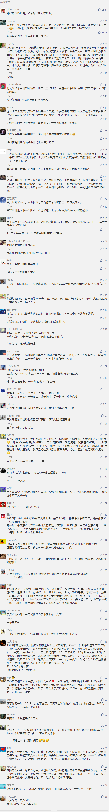

##正文

2019过去了，我很怀念他。

因为，在这一年里，我总会想到20年前的1999。

1999的春晚上，小品《打气》中黄宏喊出的那句“工人要替国家想，我不下岗谁下岗！”。

 

在轰轰烈烈的大下岗之下，数千万的国企员工的铁饭碗被打碎，曾经挤破头也要抢着进的地方国企被大规模关停并转。

没有人能够阻挡，因为这是历史的进程。

相信这两年看惯了各地小煤矿被吊销，小钢厂被关停，小养猪场被环保的朋友们，如果穿越回20年前，也会有一种恍如隔世的感觉。

这些穿越者自然也会明白接下来会发生什么。

**随着对地方国企大刀阔斧的改革，一大批竞争力更强的央企会脱颖而出，冲入世界五百强的阵营。甚至高薪的互联网行业在次年遭遇寒冬之后，激烈的竞争也会孕育出垄断级的BAT三巨头。**

 

历史往往有着惊人的相似，因为当年的改革，方式也叫做供给侧。

因此，看懂了20年之前的人，20年后往往都会活得像一个穿越者......

1999年的春晚上，还有一个值得铭记的小品是赵丽蓉老师《老将出马》。

一句“点头yes，摇头no，来是come，去是go，要打招呼喊hello”，让英语登上了春晚的舞台，也让这段双语混搭，风靡了1999。

 

可是，那一年中美之间的Hello却是冷冰冰，甚至异常的残酷，5月南斯拉夫的一声巨响和7月台湾海峡的三军联合登陆演习，使得中美关系跌至90年代以来的冰点。

那时候，少有人会相信中美关系能够峰回路转。

可是，在中美元首的友谊推动下，年底中美WTO贸易协定敲定，日益增长的经贸往来成为了此后20年中美友谊小船最重要的压舱石。

事后来看，**99年之前的一系列改革，都是为了99年之后的开放做准备。**

就像很多人并没有注意，在中美关系最冷的1999年，赵丽蓉老师在春晚上高歌一曲美国好莱坞大片泰坦尼克号的主题曲《my heart will go on》。

也说出了这位人民艺术家生命中的最后一句台词：

“Welcome to China”(欢迎来到中国)。

 

没有人知道这位年迈的老太太花了多少时间去苦练从来没学过的英语，也不知道肺癌晚期的这位老将如何强忍着剧痛，仍然在生命最后一刻尽力表演。

站在20年后的视角来看，将牺牲与奉献精神身体力行的赵丽蓉老师，这位来自于重工业基地唐山的人民艺术家，正是这20年来中国工业体系升级转型的一个缩影。

伟大和复兴，必然也要伴随着一部分人的牺牲。

而牺牲，是要有意义的。

那一年的春晚上，老奶奶哼唱的《my heart will go on》就是一个时代的风向标。

 

泰坦尼克号这部原本被监管部门毙掉的电影，在一位老将的出马力推之下，迅速风靡全国。

 

1998年，中国电影总票房就十亿出头，而泰坦尼克号凭借一己之力就拿下了3.6亿。而且，这还没计算当时中国没有版权保护，庞大的盗版行业对影业公司造成的损失。

也许很多人到现在都不知道，20年前中美WTO谈判中，最后剩下的几个硬骨头，就有开放美国的影像制品入华限制与知识产权的保护。

更不会知道，直到中美携手对抗金融危机而四万亿大放水后，电影泰坦尼克才被打破的票房数字，是我们把美国频频离场的谈判代表按在谈判桌上的重要筹码。

所以，我们也会明白，为什么20年之后的今天，中国的影视行业也紧随其他行业开启了一波强劲的供给侧改革，为什么十四年历史之久的搞盗版的圣城家园也被关闭了。

在这一波的改革之中，从煤炭到钢铁，从天然气到养猪，起青草之微末，这背后，都是历史的进程。

中国40年的改革开放历程，改革是为了开放，开放是为了倒逼改革，两者形成一个螺旋式的20年周期。

2019，将是一个值得铭记的一年，接下来中国将开启新一轮的开放，通过市场的力量，干掉落后的产能，缔造出强劲的产业，开启一个新的经济周期。

20年前，中国的GDP排名全球第七，之后20年的时间里，我们靠着闷声发展，把日本、德国、英国、法国、意大利这些曾经的列强都甩在了身后，前面只剩下一个美国。

从2019开始，也许，我们要等的，就是下一个20年。

那个时候，邀几好友小酌，青梅煮酒论英雄时不经意说一句：

2019过去了，我很怀念他。

##留言区
 

