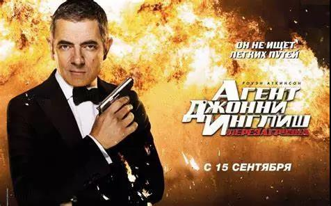
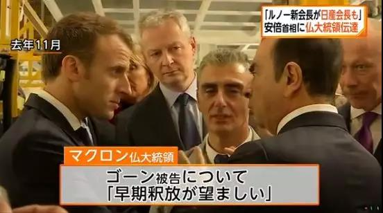
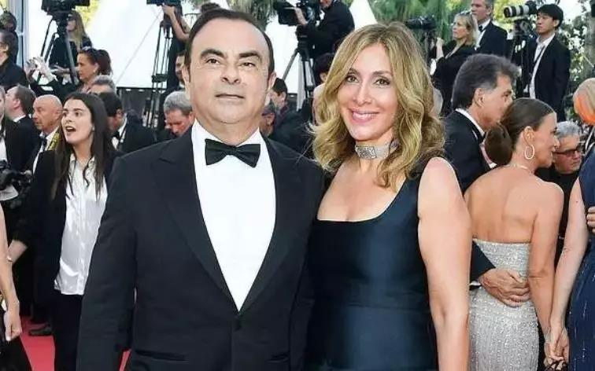

##正文

2019年12月29日，日本东京。

一群前特种部队精英伪装成一支格里高利乐队的乐手，带着一整套的音乐设备，在日本安全部门以及私家侦探的层层包围中，大摇大摆走进东京都中心最著名的豪宅元麻布Hills。

 

 

数个小时之后，早已停泊在大阪关西机场的一架飞机在夜幕中起飞，在这批特种部队的掩护下，一位神秘的大人物用假护照骗过了海关人员，摆脱了四百余天的禁锢，乘飞机飞往土耳其首都伊斯坦布尔。

 

 

这位神秘人物，就是全球汽车产业曾经最有权势的人物，前雷诺日产联盟的董事长，长得酷似憨豆的戈恩。

 

在抵达伊斯坦布尔的阿塔图尔克机场后，戈恩仅停留了一个半小时，就换乘一架庞巴迪“挑战者”公务机飞抵贝鲁特，以黎巴嫩公民身份从哈里里国际机场入境。

最终，在2019年最后一天夜里，戈恩向外界公布：‘’我现在身在黎巴嫩。我没有逃避正义，而是从不公正和政治迫害中解脱出来。”

由于黎巴嫩与日本和法国都没有引渡条约，这意味着这位汽车巨擘深陷400余天的囹圄后，抢在今年4月的审判前为自己争取到了自由。

 

 
图为戈恩在黎巴嫩875万美元的豪宅

说起来，这次戈恩的世纪大逃亡，根据其与法院达成的保释条件，难度之高可谓超乎想象。

一方面，法院禁止戈恩与他人联系，无法正常使用手机和电脑，很难与外部的救援团队取得联系，并共同制定相应的计划。

另一方面，戈恩被迫身上佩戴着GPS跟踪系统，家里装满了摄像头，内有日本检方人员24小时陪同，外有日产公司雇佣的私家侦探秘密巡逻，逃跑几乎是一项不可能完成的任务。

可是，在如此高级别的监视之下，这位相貌酷似憨豆特工的大佬还是让全世界免费看了一场精彩程度远超007的谍战巨制。

 

说不定若干年之后事情解密了，直接让憨豆来出演“逃离东京都”，未必不能再创一个“逃离德黑兰”的奇迹。

因为事后来看，面对这个不可能完成的任务，戈恩的逃离计划堪称教科书一般的完美。

戈恩逃离的第一步，是要解决保释，从警备森严的大牢里面出来。。

一般来说，东京地检办想办的铁案，是很难保释的，但是戈恩有个好朋友，是法国的总统马克龙。

毕竟是安理会五常，马克龙多次公开场合督促日本首相安倍放人，日方虽然不敢放，但各退一步，找个台阶让戈恩找个大律师保释还是可以做到的。

 

逃离的第二步，是要解决东京地检的24小时随身陪同。

这个时候，跨国企业的媒体掌控力量就展现出威力了，毕竟戈恩执掌了全球最大的汽车联盟十余年，朋友还是遍布天下的，多家主流媒体抨击日本没有人权，迫使日本检方撤离了戈恩身边的24小时监督人员。

 

逃离的第三步，则是需要政治庇护。

日本是经济大国，东京地检的背后更是有着美国爸爸，例如土耳其这种美国的盟国只能周转而不能落地，而其他很多小国又受限制于日本的经济援助可能会交人，能够选择的国家本来就少，而且还必须要有民意支持。

所以，戈恩的出生地黎巴嫩就成为一个非常好的选择，而戈恩的布局也非常的早，早在前一年，黎巴嫩的街头就已经到处可见戈恩声援广告，口号为“我们都是戈恩”。

 

最后一步，外面有再精锐的特种部队，但逃离计划也是需要里外呼应的，戈恩被控制住了，手机电脑都无法正常使用，这一年多来他唯一能够跟外界联系的通道，只有他的老婆。

 

戈恩的老婆能在检方人员的现场陪同下，通过“密码”的方式，把逃跑计划跟戈恩对上，还能够让戈恩在巴黎的总统和老朋友们相信，以她为纽带来布局救援计划。

最终，一位奇女子通过一系列的精彩布局，让老公从东京逃到了土耳其。

希望以后拍电影的时候，可以配上一句歌词，“我想要带你去浪漫的土耳其，然后告别东京和巴黎”。

 

最后，再说几句，个人奋斗背后必然要有历史的进程。

就像007电影中，护照之类的可以伪造，监控之类的可以屏蔽，甚至都可以带着人造头套过海关。

但有一个无解的事情，戈恩脚上的GPS定位设备被强行打开会触发报警，而如果不打开，从东京到大阪开车至少需要五六个小时，中间给日本方面还是留有了足够的应急时间。

这意味着日方内部必然也有人想把戈恩放走。

毕竟，日本收拾戈恩的目的很简单，只是避免日产跟雷诺并购，寻求日产的独立，这意味着戈恩对于日本来说，只是筹码。

就像之前美国跟欧洲争夺IMF的控制权，栽赃了卡恩那样，把人搞臭了搞下台了就没事儿了，毕竟刑不上大夫这也是国际惯例。

但是，日本方面放人又不能光明正大的放人，毕竟美国爸爸安插的东京地检还在那里盯着呢，所以，有关部门睁一只眼闭一只眼的放任之下，戈恩完成了这一场精彩绝伦的世纪大逃亡。

接下来，日法两国媒体都会试图大事化小，而美国媒体则将大肆抨击挑拨，但无论如何，美国制衡欧日的筹码又少了一个。

所以，这事儿值得欢迎，因为这一场大逃亡，应该只是一个开始......

##留言区
 

