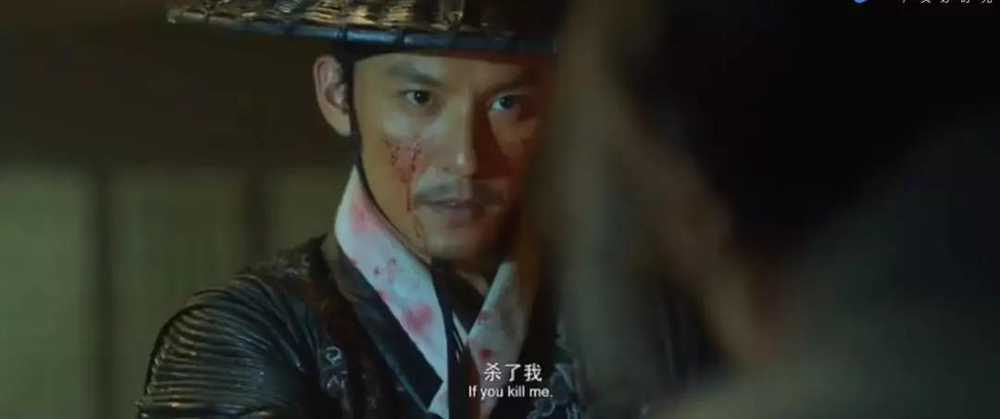

##正文

刚刚，特朗普捅了一个天大的窟窿。

据彭博社报道，美国五角大楼1月3日表示，在特朗普总统的指示下，美军空袭炸死了伊朗精锐部队“圣城旅”的指挥官卡西姆·苏莱曼尼。《新闻周刊》报道称，特朗普下令出动无人机发动打击，并于1月2日上午批准了这次行动。

 

苏莱曼尼的遇袭和身亡，很快得到伊朗当局的证实。伊朗最高领袖哈梅内伊1月3日下令，为苏莱曼尼举行为期三天的全国哀悼，并誓言将为这次刺杀对美国进行“严厉报复”。

继去年政事堂预测的降准晚了一天之后，前年预测“上党之乱”的兑现也迟了两天......感觉政事堂以后得改用农历纪年了......

不过虽然这一场大乱如约而至，但混乱可能并不会太持久，因为特朗普此刻恐怕也慌得一比，他在签署空袭的时候，大概率并不知道这位伊朗圣城军准将的地位。

说得通俗一点，此次被空袭干掉的苏莱曼尼，相当于民国末期的军统局长戴笠，明末的司礼秉笔太监魏忠贤，虽然职务并不高，但同时拥有谍报网、军力、财力以及强大的政治地位。

譬如苏莱曼尼一手打造的“圣城旅”部队，承担了伊朗全部的海外情报收集和非正式作战任务。通过这支特殊的精锐武装力量，苏莱曼尼在中东地建立起了庞大的代理人网络。

在中东，叙利亚和伊拉克政府军、阿富汗的“民兵组织”，也门的胡赛武装，巴勒斯坦的圣战组织，黎巴嫩的真主党，甚至多股库尔德武装都是苏莱曼尼多年来布下的棋子。

按照最近热播的网剧庆余年来看，苏莱曼尼几乎就是相当于执掌南庆的鉴查院，手握黑骑精锐的陈萍萍。

 

凭借着手上强大的谍报网和精锐的特种部队，苏莱曼尼被国际媒体冠以“中东谍王”，“埃及隆美尔”的称号，这几年来把美国在中东逼得节节败退，也是伊朗人眼中抵御外侮的“民族英雄”。

而且，苏莱曼尼深受伊朗领导人哈梅内伊的器重和信赖，同时被授予了伊朗的内库财权、谍报组织和最精锐的武装，普遍视为哈梅内伊的接班人。

 

所以，想一想庆余年里面的主人公范闲如果死了，会有多少人要来替他报仇，就会明白特朗普在签署空袭之前必然是被忽悠了，以为苏莱曼尼就是一个连将军都不是的“准将”。

因为一方面，虽然刺杀伊朗高官可能会美国民众的支持，但是干掉这种级别的人物很容易遭受到伊朗的无差别报复，如果处理不好，40年前卡特总统的伊朗危机就是前车之鉴，绑几个人质就能让特朗普的大选筹备功亏一篑。

另一方面，美国总统的确不用怕伊朗的恐怖组织，但面对全球最强大的谍报集团之一，不仅特朗普在全球的资产都将面临风险，特朗普的家人，也将面临苏莱曼尼徒子徒孙们无穷无尽的报复。

 

 

 

因此可以判断出，大概率这是特朗普安全团队给特朗普挖了一个坑，特朗普签署的时候只知道对方的名字和官职，并不知道实际地位。

而且，从事后各方的反应来看，美国国会多位议员表示不知情并指责白宫越过国会搞袭击，五角大楼更是表示在美国总统的指示下采取的行动，把锅甩给了特朗普.......

而这也使得特朗普处于一个非常危险的局面。

只要特朗普一下台，民主党的弹劾就会如约而至，公开刺杀他国领导人足够给特朗普扣上一个大牢蹲到死的战争罪；即使不下台，以后再有什么刺客行刺总统，美国各利益集团可以撇的一干二净，身负血债的圣城旅将会成为万年背锅侠.......

分析到这里，特朗普是不是应该慌得一比？

可以预见的是，这场美伊之间的胆小鬼博弈已经到了赛点，如果没有人认怂，就会出现车相撞的局面。

而博弈的双方，死了接班人的哈梅内伊此时就像他声明的那样，绝不可能妥协；而家族都面临毁灭威胁的特朗普没得选，只能妥协以换取伊朗人的谅解。

而妥协也是有空间的，毕竟伊朗情报机构负责人的行程泄露，多半是因为国内有着一股跟他不对付的力量，这意味着美伊两国政府之间还是有谈判的空间。

因此政事堂判断，不出意外的话，此刻特朗普表面上还在故作镇定，安排人释放与伊朗缓和的风声，暗地里则紧急跟普京等中间人沟通，让他们拉兄弟一把.......

 

而机会就是这样出现的。

接下来局面的发展，就像政事堂在2018年年中时预测的那样，中东上党一子落地，东亚满盘的棋就都活了。

##留言区
 

