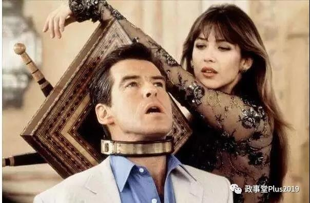
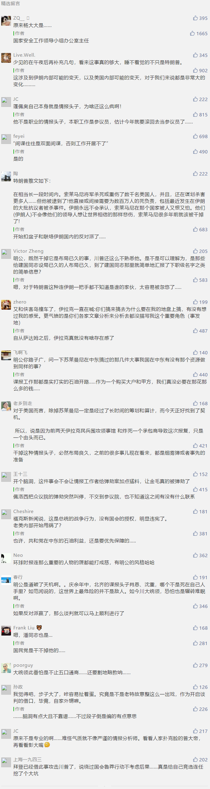

##正文

 

对今天文章做一个补充吧。

如果历史尤其是军事史读的多的话，会发现一个很有意思的事情，那就是世界军事史上，情报头子一般都是死在自己人手里，极少有情报头子被对方暗杀的先例。

因为情报机构并不像大家想象的那样，007式的潜入特工非常的少，就像当年老蒋的中统和军统的名称那样，情报机构实际上是一个统计局，绝大部分的员工做的都是统计的工作。

而情报机构的大佬们，他们最主要的工作，实际上是交易，相互之间交换各种统计和刺探出来的情报。

譬如大家熟悉的抗战时期，国军的军统、中统，日本的特高课、满铁、上海领事馆、梅机关以及汪伪的76号等情报机构之间，既有着相互之间的斗争，也有着各种秘密的地下合作。

譬如汪伪就时常向老蒋那边泄露日军的情报，军统也利用76号搞了不少的地下通道，中统和特高课也时不时交换一下八路的相关情报......

因为未知的情报有着巨大的价值，而且往往比特工们本身有价值多了，因此越到高层，也是极少出现谍报头子的肉体毁灭，甚至大家之间的关系往往还都不错。

譬如日本快垮台了，76号的主任丁默邨和周佛海就直接变成了国军的“卧底”，解放战争刚开打没多久，军统的大主任，戴笠的老板贺耀祖直接投共，死后还葬在了八宝山，而中统的大主任陈立夫，之后更是成为两岸统一的积极推动者，出任两岸统一促进会的名誉会长......

至于日本的情报机构，二战一结束，马上就成为了美国人的马前卒，纷纷进入日本政界控制大局.......

原因很简单，情报方面永远是多方博弈，很少有两方是解不开的死敌，既然大家都是玩交易的，自然就要有信用，毕竟情报投资们手里的信息都是无价之宝。

就像伊朗的苏莱曼尼，够调和中东各国，甚至跟普京谈笑风生，靠的就是他手握的财力、地缘利益以及情报等一大批的筹码。而他能够跟美国的盟友库尔德人甚至亲美的伊拉克党派这些势力做交易的背后，实际上也是美国和伊朗之间有着地下的情报机构合作。

而特朗普和蓬佩奥竟然打破了游戏规则，肉体消灭情报伊朗的情报头子......这意味着之前站在全球建制派对立面上的特朗普，如今又站在了全球情报机构的对立面之上........

各国情报头子之间握的东西，就像琅琊榜里面夏江的悬镜司，原则上是不介入党争的，面临大选的特朗普和蓬佩奥哥俩打破了潘多拉的魔盒之后，接下来怎么走，怕是已经脱离了他们的掌控了.......

 

##留言区
 

