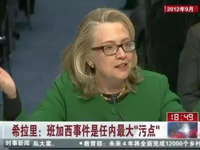

##正文

随着昨天美国对伊朗三号人物实施斩首行动，“第三次世界大战”一度登上推特热搜榜。

随着美国首都华盛顿进入紧急状态，要求伊拉克境内的美方公民立即撤出。伊朗也已经下令伊朗全国哀悼3天，并誓言“罪犯”将遭到严厉的报复。伊朗驻联合国代表则表示，美国杀害苏莱马尼无异于发动战争。

全世界屏息以待，看伊朗在三天的官方哀悼结束后，如何以及在哪里进行报复，全球的油价、金价以及股价，也都在屏息等待着伊朗人三天之后会给世界一个什么样的惊喜。

 

很多朋友都在问我，接下来的局势怎么走，其实，看一下政事堂在事情爆发几天前写的文章《特朗普的“胆小鬼博弈”》就会知道，“胆大鬼”们会搞事情，但美伊双方在撞车之前，“胆小鬼”们肯定要握手言和的。

首先，对于美国来说，目前是急于谈判的。

美国刚刚完成刺杀，一贯喜欢揽功的特朗普自己还没说啥，负责动手的五角大楼就主动把总统搬出来，表示是特朗普下达的指令。

 

对于特朗普来说，刺杀他国的高级外交与情报人员，不仅要承受外交上的巨大压力，而且还要担心遭受到未知的报复。

 

因此，就像昨天夜里国务卿蓬佩奥疯狂给全球主要大国的外交与安全部门负责人打电话，并将其发布在推特上那样，特朗普和蓬佩奥哥俩也挺慌的。

 

毕竟，伊朗也算是一个美国的选举克星。

德黑兰人质事件让总统卡特痛失总统大位，班加西人质事件更成为希拉里2016竞选时最大的黑点之一，特朗普与共和党同僚们当年可没少借机抨击这位老对手。

 

所以，为了避免伊朗成为自己竞选时的地雷，此刻的特朗普急于安排与伊朗的会谈，打出“请客”牌，可以不设定任何的前置条件。

 

其次，对于伊朗来说，实际上也是想谈判的。

一方面，毕竟身处美洲大陆的美国，其地缘安全就像《让子弹飞》中黄老爷的碉楼一样固若金汤，以目前伊朗哈梅内伊的能力，并不足以掀翻桌子，尤其是在没有两大家族的支持下，鱼死网破也报不了仇。

 

另一方面，苏莱曼尼能够普遍被视为伊朗保守派内的二号人物和哈梅内伊的接班人，靠的是他近年来在伊朗地缘扩张上面立下的赫赫战功。

随着911后布什的伊拉克战争与阿富汗战争先后进入尾声，美国部署在中东和中亚的力量也在慢慢的退出，权力真空给了苏莱曼尼空前的机会。

苏莱曼尼指挥的圣城旅扶持了一大批的政治势力，其中包括叙利亚阿萨德政府，伊拉克的什叶派联合政府，黎巴嫩的真主党，也门的胡塞武装......

随着苏莱曼尼在中东和中亚话语权的不断增强，尤其是随着ISIS的崛起，美国的中央司令部也不得不选择与其合作，以维护美国在中东的巨大利益。

所以，苏莱曼尼是一名披着外交人员外衣的情报头子，由于与中东各方都有着复杂的利益交换，看似危险但实则安全，这也是为什么这么重要的人物，平时出门连防弹衣都不穿。

 

但是，苏莱曼尼取得巨大成功背后的原因，恰恰也是他的危险所在。

伊朗在最近几年内，能够帮助阿萨德政府抵挡住美国组织的反政府军，能够扶持也门的胡塞武装打得沙特痛不欲生，能够与库尔德武装联合击溃ISIS，扶持黎巴嫩真主党和对抗以色列......

但是，这种拉着一群小弟，全球排得上数的几个金主爸爸们同时对抗，可不是光提供情报和训练就可以的，苏莱曼尼不仅需要对外提供大量的军械装备和补给，还需要巨额的政治献金用于收买各股力量。

这意味着，苏莱曼尼推动的伊朗地缘扩张，也在迅速消耗伊朗宝贵的外汇储备，尤其是随着特朗普上台后撕毁了伊核六方协议，伊朗石油出口的利益迅速滑坡，国内经济也出现了巨大的震荡。

因此拍脑袋就知道，伊朗国内的公务系统中很多人，对于穷兵黩武扩张的苏莱曼尼，是敢怒不敢言的。

如今，随着哈梅内伊接班人苏莱曼尼的去世，以及看到特朗普必然会递出的橄榄枝，伊朗国内的改革派必然会提出趁美国理亏和特朗普心虚，逼着特朗普和美国回到谈判桌，解除对伊朗的制裁。

 

毕竟，只要六方会谈的鸿门宴重启，伊朗的封锁被结束，庞大的石油产能就可以源源不断的为伊朗换取美元。

 

而这也是符合伊朗国家利益的。

几年来苏莱曼尼虽然替伊朗打下来一个什叶派之弧，但是目前伊朗却没有经济实力守住这个新月地带，哈梅内伊需要足够的钱，才能够将中东的什叶派穆斯林联合起来。

 

因此，虽然很多人都在传言说什么“第三次世界大战”，但政事堂认为接下来可能会有一定的紧张，但停滞的六方会谈反而可能因为此次的空袭斩首而加速重启。

如果政事堂推测没错的话，特朗普会给出一个伊朗无法拒绝的条件作为筹码，那就是像当年古巴危机中，美国偷偷从土耳其撤出核弹那样，未来一年内，美国也将默默的从伊拉克撤军，让伊朗看到消化伊拉克的机会。

一旦谈判能够重启，中东这个火药桶就会开始熄火，这也意味着整个中东的地缘将出现开启新的篇章......

只不过，把视野放得更远一点，就算今年美国和伊朗的鸿门宴谈了，把伊拉克这颗钻石送给伊朗的美国，必然也会杀一个回马枪试图取回。

 

而死了“小六子”的哈梅内伊，就算吃了鸿门宴，怕也不过是是把仇恨埋在心里，早晚还得搞反击。

未来中东这个火药桶，怕是停不了了.......

 

##留言区
 

