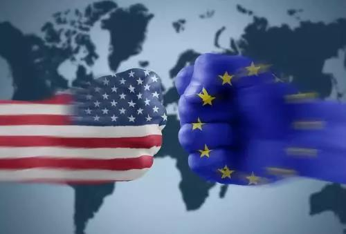
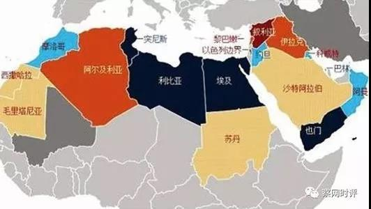

##正文

圣经旧约创世纪中有一个故事，叫巴别塔。

那时，人类都说着一种语言，他们联合起来，试图兴建通向天堂的高塔，但是，人类的齐心协力与统一强大引发了上帝的恐惧。

上帝为了阻止人类的高塔计划，上将人类变成了说不通语言的群体，使之不能沟通相互猜忌，高塔的计划也因此失败，从此人类分散为不通的部落，再也无法对上帝造成威胁。

这个塔的名字，就叫做巴别塔。

 

圣经旧约能够成为天主教、新教、东正教、犹太教以及伊斯兰教等西方主流宗教的起源，自然是有着强大的哲学逻辑的，譬如创世纪中巴别塔的这一则故事，就在不断的被重演。

刚刚从日本逃到黎巴嫩的雷诺日产联盟前董事长戈恩，这位曾经带领着日产从破产边缘崛起的超级英雄，被东京地检逮捕的原因，是他正在主导的法国的雷诺与日本的日产三菱合并。

 

一旦合并成功，联盟不仅将形成全球最大的汽车“巴别塔”，也会推动欧盟与日本的产业联合，这自然会威胁到“上帝”的利益，上帝之手必然会推动联盟拆分为三家文化不同的公司。

同样，最近刚刚被无人机击杀的伊朗圣城军领导人苏莱曼尼死得也不冤，这位圣城军的领导人这几年来一直正在推动伊朗、伊拉克、叙利亚、也门的什叶派之弧。

 

苏莱曼尼要做的，就是打造一个什叶派的巴别塔，而且还就在圣经里面巴别塔所在的古巴比伦的土地上。所以，之前小布什和奥巴马都放过一马的这位什叶派英雄，倒在了宗教狂热的特朗普团队手里。

同样，就像昨天路透社爆料出来的，美国政府在2018年至2019年曾展开强大攻势，阻挠荷兰ASML公司向中国企业出售价值1.5亿美元的光刻机，并最终获得“成功”。

美国政府一边阻止欧洲的光刻机卖到中国，一边阻止中国的电信设备在欧洲铺网，归根结底，也是从产业链的角度，防止中国跟欧洲联合组建丝路“巴别塔”。

 

所以呢，圣经的经典还是有道理的，近期这些美国地缘上的动作，都能够用巴别塔的逻辑来解释。

毕竟，在现行的国际秩序中，美国就是那个无所不能，给全人类带来灯塔的上帝。

 

甚至再往前推几年，我们也会看到类似的动作。

在欧洲，美国策划的乌克兰危机，不仅使得大毛俄罗斯和二毛乌克兰兄弟彻底翻脸，更重要的是，让天然气合作下的俄欧经济联盟迅速崩溃。

在亚洲，美国扶持菲律宾搞的南海仲裁，也使得东盟RECP协议被搁置，阻止了东亚与东南亚的产业经济联盟。

毕竟，作为民主灯塔的美国，在指引方向的同时，也要维护上帝的利益。就像圣经故事那样，从阿拉伯联盟到苏维埃联盟，从南斯拉夫联盟到东亚A3联盟，美国习惯性把统一的联盟分化瓦解掉。

没办法，就像政事堂以前讲过的兰彻斯特方程那样，多股力量的联合不是简单的加法，而是二次方级别的增强，很容易对一极独大的势力造成威胁。

最显著的例子，就是美国对欧洲煤钢共同体放了一马，导致共同体闷声发展了40年之后，成为了美国心腹大患的欧盟。

 

所以，对于英国的脱欧，美国必然是非常支持的。

而从地缘的角度来看，链接欧亚大陆的中东，作为巴别塔的出生地，更是“上帝”要拆分的重点。

自二战结束之后，在中东的土地上，从五次中东战争到两伊战争，美国挑起的代理人战争打了半个世纪，战争让中东的民族和宗教形成了不可调和的矛盾。

甚至到了互联网时代美国也没有收手，国务卿希拉里搞起了阿拉伯之春，对中东地区来了一次大洗牌，多个美国的传统盟友都惨遭毒手。

 

至于那些试图整合中东地缘的政治强人们，美国更是不吝于自己动手，从伊拉克的萨达姆，基地的拉登到利比亚的卡扎菲，甚至土耳其的埃尔多安要不是接了普京的一个提醒电话，也差点被导弹一波带走......

好了，历史讲完了，我们回到现实。

作为一个理智的人，我们要明白，美国的拆巴别塔式行为，是任何一个世界霸主所必须要做的事情，中国古代的中原王朝对周边少数民族玩了几千年打击与羁縻，大英帝国日不落的鼎盛时期，更是把离岸平衡的搅屎棍玩到了炉火纯青。

所以呢，看懂的人不会有什么仇恨的思想，也不会去炒作什么修昔底德陷阱。因为美国作为全球的超级霸主，人家不是针对你，人家针对是在座的诸位......

 

而看懂后能否去践行，这也是政治家和政客之间的区别。

看着埃尔多安被导弹袭击后，继续跟美国做盟友，跟特朗普做中东的地缘交易；看看俄罗斯在乌克兰问题上被坑惨了，但普京依然坚定支持特朗普；看看日本的安倍十年前被美国人赶下来，看过国家被广场协议薅羊毛，可再次上台后，还在继续舔.....

 

真正的政治家们很清楚的明白，无论美国的打击还是制裁，都是作为全球霸主必须要尽的责任和义务，没有什么个人的仇恨，当你有一天坐到那个位置上的时候，也会做同样的事情。

所以，大国之间没有真正的仇恨，谁也不必要盯着美国的怼，因为美国作为全球霸主，他有太多的矛盾和突发的事情要去解决。

真正的地缘外交，就像电视剧潜伏里面的那句经典台词，只要你一枪打不死我，我又活了过来，咱们还可以接着做生意，只要价格公道。

##留言区
 

