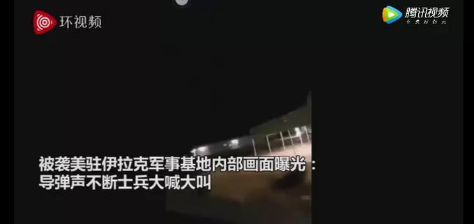
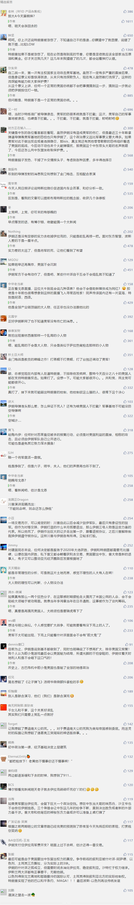

##正文

今天一早，伊朗革命卫队对美军驻伊拉克空军基地发射了短程弹道导弹，隶属于伊朗革命卫队的法尔斯新闻社发布消息：

阿萨德基地内至少有80名美国军人被杀、200人受伤。伤者被直升机带出基地。该知情人士补充说，基地内的20个重要目标被15枚导弹击中，大量的无人机和直升机被摧毁。

 

随后，该消息又被伊朗英语新闻电视台PressTV验证，一时之间，仿佛“三战”就要开启。

 

不过很快，刚刚斩首了六名伊朗指挥官的五角大楼就发布了消息，伊拉克的美国大兵安然无恙，无一伤亡。

 

到底谁在说谎呢？

以不能死美国人为底线的特朗普，如果真在伊拉克死了80个美国大兵，面对国内一群反对势力肯定是无法遮盖的，那么这一场战争恐怕真的无法避免了。

因此，只是伊朗方面放了一个“假新闻”。

为啥官方新闻还敢于如此造假呢？

毕竟，特朗普的击杀了伊朗的民族英雄，引发了民众巨大的愤怒，伊朗军方和政府都需要有所表态。

 

因此，一轮壮观的导弹齐射，虚构的美军伤亡，不仅令寻求谈判途径的政府能平息国内民众的不满，大秀肌肉的军方逼着美国“不敢报复”也能获得狂热的支持。

 

这是一个伊朗内部各股势力都能接受的一个选项。

而且，对着戒备森严的美军空军基地空地上放十几颗落后的导弹，给足了美国大兵躲进防空设施的时间，以避免碰触特朗普不能死人的红线，防止美国的报复。

伊朗人打的主意，是学习当年炮击金门，跟特朗普打一场默契球，对于这个动作，美伊双方可以"各表"......

 

几天前刺杀事件刚爆发之际，政事堂就表示美伊之间根本不想打，被无数读者后台说坐等打脸。

逻辑很简单，就像《战争论》中说的，军事是政治的延续，美伊双方的高层考虑到自身的政治利益，就像古巴危机中的双方那样，“胆小鬼”们都不愿意打仗。

毕竟，对于特朗普来说，美军目前在中东的驻军根本不足以短期内推翻伊朗政府，在大选年匆忙调兵很容易把自己带进沟里。

对于伊朗的哈梅内伊也是如此，随着撕毁伊核协议的美国重启制裁，伊朗石油出口出现了断崖式的下跌，一个多月之前伊朗取消了汽油补贴引发的骚乱，竟有民众走上街头反对哈梅内伊，逼着伊朗当局全国断网才得以平息。

在这个关键的时刻，特朗普杀害了什叶派的英雄，使得伊朗民众的宗教热情被点燃，伊朗当局的保守势力得以绝地反击，政事堂估计他们将轻松赢得马上召开的伊朗议会选举。

此外，伊朗强忍着制裁，花费巨额资金收买伊拉克的什叶派政党和民兵，越境打击逊尼派的ISIS，保护什叶派的阿萨德政权，一顿操作猛如虎，好不容易看到了美国撤出伊拉克的希望，绝不愿意在这个关键的时刻挑起战争导致功亏一篑。

因此，伊朗的保守派当局面对特朗普，就像一个初恋少女等干爹，怕他不来，又怕他乱来.......

 

这笔账伊朗当局并不难算，因为特朗普的这一任任期只剩下一年。

如果今年特朗普被民主党干掉，无论哪个反特朗普的总统必然会拉着伊朗当局恢复奥巴马牵头的伊核六方协议，解除制裁。

如果特朗普赢了，那么伊朗当局只需要忍一年，等政治环境明晰后跟特朗普签新的条约即可，还可以利用这一年国内的反美潮流连续打赢议会和总统选举。

因此，伊核协议对于伊朗来说，并不急于在今年跟特朗普搞定，他们的重点是要解决伊拉克的问题。

目前伊拉克的议会当中，不仅什叶派在18年的议会上获得大胜，而且什叶派英雄苏莱曼尼的死也令伊拉克什叶派群众产生了强烈的反美情绪。

再加上一心想退出伊拉克泥潭的特朗普任期只有一年，伊朗保守势力必须要趁今年，像当年古巴危机是那样，让美国总统偷偷撤军，否则夜长梦多，换个总统导致功亏一篑。

估计接下来，伊朗军方会以干掉刺杀将军的无人机表示复仇结束，但宗教方面表示什叶派的复仇并未结束，通过“激进分子”给特朗普头上悬了一道达摩克里斯之剑。

再加上这一轮的空袭，迫使除了美军之外其他的各国军队先后退出伊拉克，伊朗炸了美国的空军基地，也让其有了理由替伊拉克支付特朗普要的撤军补偿，给足这位交易高手面子。

因此别看美国共和党一群胆大的战争贩子想要扩大战争，这位胆小鬼在几个小时后发表的讲话，会在吹嘘自己牛逼之后，表示放伊朗人一马.......

##留言区
 

