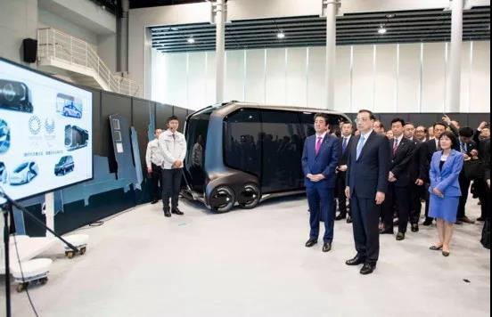

##正文

昨天，完成了“肖申克救赎”的雷诺日产前董事长戈恩在黎巴嫩召开了新闻发布会，现场，他用四种语言进行了慷慨激昂的自我辩护，并疯狂炮轰日产高层与日本检方“勾结”，采取“残忍的手段”谋求将其赶出公司的阴谋。

 

当然，政事堂不怎么喜欢搞意识形态，骂人权和阴谋论打鸡血没啥意思，而是希望从产业的角度，让读者们明白戈恩是如何栽在了历史进程之下。

记得上周末，舆论都在讨论特斯拉降价将屠杀国内厂商，政事堂从政策角度着手，撰文《干掉国内新能源车企的不是特斯拉》，认为中国政府是通过引进特斯拉推动降价和规模化，以提升中国新能源车的产业链的全球竞争力。
>只要国产化的量上来了，整个产业链的量也就带动了，中国凭借着全球最大的人口规模把成本平摊后，会把整个供应链上下游的价格迅速压低到其他国家都难以进入。

因此，当其他公众号的读者还在跟风拍钢铁侠马斯克马屁的时候，政事堂的读者们第二天开盘就杀入了特斯拉产业链的概念股里面了......

同样，汽车巨头戈恩如今的问题，从根子上来看，也是全球汽车产业链方面的博弈。

汽车是一个拥有庞大上下游的行业，不仅提供了庞大的就业，也为政府提供了强劲的税收，譬如一气养活了大半个吉林省，千亿纳税的上汽在上海也能稳居一哥。

同样，作为法国最大国有企业，戈恩的雷诺汽车所提供的就业和税收，也是法国人浪漫的底牌之一。

可是，目前全球的汽车领域正在进行一次革命性的洗牌，就像当年功能手机向智能手机转型那样，传统的功能汽车也正在向智能汽车转型。

行业升级的结果，就是大洗牌，就像功能机时代全球通信供应商还是十几个巨头争霸，但是5G时代全球经过几轮兼并重组后，就仅剩了诺基亚、爱立信、三星、华为和中兴五家企业。

看着三星一家撑起了韩国电子行业以及华为中兴背后数百万人就业的产业链与税收，就会明白体量远大于通信行业的汽车产业，对于发达国家有多么重要。

所以，雷诺试图吞并日产和三菱不仅是企业行为，更是法国的政府行为，因为在未来的这一轮洗牌过程中，大家都知道，只能剩下几个大玩家。

而这也是为什么雷诺不仅要吞并日产三菱，还在试图收购菲亚特的原因，而明白了法国政府的角色，就会明白戈恩导致两场收购失败后，法国的另一家汽车厂商标致迅速替雷诺收购了菲亚特。

这也是戈恩这种拥有足够免罪权的企业级大佬竟然会入狱，东京地检会拼命收拾他，而不知所以的东京法院却觉得他罪不至此的怪相。

这更是为何最后随着标致收购菲亚特，结束了这一场博弈之后，戈恩能够轻松逃出日本的根源。

原因只有一个，那就是戈恩这个大人物卷入了全球产业地缘的博弈之中，瞬间从棋手变成了微不足道的棋子。

举一个例子就会明白，新能源汽车的充电标准，就像手机充电接口那样，技术并不复杂，但是背后却牵扯了巨大的利益。

因此，就像大家熟知的5G投票那样，行业标准取决于市场规模与技术储备，华为联想们手握的一票，就能够决定5G领域有多少产业链能够落在中国。

同理，法国政府希望雷诺或者标致能够吞下日产三菱乃至菲亚特，是希望在这一轮汽车产业智能化的过程中，通过行业对法国有利的标准制定，保留住法国国内庞大的供应链。

毕竟，法国的黄马甲已经很令人头疼了.....

 

就像欧盟中的德法博弈那样，虽然要统一对外，但是内部法国凭借着海外势力范围，还是硬压了实力更强的德国一头，拥有更强的话语权。

产业角度的逻辑也是相似的，欧盟的标准必然是统一的，虽然法国的标致+雷诺不及德国的戴姆勒+大众+宝马，但是吃下日本的日产三菱和意大利的菲亚特之后，法国就能从规模上压德国。

没办法，面对美国的技术绝对优势，其他的工业国想要后发制人就只能利用体制优势。

因此，不仅法国在推动车企的整合，德国政府也在推动戴姆勒、宝马、大众三大车企组建技术联盟，日本的丰田本田铃木马自达斯巴鲁，也在进行技术同步。

所以呢，就像华为的竞争对手中兴，作为国企在5G投票时会毫不犹豫的支持华为那样，法国的国企雷诺，也要为法国的国家利益服务。

反之，想一想去年的“美帝良心想”就会明白，日本政府和民众从感情上也很难接受日本的企业站在法国的国家利益角度做事情。

这就是戈恩这个曾经的日本国家级英雄会一夜之间形象垮台原因。

毕竟，个人的荣誉在国家的利益面前根本不堪一击，日本政府会发动舆论干掉这位曾经带领着日本车企走向辉煌的大功臣。

而把视野再进一步提升来看。

全球经济与科技主要集中在北美、西欧和东北亚三个经济发达地区。

对照手机的智能化来理解汽车的智能化，就会发现，就像当年3G4G标准的竞争中，美欧亚的三方势力合纵连横，如今德日法在为了自身的技术标准和产业链组建联盟的同时，必然也有国际上的纵横捭阖。

譬如，就像美国一边不允许欧洲的光刻机入华，另一边也不允许欧洲盟友采购华为，日产与雷诺的联盟，也意味着欧盟和日本在智能汽车技术合作方面的产业联合。

所以从这个角度来看，东京地检扣戈恩与借着加拿大司法部门扣孟大小姐，动机也是有一定相似的。

而回到中国的汽车产业，未来行业的发展方向，也是可以预测的。

目前中国的汽车市场，就像十多年前手机市场那样，高端机子都是被美欧日韩的独资或者合资方式垄断，国产基本都是一群山寨机。

如果沿着功能机发展，我们绕不过诺基亚和摩托罗拉那数不清的专利权，因此，政府只能选择花大力气在智能化这个领域弯道超车。

因此，从技术方面，我们需要像当年3G4G时代在欧美日之间搞平衡那样，我们要对智能汽车搞门户开放，让不同的技术都进入到中国的市场，促进供应链的成长。

所以，我们开放了汽车行业的外资股权限制，让德国的宝马入股华晨宝马，让特斯拉在上海建厂，中日关系在今年回暖后，估计也会开启大规模的合作。

我们最大的筹码，就是全球最大的新能源市场，无论哪一家车企联盟拿下了中国，规模化的成本降低就能够使得其标准可以横扫全球，赚取超额的利润。

因此，我们的重点，是汽车的基建，今年高速路改革以及停车场改造以及5G等一系列加速的原因，回想一下，逻辑就是当年我们捏着鼻子搞3G的基建。

中国的基建都起来了，那么在各方的利益博弈之下，各方自然就要拿看家的本领来换，譬如德国就让吉利入股戴姆勒了，美国就让特斯拉100%中国国产化了，日本更是拿出来最先进的技术准备搞合作.......

 

所以呢，对于整个行业来说，接下来的情况，特斯拉新能源入华就像当年苹果的智能机入华，在中国政府亏本基建补贴之下，会把国内甚至国际一众企业打得丢盔弃甲。

但是，美国的特斯拉、德国的BBA以及日本丰田带来的产业链，就像当年苹果带来的产业链，将很快让中国的供应商们拥有全球最强的生产力。

因此，在未来的洗牌与升级中，中国的车企一方面整合，剩下如华为一般的大厂，另一方面会靠着产业链贴牌，未来崛起如小米等新的造车势力，甚至如贾跃亭、罗永浩这样的都可以凭借着国内强大的产业链贴牌生产汽车。

更不要说，凭借着规模优势，还会崛起如支付宝、微信等一系列应用型的软件系统。

到了那个时候，我们就会再一次见证中国凭借着产业链实现弯道超车。

##留言区
 

