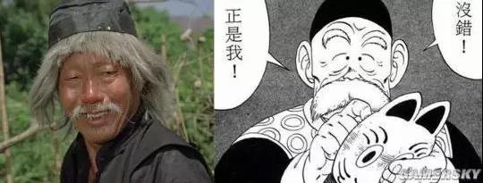
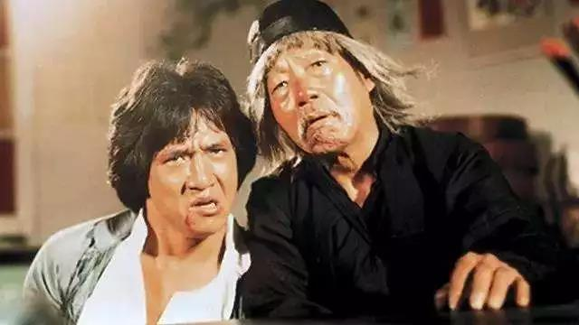

##正文

今晚，被媳妇拖去听了一场钢琴家理查德克莱德曼的音乐会。

在观众们都沉浸在音乐之际，政事堂脑子里面只有五个字在反复的回荡：

历史的进程。

说起来，克莱德曼在中国70后和80后中有着非常高的声望和广泛的知名度，更是00后和10后学琴小朋友们“挥之不散的噩梦”。

不过，这位大叔在法国并没有什么名气，尤其是很少有年轻人知道他，一位国内不受重视的艺术家在他国被奉为圭璧，是何故呢？

 

因为中国80年代的那一波钢琴热潮就是这位大叔搞起来的。

当时，无数中国青年用父母攒了几个月的工资去买录音机和随身听，就是为了听这位大叔的磁带，而他更是开创了中国国际化商业演出的先河。

所以，在没有任何竞争对手的情况下，克莱德曼在中国整整收割了一代的中国青少年，以至于虽然被国内古典音乐好爱者普遍看不起，但是他国内知名度在活着的音乐家中无人能及，跟已故音乐家相比，可能也就只输贝多芬一人。

成功背后的原因很简单，那就是历史的进程。

法国是新中国跟西方列强中第一个建立外交关系的国家，是中国打破西方包围网的突破口，两个国家甚至在核技术方面都有着深厚的合作。

因此，作为民间友谊加深的桥梁，法国人克莱德曼靠着个人的奋斗，踩在了历史的进程之上，垄断了中国改革开放之初20年的钢琴音乐市场。

同样，与克莱德曼同时期的相声演员，春晚的常客大山能够红火那么多年的背后，是因为他的祖国加拿大是跟新中国建国以来关系最好的发达国家。

 

甚至90年代中国足球先后请了德国的施拉普纳和英国人霍顿这俩国际上毫不知名的主教练，背后是89德国大规模注资上汽以及97年英国归还香港，中德、中英关系达到了历史的新高度。

同样，看着如今弱智般的动画片熊大熊二，对比我们小时候能同步看到日本的灌篮高手和圣斗士星矢，就会明白，72年实现了中日外交正常化的日本，自然能够轻松获得中国的文化市场。

而80后者一代人年少时文化娱乐被日本占领，长大后又被韩国文化侵蚀的背后，是韩国跟我们的建交，比日本晚了十多年。

而以大长今、蓝色生死恋为代表，韩剧将日剧赶出中国市场的背后，则是小泉纯一郎在2001年开始，搞起了参拜靖国神社......

至于最近的那些跑去韩国当练习生的小鲜肉们纷纷回国，变成了纯国产，以及韩流在国内退潮的背后，则是韩国政府傻逼式的去搞了萨德。

所以呢，搞艺术也得懂历史的进程，否则分分钟会被碾压成渣渣辉。

而纵观华人演艺圈，历史进程踩的最好的，莫过于李小龙和成龙。

很多人都不会留意到，李小龙在1971年之前混的都特别的惨，演电影只能跑跑龙套，但是7月份之后，几个月的时间，这位跑龙套的华裔少年就崛起成为全球一线巨星。

不要以为努力就一定能够获得成功，李小龙成功的背后是踩中了历史的进程，1971年7月，基辛格完成了举世瞩目的秘密访华。

 

而李小龙能够在美国和日本能够横扫70年代无敌手的背后，是71年中美从敌对走向盟友，72年中日从血仇变成亲如一家。

同样，别看成龙现在只能duang的一下给中年油腻大叔们卖卖洗发水，穿着一身塑料忽悠中年肥宅充值去游戏里砍人，一副过期明星的样子。

 

80年代的成龙，虽然在国内知名度还不算很高，但在日本却是神一般的存在，只不过随着2000年之后中日关系的几次转冷，逐步被日本官方封杀罢了。

要知道80年代成龙最巅峰的十来年时间，光电影就上映了60多部，日本上下无人不知这个大鼻子的中国男人。

 

当时，数不清的日本妹子想要嫁给这个长得并不英俊的中国男人，甚至如果有中国人告诉日本人自己不认识成龙，仿佛就像日本人不认识丰臣秀吉一般被视为智障。

而且那个时候，不仅日本全民狂热追成龙，大量的流行漫画里面，都有成龙元素。

 

 

甚至七龙珠里面孙悟空的师傅龟仙人，不仅“艺名”叫做成龙，造型也是成龙醉拳里面师傅的模样。

 

 

而且，五音不全的成龙在80年代的日本乐坛，也拥有着克莱德曼在中国钢琴界同期的垄断级地位。

以至于谭咏麟为了在日本卖唱片，直接把成龙印在封面上，虽然里面没有成龙一首歌。

 

成龙为啥80年代能够横扫日本？

让他一炮走红的电影《醉拳》上映，与十一届三中全会的改革开放，中间只相差1个月。

 

随着中国的改革开放，日本成为了中国最大的投资国，中日经贸与投资出现了十多年的井喷式发展，继李小龙去世后，日本必须要再塑造一个亲华的大使。

成龙此刻就应运而生。

就像当年泰坦尼克在中美签署WTO之际，在中国取得了无法复制的辉煌，历史无数次的证明，影视文艺想要取得世界级的成功，必然要踩在经贸合作的历史进程之上。

原因很简单，经济基础决定上层建筑。
 

##留言区
 

