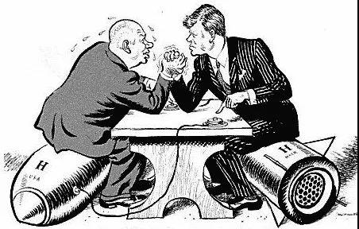

##正文

今天中午，伊朗承认意外击落乌克兰航班。

 

据伊朗迈赫尔通讯社报道，客机坠毁后，伊朗武装部队参谋部立即成立了一支独立于民航组织的调查小组，该小组调查的详细结果如下：

一、由于美国总统及美国军事指挥官威胁，若伊朗作出反击，美国会袭击伊朗本土的目标，又因为该地区领空目前空前动荡，**伊朗武装部队**处于最大程度的警戒状态。

二、在**伊朗伊斯兰革命卫队对美国军事基地进行导弹袭击**后数小时，美军飞机在伊朗边界附近出现的频率有所增加，**有一些关于伊朗战略中心受到空中威胁的消息被传递到了伊朗国防部门**，一些目标确实出现在了雷达上，这也导致防空系统的灵敏度有所提高。

三、在这种敏感又危急的状况下，乌克兰航空的752号航班从伊玛目霍梅尼机场起飞，这架飞机在改变方向的时候，其形态完全类似于在**接近伊斯兰革命卫队敏感战略中心**的敌对目标。在这种情况下，由于人为的失误，该客机无意中成为了目标，不幸导致许多亲爱的同胞和外国乘客遇难。

四、**伊朗武装部队**工作人员向遇难者家属表示慰问，并对人为的失误表示歉意。伊朗保证，将对**武装部队的工作流程进行根本性调整**，避免此类事件再次发生。酿成事故的责任人将被移交军事法庭，法庭将依法对其进行处理。

五、**伊斯兰革命卫队**相关官员将前往伊朗伊斯兰共和国广播电视台（IRIB）向全国做出详细说明。

如果总参谋部说的都是实话的话，那么如今就是在重复当年的古巴导弹危机，美国政府与伊朗政府在进行一场“胆小鬼博弈”，而美国的国家安全顾问团队以及伊朗的共和国卫队则在扮演“胆大鬼”。

因此，接下来的中东走势，就像政事堂在事件刚爆发时就预测的那样，跟古巴导弹危机类似，美国撤出伊拉克，伊朗撤出部分什叶派控制区，双方完成一次国际地缘上的交换。

而如此急于退出的原因，其实也有着历史的教训，世界的大冲突爆发之后，各国国内的政治力量也将开始洗牌，譬如古巴危机的一年后，肯尼迪被枪杀，第二年，赫鲁晓夫被赶下台了......

 

历史不会简单的重复，但往往惊人的相似，譬如伊朗参谋部今天的报告，就把屎盆子都扣在了刚刚痛失大将的革命卫队身上。

伊朗有着比较特别的军事结构，类似于二战时期德国的国防军与党卫军那样，伊朗的作战部队也分为共和国军和革命卫队。

共和国军起源于巴列维王朝成立，捍卫的是伊朗的国家利益，革命卫队起源于伊斯兰革命，捍卫的是宗教革命的胜利果实。

虽然两支军队在国防部都有着统一的指挥体系，但经济权和人事权独立的革命卫队，由于效忠哈梅内伊，行事往往会有相当大的自主权。

譬如刚刚被美军斩首的那个哥们，就是革命卫队下属圣城旅的负责人，负责着伊朗在中东地区组建什叶派之弧的使命，远不是伊朗国防部外交部管得了的，因此被舆论炒作为“二号人物”、“三号人物”。

 

伊朗军方背景介绍完了，我们就会发现参谋部的这段公开回应很有意思。

简而言之，伊朗军方一方面不知道革命卫队何时何地何种方式对美军复仇，另一方面也不知道革命卫队为何搞出人为失误击落客机，最终解释的事儿交给伊朗革命卫队自己来做。

军方表示接下来，就是要借机对此次击落客机中暴露出来的问题，（以及革命卫队高级将领的去世），对伊朗军事系统的工作流程进行根本性调整.......

所以我们会发现一个很有意思的事情，客机被导弹打下来，对于那些在中东有着庞大情报和侦查网的西方国家都在纷纷装傻，绝不去捅破那一层窗户纸，给足了伊朗的台阶。

譬如特朗普表示，“我有我的怀疑，这架飞机在一个非常恶劣的环境中飞行，有人可能犯了错误。

甚至死了国人的加拿大总理特鲁多，英国首相约翰逊，澳大利亚总理莫克森，也纷纷表示，袭击可能是无意的......

大家不去碰伊朗，是因为在这场全球的政治博弈中，玩家们都很清楚，接下来伊朗内部的博弈将成为主流。

大家的不干涉，反而符合各自最大利益，毕竟，谁在介入，谁就会成为其内部各股力量共同的敌人，不干涉的，反而成为各方求援的对象。

同样，别看伊朗自己内部风起云涌，在伊朗捅了篓子又装胆小鬼的特朗普，日子也不好过。

据环球时报报道，在美国的自由派媒体们在伊朗承认飞机被其击落之后，却将板子打在了特朗普的身上。

他们认为：特朗普暗杀苏莱曼尼，导致了接下来一系列的连锁反应，进而导致了伊朗政府不慎杀死了176人。

“激化局势是有代价的”，他在这则已经获得3000多条点赞的帖子中写道。

 

 
（引自环球时报）

美国资深演员Mia Farrow也在她的个人账号中对特朗普写道：如果你没有杀死苏莱曼尼，如今那176人就还会活着。在那个平常的一天，就不会有人射落那架客机，而且如果伊朗在回应苏莱曼尼的死时不是那么谨慎，我们现在早就陷入全面战争了。

 

 
（引自环球时报）

除了媒体纷纷把死亡归结于特朗普，另一颗炸弹，则是通乌门最重要的证人，前国家安全顾问博尔顿在美伊刚刚点起火后，就宣布愿意就总统特朗普的弹劾调查作证。

在政事堂看来，博尔顿在对伊朗进行斩首行动之后选择参加听证，多半对特朗普进行一次极限施压，希望迫使特朗普在对伊朗方面能够更加强硬。

 

可是如今看来，胆小鬼特朗普在伊朗问题上怂了，搞不好就会把超级鹰博尔顿搞到自己的对立面上，使得自己在接下来的弹劾上可能遭遇一次新危机。

逻辑都是一脉相承的，这也是为啥特朗普对伊朗的反击只能选择捏着鼻子忍了，因为搞得事儿越大，就会越让局势脱离自己的掌控，导致内部出现问题。

毕竟，最有威胁的敌人往往都是来源于内部，就像当年孔子说的，吾恐季孙之忧，不在颛臾，而在萧墙之内也。

##留言区
 

