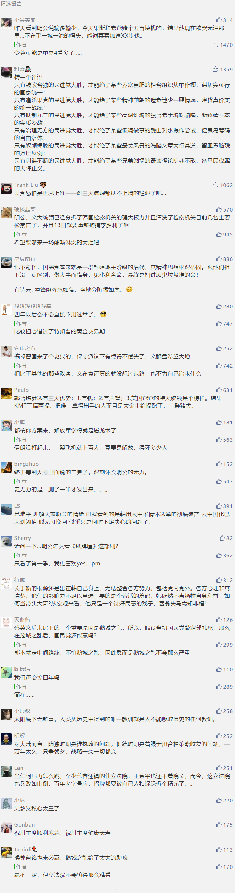

##正文

今晚，蔡英文不出意料的赢了韩国瑜，国民党主席吴敦义也在今晚带着副主席和一级主管们一起总辞职。

立委选举方面，民进党获46席，国民党获22席，其他党派获5席，其中韩国瑜执政的高雄市8个“立委”席次也全部由民进党拿下。

虽然自郭台铭弃选后，我就不对国民党抱希望，但真没想到这群扶不上墙的烂泥会在立法院也输的这么惨......

 

就像之前说的，民进党继续控制立法院的话，国民党的党产就彻底没希望解冻了，届时连工资都开不出来的这群老党棍们还能不能撑到下次选举，都要打个问号了。

所以，虽然从韩国瑜开始竞选，政事堂就撰文判定他输了，到竞选前几天也留言表示就是输多输少，看到今天很多读者留言祝贺我兑现了承诺，但是政事堂却一点都高兴不起来。

原因是我用了半年的时间，没想出来韩国瑜能怎么赢，也没想出来我们接下来应该怎么搞。

很多的老读者们会发现政事堂有一个习惯，对于分析国际政治上，对于跟我们没有巨大地缘利益的国家，政事堂往往喜欢是去做预测，而跟我们有着巨大利益的国家和地区，政事堂往往是喜欢去琢磨一些能够克敌制胜的方案。

譬如对于英国前段时间的大选，面对保守党民调的遥遥领先，政事堂提出让工党和自民党通过相互换票让约翰逊瘸腿，

譬如台湾地区选举刚开始的时候，政事堂希望郭台铭出面搞郭韩配可以压制菜。

甚至对于隔壁韩国，政事堂也希望进步派的文在寅能够揪着胜利案挑起民意，去压制韩国的保守派。

毕竟，英国创始加入亚投行，韩国的FTA和RCEP，两岸的产业链.......

但现实却是，这些方案都没有实施，工党和自民党搅的一塌糊涂让约翰逊轻松胜利，郭台铭和韩国瑜的内斗又让蔡英文赢得一塌糊涂，文在寅的胜利案遭遇了内部的掣肘，反而痛失一员大将曹国。

我都能想到的方案，那些政治家们不可能想不到，但是他们不去实施的原因是什么呢？

哎，这就是人性.....

希望四年之后，卷土重来未可知

##留言区
 

