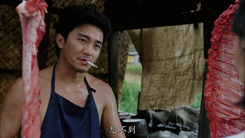
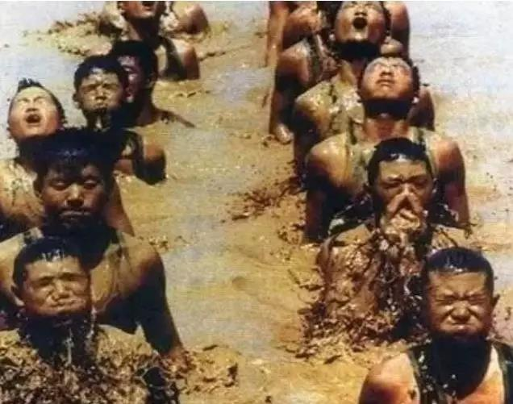
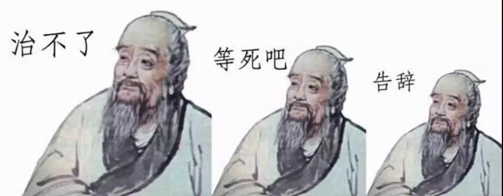

##正文

最近如果没啥大新闻，政事堂一般都会挑读者们关心的问题来写。

大上个周日，写了国家布局特斯拉产业链的逻辑，结果上周特斯拉概念股火了一周，上周日写了国家强推ETC产业背后的逻辑，结果今天ETC概念股又火的一塌糊涂.......

既然啥火我就写啥，那么今天就聊一下澳大利亚的那场大火。

 

最近澳大利亚这一场大火烧了四个月，火势却控制不住，因此很多人都开始纷纷替澳大利亚找原因。

 

对于救火，政事堂并不专业，不过却可以跟大家分享一则历史故事。

春秋时期，鲁国有人放火烧荒，结果不小心搞了个大新闻，眼看就要烧到国度，鲁国国君鼓励国民参与救火，但大家只愿意趁火去抓野兽，没人愿意救火。

这个时候孔子出来了，他告诉国君，火太大了，靠奖励掏空国库也是搞不定的，因此，孔子下令：

不救火的按照降叛变鲁国处理。

 

抓野兽的，按照挖鲁国墙角，薅国君羊毛处理。

 

结果，命令还没传遍全国，火就被扑灭了。

这个故事是真实的吗？

政事堂估计有假的可能，因为写这个故事的人，是主张法家的韩非子，他选用了一个儒家鼻祖来讲一个法家思想的故事，并不符合逻辑。

考虑当时韩非子的法家思想还并不被世人所接受，因此挂着孔夫子的羊头卖自家的狗肉，也是非常有可能的。

 

虽然韩非子故事未必是真的，但是逻辑却是对的。

中国自汉武帝用董仲舒改造儒家思想后，中国社会开启了两千年的外儒内法的政治模式，表面看起来是孔子的那一套，内核运作的逻辑却是韩非子的那一套。

就像后来冯梦龙在注解这一段的时候还讲了一个类似的故事，南宋有一次着火，歌舞升平的临安大家都不愿意救火，此时丞相下旨，火烧过来就对殿前指挥使问责。结果，负责救火的指挥使马上就带着军队拼命把火给灭了。

历史不能白学习，故事的背后都是人性。

我们对照一下，在大一统的中国，出现火灾或者其他重大自然灾害的时候，都是高级领导带领着人民子弟兵们舍生忘死的冲在第一线。

 

可是，在西方国家，救火就像封建制的鲁国国君希望掏钱解决那样，把他视作一笔买卖。

既然是买卖，那么就会归结为一本经济账，火势小预算大就能灭，火势大预算小就灭不了。

澳大利亚大火烧了三个多月还不动用军队的原因之一，是动调动军队灭火实在是太贵了.....

所以呢，那些替澳大利亚大火中数亿小动物悲伤的朋友真不必难过，澳大利亚不奋力救火的原因只有一个，那就是：

 

考虑到这次史无前例的大火，救火不仅要付出巨大经济代价，甚至还可能造成消防人员的伤亡，于是澳大利亚总理和分管的部长，坐着飞机出国度假去了......

反观在中国呢，只要一到火灾水患高发期，各级政府公务员就会被轮番派到河堤和林区，谁的责任区出了意外就直接问责，处理方式基本就是从上至下一撸到底。

看看近年来因为各种安全事故而被问责的省部级高官以及牺牲在救火现场的书记们，再对照一下澳大利亚的这场大火，就会发现咱们中国人在两千多年前，就把事儿想的明明白白。

 

按照中国的法家机制，各级肩负责任，效率是非常强劲的，就像当年孔子勒令救火，命令还没传遍全国，火就被扑灭了。

反观最近一年，从巴黎圣母院到巴西大火再到澳大利亚大火，没有直接的负责承担责任，就会导致星星之火得以燎原，结果就像《扁鹊见蔡桓公》，本来能治，但拖着拖着就积重难返了.....

 

澳洲这场大火相当于从上海烧到了广州，算一算得撸多少省委书记和部长就知道肯定这事儿肯定不可能发生在中国，因为在我们这个大一统的国家里面，对于很多自然灾害，责任机制就像扁鹊的大哥二哥治病那样，刚看到火苗就给按死了。

而正是有着这种责任机制，中国才能成为世界文明古国唯一幸存的那个。

因为肩负的责任与使命会驱使一群人逆向而行，在每一次中华遭遇危难之际，挽狂澜于既倒，扶大厦之将倾。

##留言区
 

