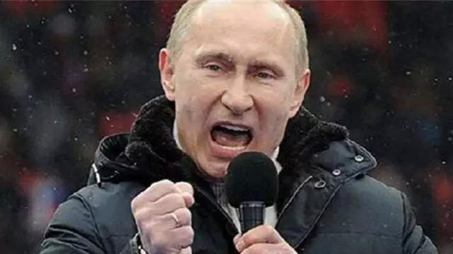
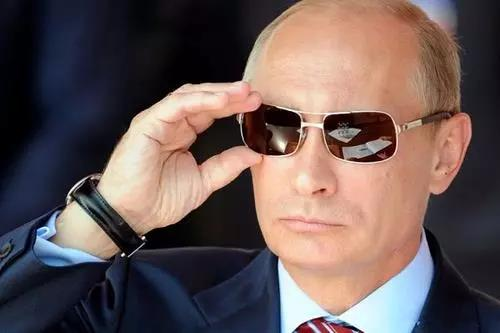

##正文

俄罗斯政坛大地震！这是俄罗斯国营电视台“今日俄罗斯”的头条新闻。

昨天，普京发表完国情咨文后，总理梅德韦杰夫宣布俄罗斯政府全体辞职，随后，普京任命米舒斯京担任俄政府总理。

 

1999年8月16日，叶利钦提名的普京被议会通过任命为总理，4个月后，叶利钦突然召见普京，对他说：请照顾好俄罗斯，随后，普京成为俄罗斯总统，举世震惊。

20年之后的今天，普京更换总理再一次震惊了世界，西方主流媒体纷纷将其列为头条，连特朗普弹劾案移交参议院也只能屈居第三。

一时之间，“后普京时代”成为了新闻标题，甚至新朋友米舒斯京还是老朋友梅德韦杰夫会接班也纷纷成为了坊间议论的焦点，甚至，还有很多人都在担心俄罗斯的政坛接下来会出现不稳。

 

不过，在政事堂看来，大家没什么要担心的，这次人事更迭之后，普京在俄罗斯是真的稳了。

因为人事任命其实都是浮云，真正重要的是制度的建设，

此次人事任命的背后，是俄罗斯修宪工作小组的第一次工会议会将于明天举行。

普京在昨天宣布了修宪的主要工作，其中有两点值得注意，其一是将组建政府确认总理和部长的权力逐步交给议会，其二是加强国家安全并将国家安全和军队的领导权完全授予总统。

这背后的原因不难理解。

随着美国页岩油革命，美国从最大的石油消费国变成了石油输出国，使得国际油价长期低位徘徊，而乌克兰危机后，俄罗斯的天然气出口更是遭受美国严厉的制裁。

能源出口额下滑导致经济过度依赖能源的俄罗斯出现了长期低迷，俄罗斯民众近年来纷纷表达出了对政府的强烈不满。

因此，总统普京就需要跟负责经济工作的总理梅德韦杰夫做切割了。

毕竟，全球都流传着一个俄罗斯秃头定律的笑话：

>列宁秃，斯大林不秃，赫鲁晓夫秃，勃列日涅夫不秃，安德罗波夫秃，契尔年科不秃，戈尔巴乔夫秃，叶利钦不秃，普京秃，梅德韦杰夫不秃，普京秃，梅德韦杰夫不秃，普京秃，梅德韦杰夫不秃……

普梅的“二人转”很容易被外界视为一体，批评梅德韦杰夫的时候很容易把矛盾引至普京。

因此，在未来经济看不到增长复苏的大背景之下，让总理梅德韦杰夫卸任对普京是一个很好的选择。

而且，随着米舒斯京为代表的新一届政府上台后，一方面，普京可以放手去推动一些梅德韦杰夫政府推不动的改革，另一方面，在经济领域普京又多了一个新的”能抗事儿“的重臣。

所以，在即将修订的宪法当中，总统更加专注于国家安全和军事，俄罗斯的对外强势会给普京不断加分。

 

而随着总理和政府的任命由总统改为了议会，那么经济的责任就变成了内阁总理一人的负责.....

 

而这个逻辑，在政事堂之前西游记系列中，也有过解读。

那么，此次普京给安全委员会增加权力可以理解，为什么又要给议会增加权力呢？

这其实还有更深远的布局。

普京将在2024年卸任俄罗斯总统，届时除非修改宪法，否则无法连任，因此，普京需要给2024年之后的俄罗斯设计政治架构。

目前，俄罗斯下院的第一大党是普京的统一俄罗斯党以及其下属的三个议员同盟。

 

不过，由于俄罗斯的权力集中在总统手里，所谓的第一大党几乎就是一个摆设，甚至在很多基层都没有党组织。

因此，普京的这一轮布局，在于若无法通过宪法增加总统任期，那么自己卸任总统之后，将出任统一俄罗斯党的党主席，正好可以通过被加强的议会继续施展自己的影响力。

 

因此，此次调整，正好使得总理、内阁、重要职务的任命权从过去的总统普京，转移到未来的议会第一大党的党主席普京。

因此，党建将是普京接下来的工作，而且，普京总统未来卸任后，多半还会通过俄联邦安全会议，继续对军队和安全部门施加影响。

当然，不要觉得普京设计的方案有多聪明，其实多看看历史就门清。

当年清朝的乾隆准备交接之前，提拔了主持财经工作的和珅作为内阁首席大学士，统领六部，因此，经济上所有的骂名都被和珅背着。

而且，与嘉庆交接后，乾隆又当了多年的太上皇，过程中继续用和珅等臣子来制衡嘉庆，维护自身的权力。

 

而这才是嘉靖后来没放过和珅的原因，并非什么坊间的”和珅跌倒，嘉庆吃饱“。

历史是一面很好的镜子，通过此次调整可以推测出，梅德韦杰夫和米舒斯京大概都不是普京心仪的人选，这位俄罗斯的政治强人未来的选择很可能出其不意。

所以呢，别信那些坊间谣传，别说今年了，即使2024年之后，普京对于俄罗斯的控制依然不会出现变化。

而可以预见的是，专注于执掌军事大权的普京，为了不断获取胜利，将在国际地缘博弈上，带领着俄罗斯更加积极主动的出击。

这也是混乱带给我们的阶梯.......

 

最后，昨天的文章收到了45000+的付费阅读，但收费的知识阅读并非政事堂的初心，我一直认为，应该把思维分析方式分享给更多的朋友。

因此郑重声明，此次付费阅读的收入，我会全部用于对贫困学生的资助。

##留言区
 

