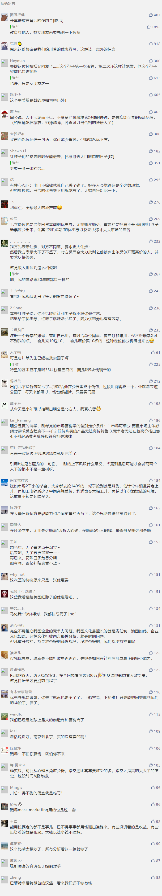

##正文

前两天网上流传了一个段子，京东发放了一批无门槛的优惠券，引来一批的羊毛党把京东给薅秃了，传言说京东把小家电部门给集体开除了。

很显然这都是吃瓜群众编排的段子，京东风控部门又不是傻子，优惠券的大规模使用必然会引发预警机制，不可能把家大业大的京东给薅秃了。

甚至退一万步说，按照网上传言最多的7000万数字，不过是某异父异母亲兄弟兼竞争对手百亿补贴的一个零头，京东就当一次事件营销其实也不错。

不过，优惠券的新闻突然让我有了兴趣，今天是喜庆的小年，就跟大家分享一下优惠券的设计机制和逻辑。

说起优惠券，他最重要的作用，通俗来说，就是将有钱人和没钱人区分开，分别赚取利润。

而从营销的角度来看，瑞幸的优惠券逻辑很简单，通过优惠券+遍地商铺的模式，试图将国内的咖啡消费从上到下一网打尽。

 

这就使得搞成本出身的人，很难理解搞营销出身设计出来的瑞幸咖啡，导致最近的一波涨势干掉了一大波的空头。

优惠券的机制，是先给你发一个1.8折的咖啡券，你消费了之后，他会再给你发一张2.8折的券。

当你不使用这张2.8折券的时候，过段时间，瑞幸又会送你一张1.8折的券。而如果你使用了这场2.8折的券，瑞幸之后就会再给你发3.8折的券，慢慢提升价格。

因为等劵是需要时间成本的，不同的人成本也不一样，因此，瑞幸通过优惠券的分发机制和大数据分析，把每个消费者贴上了1.8折、2.8折、3.8折、5折......的标签。

对于消费者来说，对价格不敏感的原价买也没关系，对于价格敏感的则会寻求瑞幸各种渠道释放出来的折扣券。

而对于瑞幸来说，咖啡这玩意哪有多少成本，1.8折卖也不亏本，因此，优惠券的本质，在于把不同消费能力的人群进行区分，对有钱的多赚，没钱的少赚。

毕竟，苍蝇腿也是肉，不放过任何一个消费者，只要他能够提供利润。

所以，发放优惠券的目的，是为了将客户进行区分，重点是那些对价格敏感，竞争力不足的红脖子群体。

看看每逢双十一，三大电商拼了老命的发券我们就会明白，我们用优惠券的方式，虽然赚不到大钱，但能把红脖子们成为我们的客户，离不开我们。

 

而优惠券的另一个影响，是从心理学的角度。

根据心理学，人类对于失去的感受往往要大幅高于得到的感受，丢一块钱带来的痛苦，至少需要获得四块钱才能弥补。

而这个数字跟贫富差距也有着直接的联系。

越是人在纽约刚下飞机的硅谷精英们，这个比值越小，越是红脖子啃麦当劳的绣带穷鬼们，这个比值越大。

而绣带工人们喜欢吃麦当劳的原因之一，就是麦当劳门口经常有促销员把优惠券塞到大家的手里。

很多手头并不富裕的大兄弟，看到柜台50块钱的套餐，用券只需要25的时候，再看着手里限时使用的优惠券，就会毫不犹豫的去购买。

毕竟，在他们的意识当中，觉得如果不用券，就会损失自己的25块钱。

而这损失25块钱的痛苦对于他们来说，需要赚远高于这个数字的钱才能弥补的。

所以，这群红脖子们被优惠券捆绑之下，成为了麦当劳最坚定的盟友，而也使得靠快消品的麦当劳能够畅销天下，成为全球最大的地产商......

 

这就是我们给优惠券背后的逻辑。

最后，祝政事堂的读者们小年快乐！

##留言区
 

