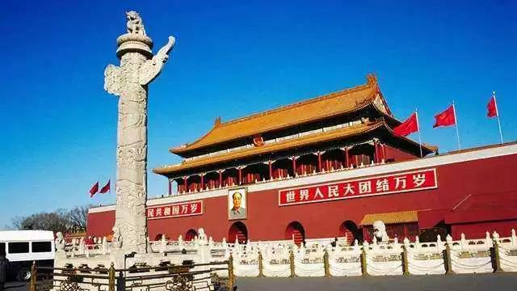
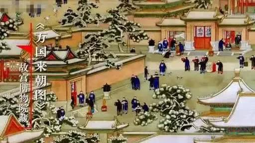

##正文

公元985年3月16日，汴梁皇城东华门外。

25名新科进士等待着他们的名字从皇宫内被一声声的传出来，再一个个步行进殿。

等待他们的，是宋太宗赵匡义，这位大宋皇帝喊着他们一个个的名字，拉着他们的手，赐予他们进士的功名与宅邸。

告别金銮殿后，进士们返回东华门张榜，并由顺天府尹给状元插花、披红绸，扶他骑上御赐的高头大马，纵马汴梁，让全京城的民众都能见识到“知识的力量”。

后世将这一套机制称为“金殿传胪”。

当然，这个荣耀不仅仅局限于汴梁城，进士们的录取通知书更是以“素绫为轴，贴以金花”，由当地父母官带队，一路敲敲打打的送到进士们的家里。

宋代金榜题名给予读书人带来的荣耀，远大于唐朝时的“春风得意马蹄疾，一日看尽长安花”，科举的成功给家门、乡里带来的荣耀，带动了宋朝人读书的热潮与文化的兴盛。

在这一场中国式文艺复兴之下，识字率的提升推动了生产力高速发展，让宋朝迅速拥有了远超于西方世界的财富与科技。

更重要的是，就像北宋重臣韩琦说的，“东华门外唱名者方为好男儿”，“金殿传胪”的政策导向如“千金马骨”一般，使得大量民众积极参与国家治理，彻底改变了北宋之前的门阀政治，真正实现了“旧时王谢堂前燕，飞入寻常百姓家”。

而这个改变，仅仅是赵匡义在皇城里的一个动作，引发的蝴蝶效应。

到了清明时代，皇城从汴梁迁到了北京，朝廷对于科举和教育的重视，让“金殿传胪”在“故宫”紫禁城被进一步加码。

 

午门共有五个门洞，正中的门，只有皇帝才能出入，皇后也只有在大婚入宫时，才可以走一次，文武大臣亲王贝勒们只能走两边的掖门。

而科举进士前三名的状元、榜眼、探花，却可以捧着黄榜沿着御道，走只有皇帝才能走的正门。

这种荣誉感驱使着无数的年轻人愿意寒窗苦读，不仅为朝廷带来了大量的优秀人才，也为社会提供了巨大的流动性。

这，就是故宫政策导向的力量。

所以，看看近年来教育系统的改革以及刚刚发布的一号文件，再看看故宫文创这两年突然的大火，就会明白，故宫这两年的转型成功，是踩在了历史的进程之上。

而反过来看，这次开车进故宫炫富事件造成的危害，不仅危害到了故宫文创体系的发展，也间接影响到了国家宏观政策的推行。

所以说，政事堂觉得这妹子还是自求多福吧，“男朋友”是否还会继续承认你，恐怕是个未知数了。

尤其是故宫本身既象征着文明的传承，也象征着天人感应之间的通道，这也是为啥故宫今年的天价年夜饭被网上骂成狗的。

因为故宫前面的天安门上，挂了一个画像，他告诉了全体中国人，人民万岁。

 

嗯，这还不算完，妹子还惹了第三个问题，这个更无解。

因为，故宫紫禁城另一个重要的功能，是大国的外交和理藩。

 

无论是番邦的首脑还是外国的使节，他们进故宫的时候，要穿过幽暗的天安门门洞，午门广场的两侧的朝房，使得通往太和殿的道路显得更加狭长。

而从午门侧门入宫后，眼前豁然开朗，穿越太和门一侧，他们将忽然看到一片极度开阔的广场，广场尽头是高高在上，金壁辉煌的太和殿。

嗯，就是妹子拍照片的那个地方。

这个参观动线，是被精心设计过的，所引发的心理活动，将使得这些番邦的首脑们内心深处，都会不由得产生对中华文明的憧憬与敬畏。

 

 

这可不是拿钱能够衡量的，所以，禁止把车开进故宫可不仅是为了保护古董，还肩负着在国际上结交好朋友的重任。

要知道终明一朝，根本不允许骑马或者坐轿进入紫禁城，而马背上出身的清朝，虽然允许极少数亲王重臣骑马进紫禁城，但很快也改成只能象征性的骑着马进来，然后把宝马停在“停车场”而已。

而这自然是有意义的，因为要把礼遇送给更有价值的人。

1778年，乾隆帝为庆贺自己的70大寿，邀请六世班禅进京，在紫禁城保和殿设宴，特许班禅乘轿。

大家可以想象一下几个月前的画面，袁隆平被抬进人民大会堂，有多少袁老的粉丝和徒弟看到这一幕是热泪盈眶，我们就会明白，班禅带来团队当时激动的心情。

 

历史也证明了这一点，六世班禅和他的徒弟们面对英国东印度公司对西藏的步步蚕食，一直都在坚持西藏是中国神圣而不可分割的领土，捍卫了我们国家的主权。

考虑到我们未来还有很多统战工作，妹子就这么把车开进来，搞的天下皆知，就是在毁这个价值。

所以呢，逻辑都清楚了，就知道这个妹子捅了一个多大的篓子了，以至于政事堂都没想抨击她，只是觉得有点可怜。

因为得到后再失去，才是最痛苦的.....

##留言区
 

