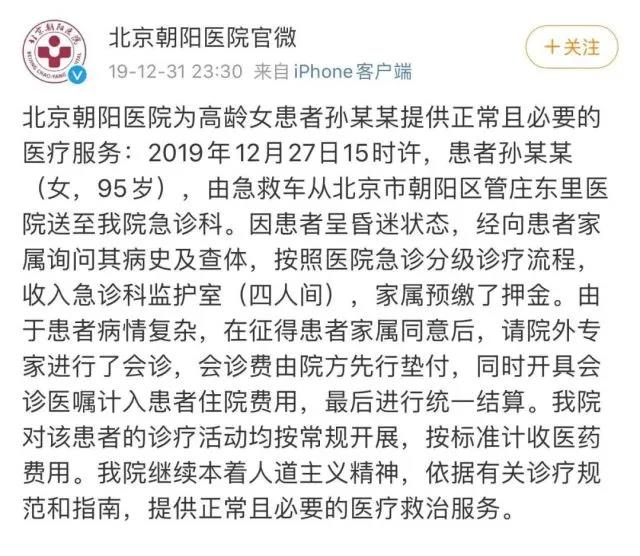

##正文

今天凌晨，武汉卫健委发布消息，新型冠状病毒感染病例198例，死亡3例。国家卫健委也表示，近日已陆续向全国各省派出工作组，指导做好疫情防控相关工作。

此时距离除夕夜仅剩四天，全国各大医院陆续发布防控方案，组织全员培训。

而全国无数的医务工作者们，也纷纷把孩子丢在家里，在医院加班待岗过春节，以迎接这一场为了全国人民必须打赢的战役。

 

就在这些全副武装的英雄跟病毒展开决战之际，北京朝阳医院却爆发了一则骇人听闻的恶性伤人事件。

今天下午两点左右，一名男子在医院眼科门诊，向正在工作的眼科主任医师陶勇挥刀，陶医生身中数刀后被紧急抢救。

 

陶勇医生，是国内医学界的青年翘楚，从德国留学归来的他，年仅35岁已经是博导、863首席科学家，迄今为止，他发表了90多篇SCI，主持的国际科研基金就有4个。

近五年来，陶勇医生的高分子材料成功显著，先后获得了欧洲糖尿病协会、欧洲糖尿病协会、霍英东教育基金会等给予的数百万项目科研经费支持，是中国葡萄球膜炎研究的大牛。

 

而且，陶勇医生不仅擅长科研和教学，在第一线奋战的他迄今已完成上万例的手术，其中，为贫困患者实施免费白内障复明手术就超过两千例。

 

而他这次遇害，也是以主任医师的身份，在门诊接待患者。

可是，就这么一双仁心妙手，竟然今天就这么被砍了。以后，他很可能没办法再上手术台，施展他的妙手回春之术。

 

苍天有眼，陶大夫逃过一劫。

可是，这几刀下去，将一个863首席科学家砍下了手术台，也断绝了未来上万名贫困患者接受免费白内障复明的机会。

更令人愤怒的是，这几刀不仅捅向了陶大夫，更是对春节期间，对那些奋战在抗击新型病毒一线的英雄们背后恶狠狠捅了几刀。

而这，已经是一个月内又一次针对医生的恶性刑事犯罪了，上个月，民航总医院杨文医生的惨案还历历在目。

而这一次陶勇医生一只脚踏进了鬼门关，某种角度上来说，也是北京的医疗系统和朝阳医院的某些领导依然秉承着和稀泥的老思路。

虽然凶手被绳之以法，就是此次出事儿的朝阳医院，在把上个月却杀害杨文医生凶手母亲的接过来，不仅垫付了院外专家会诊的费用，还住进了日费万金的ICU。

把一个本应人人喊打的过街老鼠，摇身一变捧为了VVIP。

 

 

虽然院方说是最后统一结算，但傻子都知道ICU的这笔天价治疗费用会是谁来买单。

某些结构花着全国纳税人的钱，养着杀人凶手母亲的这种行为，必然会鼓励着更多不怕死的人，通过杀害医生把事情闹大为家人获取免费的医疗服务。

所以，全国那么多医院，2020年的第一起恶性伤人事件发生在朝阳医院也并非偶然。

虽然新闻没报，但政事堂猜测，这位凶手后面多半也有一位亲人，等着朝阳医院继续提供的免费治疗和VVIP服务。而朝阳医院和相关机构按照惯例也会选择继续息事宁人，压着医生们不进行民事起诉。

这是让政事堂非常愤怒的，再这么和稀泥，继续向凶手的家属提供免费的VVIP服务，并阻止医生的民事赔偿诉讼，就会导致未来类似的刑事案件层出不穷，更多的医生倒在血泊之中。

 

对患者来说，什么是绝望？

绝望是面对死神时的无能为力。

如今层出不穷的病毒就像曾经北方无穷无尽的游牧民族，而医生，就是横在我们和死神之间最后的一道万里长城。

目前部分机构默许医闹，容忍伤害医生的行为，就是在自毁长城。

一而再再而三的安全事件与院领导的和稀泥，只会让大量公立医院的医生以及未来准备投身于医疗事业的年轻人因为看不到希望而绝望。

 

绝望之后，就会选择放弃。

毕竟，陶勇三十来岁就成为博导、主任医师、863首席科学家，是无数医生一生都无法企及的目标，而对凶手的纵容，会让无数有志于成为陶勇的年轻人绝望后，放弃从医这条路。

医生少了，到时候又有谁来当这抵抗病魔的万里长城呢？

那时候，才叫真的绝望。

其实，解决医闹方案并不复杂，就像当年孔子鲁国救火的逻辑，**一方面，刑事上面交检察院公诉严惩，另一方面，民事上罚得罪犯倾家荡产卖房卖车。**

因为在中国，将犯罪成本大幅提升，只要远超于收益之后，能够杜绝绝大部分的犯罪，尤其是把犯罪的患病亲属打成过街老鼠，几乎就可以杜绝此类情况的发生。

虽然不太道德，但我们不能让英雄们流血又流泪。

这些抗击病魔的战士，就像中国自古以来的那些万里长城那样，敌人很难战胜的他们，却总是倒在背后自己人的屠刀之下。

纵容这把刀，的确能保住不少人的乌纱帽，可是纵容杀害岳飞凶手的南宋，蒙元大军杀来时，就没有多少人愿意再去做岳飞挽天将倾；纵容杀害于谦凶手的大明，满清入关时，也没有多少人愿意再去学于谦奋死一战。

这一次武汉突发的新型病毒，还有全国百万公立医院的医务工作者枕戈待旦，可是下一次呢？

未来医生们都去了待遇优厚安全保障的私立医院，有谁会赚不到钱还冒着生命危险奋战在抗击病毒的第一线呢？

 

秦人不暇自哀，而后人哀之；后人哀之而不鉴之，亦使后人而复哀后人也。

保护英雄，就是保护我们自己！

##留言区
 

