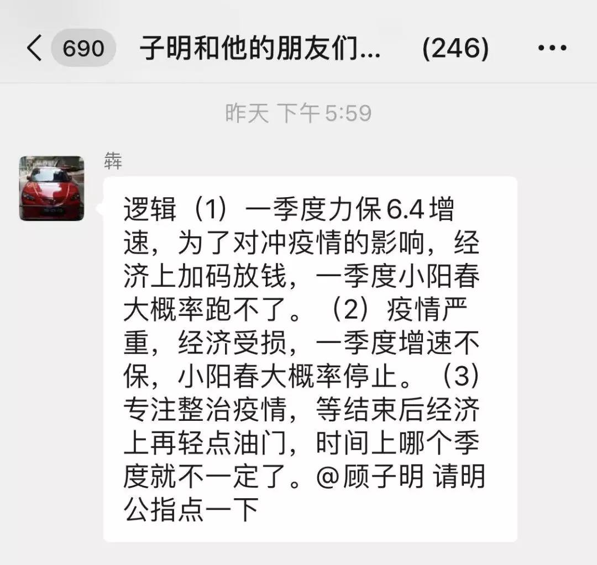

##正文

昨天晚间，政事堂遭遇了一个群友的灵魂拷问，之前政事堂言之凿凿的“一季度小阳春”，是否还会出现？

甚至还有朋友给出了“上中下三策”式的可能。

 

昨晚，这个问题一时之间也把我问住了，原因很简单，政事堂一切国内预测都是基于政策逻辑而非市场逻辑，而冠状病毒影响的是市场信心，这使得我昨天提笔写了两句之后，后面却犹豫不决。

说起2020年一季度小阳春的逻辑，想来政事堂在2019年年初的时候就通过系列文章解读过了，前段时间相关的文章中，也有不少读者在留言区给出了自己的解读。

 

在政事堂看来，简而言之，对于我们来说，2020年有可能是考核GDP增速的最后一年，从建党百年的2021年开始，观测指标很可能将转变为高质量的经济发展。

因此，和2019年时政事堂分析的逻辑是类似的，一方面，财政投资将倾向于新基建，接下来开始的新经济转型奠定基础，另一方面，本年度财政的弹药会在一季度集中打出，货币政策则给予相应的支持，以实现全年增速的惯性。

而今年年前资本市场最直接的反应，就是随着2020年地方专项债开始集中发售和央行在春节前的降准和逆回购，专项债和银行间利率直线下降。

好了，再回到一季度小阳春的问题。

此次小阳春的逻辑是政府投资而非民众消费，而此次病毒影响的是民众消费而非政府投资。

两者的根本逻辑是不同的。

因此可以预见的是，在政府主导的投资领域并不会因为病毒影响而减弱，一季度小阳春的大逻辑并没有发生变化。

但是，投资与消费的传导链可能会出现变化，去年是通过投资传导至消费，在信心和资金面的双驱动下，出现了一季度股市房市的双火爆。

但是，这个逻辑在2020年出现了变化。

从政策的角度来看，为了对冲经济影响，政府必然会加速推动财政政策的落地，导致投资进一步提速。

从市场的角度来看，一季度消费的信心不足会使得消费市场的萎缩，导致巨额投资无法传导至消费，只能再返回到投资。

因此，政事堂推测，今年一季度的资本市场分化会更加剧烈，政府青睐的新基建类投资可能会进一步加大规模，在这波小阳春中一枝独秀。

而在房地产领域，原本应该出现的房产销售火爆而土地交易冷清的局面，也可能会出现变化，销售出货可能不如预期，而土地市场却可能回暖。

至于今年下半年，则可能出现普遍的投资力度后劲不足，而一季度甚至上半年被遏制的消费出现报复性的增长，部分产业结构好的准一线城市可能会出现19年年底深圳房价的一波小涨幅。

也许，这可能是这一场病毒对资本市场的影响吧。

##留言区
 

