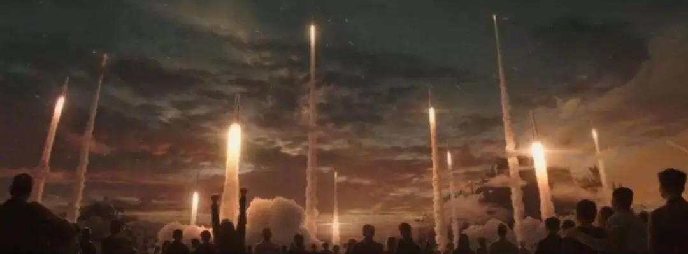
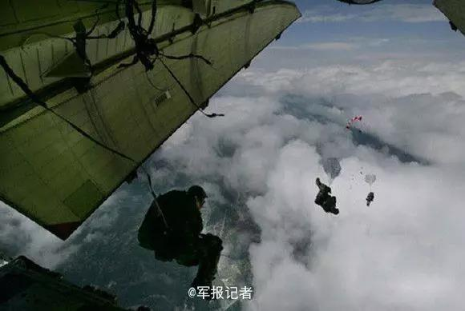

##正文

今天，随着武汉的“封城”，春节档电影的集体“下线”，再加上SARS著名流感研究专家管轶发布了一系列骇人惊闻言论，一时之间谣言四起，越来越多的人加入到造谣的行列，我大A股也跟着来了一波恐慌式的下跌。

 

由于上次SARS的时候都没有“封城”，这次直接将九省通衢的武汉“封了”，的确容易引发一些人的想象。

不过，在政事堂看来，这反而意味着在政府大力度的动作之下，这次病毒的控制，很可能会比目前预期好不少。

记得去年春节档创下记录的电影《流浪星球》里面有一个词比较火，叫做“饱和式救援”。

 

主人公团队奉命救援杭州发动机的时候，除了他们之外，我们一共派出了15只精英小队，一路遭遇到了巨大的牺牲。

虽然主人公团队失败了，但是杭州的发动机最终还是被其他团队给启动了，也就是说，主人公小队一路上中所有的牺牲都白费了。

的确，流浪地球里面中国饱和式的救援，毋庸置疑是对资源的巨大浪费，甚至也非常的冷酷，譬如主人公小队在经过上海的时候，收到其他小队的救援信号，但还是放弃救援而继续前进。

不要以为这很残酷，现实中我们也是习惯了不计成本的饱和式救援。

记得2008年的汶川地震，我们三天之内动员了来自五个军区、涉及20多个兵种的十余万部队投入到救援当中。

当时，汶川已经完全跟外界失去联系，城市沦为一座孤岛，我们也是地面上各路部队分头挺进，天空中解放军各兵种、民航、海事等各机构的直升机四面汇聚。

最后，愣是靠上百家直升机在打通了一条空中生命通道，承担起了物资运输和人员的转移工作。

而且，为了第一时间与灾区建立联系，我空降部队15名敢死队员携带专业设备在，无气象资料、无地面指挥、无地面标识的情况下，实施了首次5000米高度。

在跳之前，15勇士连遗嘱都事先写好了。

 

 此外，全国的消防系统、医疗系统、铁路系统、通讯系统等相关机构全部第一时间进入到战备时间，不惜代价不计成本的参与到救灾，这使得中国政府为汶川灾民动员的规模远远大于汶川的灾民数量。

因此，08年汶川救援背后的成功，也是一次不计成本的饱和式救援，和98年我们举全国之力抗击洪水的逻辑是一致的。

不要奇怪，用饱和式的救援来解决问题，是中国政府在面对危机时的一贯方式，是刻在我们文化基因里面的。

自秦始皇统一六国之后，无论是面对北方的游牧民族还是时常泛滥的黄河这些灾难，我们大一统的中央政府都会选择饱和式的救援来应对。

这背后，是历史无数次的告诉了我们，我们的优势在于庞大的人口和强大的国力，只要我们不被灾难迅速击倒，那么很快我们就能凭借国力反推。

所以，面对黄河，我们筑堤坝，面对游牧民族，我们驻长城，我们不计成本搞出来隔离的防御网，目的只有一个，那就是防止危机短时间内的爆发出现不可控的情况，导致我们庞大的国家出现应对不及时。

因此，我们的中央政府在应对紧急事件的过程中，往往会用力过猛，付出较多的代价，但是，这种付出使得我们很难遭遇到像还在烧着的澳洲大火那样不可逆转的灾难。

而这也是四大文明古国为何最终只剩下了中国。

所以，面对病毒，就像当年教员教育我们的，战略上藐视对手，不用担心其广泛影响经济，但战术上要重视对手，大家一起配合政府将病毒隔离开。

我们的经济体量已经是03年的7倍有余，各方面的力量已经远比当年强大，因此病毒带来的影响也会远低于2003年。

每临大事有静气，不信今时无古贤。

##留言区
 

