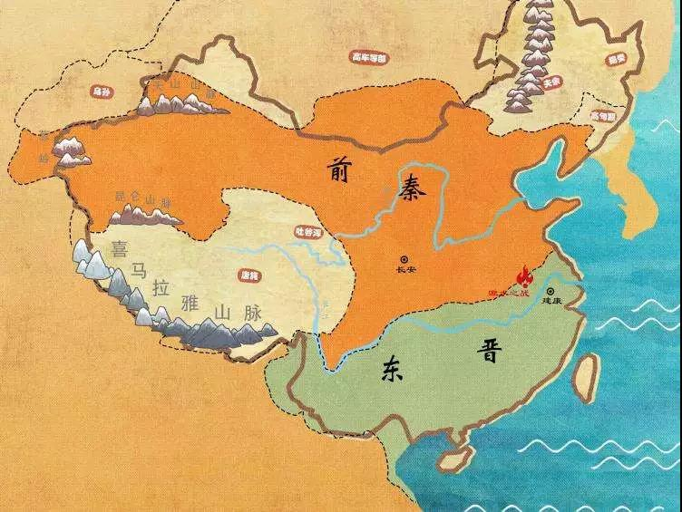
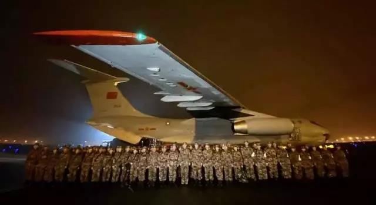

##正文

这两天，关于武汉病毒的谣言铺天盖地，甚至今天还看到大量污蔑武汉患者的。因此，写一篇关于谣言的文章，希望政事堂的读者们能够明白谣言的散播带来的危害。

公元383年，中国古代史上规模最大的一场战役“淝水之战”爆发，前秦苻坚以“拥众百万，资杖如山”的兵力和“投鞭于江，足断其流”的军威，挥师南征东晋，希望凭借着绝对碾压的势力，一举底定江山。

 

可就在双方主力决战，秦军主力开始调动之际，东晋潜伏在秦军内的士兵们突然大喊，“前线的秦军败了！”，导致秦军阵脚大乱，看到山上的草木以为都是晋军，听到风声与飞鹤的鸣叫，以为都是追兵。

结果，这支一度横扫中国的百万大军，在“风声鹤唳草木皆兵”之下崩溃，死在晋军手上的人没多少，反而大部分都死在自己人的乱军践踏之下。

这并非偶然，回顾历史，拥有十倍以上绝对碾压实力的一方，想要输，唯一的可能，就是有内鬼在内部制造恐慌，导致出现践踏式的溃败。

从韩信在赵军大营插汉旗后打赢的井陉背水之战，到许攸帮曹操点燃乌巢引发骚乱后打赢的官渡之战，亦或者黄盖帮周瑜点火搞乱曹军后打赢的赤壁之战。

大逆转的关键，都是那些成功造谣的内鬼。

 

而如今，我们对武汉病毒的包围战也正处于大决战的关键时刻。

因为农历春节，不仅有着全球最大的人口流动，更为关键的是，从治疗病患的医院工作人员，到运输资源的物流系统，再到生产防护器材的厂商，全部都放假了。

可以说，就像很多病毒的患者一样，中国目前处于全年最虚弱的时刻，一贯产能溢出的中国，竟然短期内出现了供应不足的局面，在武汉，从医生护士到各项医疗物资都非常紧张。

可我们再看这两天，市面上的主要流言，要么是说虚构武汉病毒肆虐的惨状，要么是虚构武汉患者对医生动手。

大家可以想一下这些流言试图达成的结果。

虚构的肆虐惨状会导致原本短期内的物资供应不足迅速激化，由于全国短期内的库存物资就那么点，各地的挤兑导致主战场武汉弹药紧缺，并严重干扰本来就很脆弱的武汉物流系统。

而虚构的武汉患者对医生动手，则会打击全国数十支正在召集支援武汉的医疗团队的士气。

我想，很多人转发谣言的初心是好的，可是结果，却让本来已经超负荷运作的武汉医疗系统更加崩溃，各大医院需要紧急物资的内容反而被掩盖。

而更令人愤怒的是，这一波谣言的散播，正好的到了关键的时间点，随着中央政府战争机器的启动，这场面对病毒大决战就要拉开了。

很快，在中央要求下，已经恢复生产的物资会从全国源源不断涌入武汉，从军队到地方的医疗团队也会纷纷飞抵武汉。

那些除夕夜空降武汉的“中央军”们，会逐步接替那些已经超负荷运转多日的武汉医疗团队。

 

可是，军队换防的时候，往往就是最危险的时刻。

此时散播谣言的人，就像淝水之战，秦军主力正在做调动时，内部突然高呼“前线秦军败了”的人。

而全国蔓延的谣言，则有可能对正处于最脆弱时刻的武汉造成致命的伤害。

而目前，这一场病毒包围战的关键，就是把病毒集中在武汉进行围剿，切断向全国扩散的通道，凭借着中央饱和式的资源，一举打赢这一战。

如果最终丢了武汉，那么蔓延向全国的病毒所造成的危害将无法想象。

因此，无论是全国人民还是武汉的医疗团队，重点就是撑住中央军换防的这几天，只要在春节假期内稳住了大本营武汉，那么接下来就是全国对零散的小股病毒进行围剿。

所以，为了避免淝水之战式的惨败，大家这几天看到那些“震惊”类的谣言时，先想一想，再决定是否转发。这几天是我们中央军空降换防的关键时刻，也是我们最后可能出现危机的时刻。

等到中央军的BMG正式吹响，那么这一战就真的稳了。

 

而且，大家可以试想一下，那些制造流言的人，他们的初衷就是要制造混乱，毕竟，混乱才是最好的阶梯。

就像很多朋友都对金庸小说天龙八部里面慕容博制造谣言挑拨宋辽开战嗤之以鼻，觉得毫无成功可言，可是历史上，慕容博的祖先慕容垂就是利用淝水之战后践踏式的混乱复国成功，夺去了山东的青、兖、徐诸州，成立了后燕。

 

所以，慕容博不惜装死退出江湖，也要挑拨宋辽开战，甚至为了让大辽南院大王萧峰南下攻宋，也不惜在绝对优势的情况下，牺牲自己让萧峰父子报仇。
 
 

同样，目前那些编撰谣言的，要么是囤货居奇发国难财的，那么是吸眼球赚取流量啃人血馒头的。

真正有能力的，都已经在出线出力向灾区调集人力和物资。真正发现问题的，国务院和中纪委都公布了举报和征集的方式，完全可以有更高效的方式与中央建立起联系，成为国家和民族的功臣，名扬青史。

这几天，武汉数千名医生数万名后勤人员不眠不休的奋战在一线，数十支各地的医疗救援队也都放弃春节假期纷纷加入到这一场病毒的围歼战中。

我们在大后方，虽然上不了战场，但是不造谣不传谣，不囤积不浪费物资，保护好自己和家人，就是对那些奋战在一线的英雄们最大的支持。

##留言区
 

