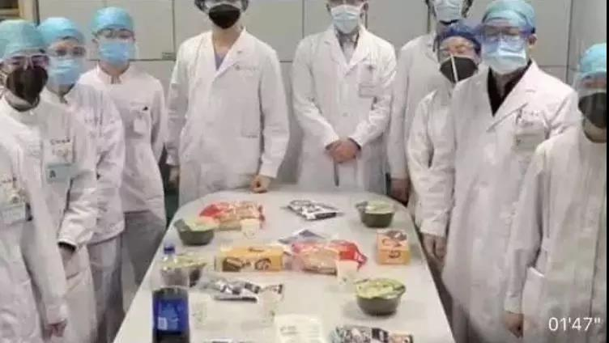

##正文

最近，很多自媒体甚至一些有公信力的媒体都在散播谣言，这些高考数学可能都不及格的传媒人，在通过武汉各大医院的床铺紧张，以及物资紧张，反推出武汉的实际患病人数远大于公开报道。

这类的谣言乍一看，的确很有道理，也让很多百姓相信政府在瞒报数据，实际的患病人数远大于公布的。

但是，他们并没有考虑到每到冬天，同样也是感冒等高发季节。

根据中国疾病预防控制局数据，2019年1-8月中国流行性感冒发病数为205万例。

把全国的205万平摊到武汉这种千万人口规模的大型城市，可以估算出，武汉今年早春正常去医院看病的流感群体就有上万人。

而根据中国全科医学杂志给出的发病率数据，算上那些感冒了选择在家里吃药的群体，武汉一个城市早春感冒的群体，再怎么保守的估计，也是十万级。

 

好了，谣言一起，恐慌就来了。

 

就像银行出现挤兑，股市出现股灾，P2P出现暴雷，陷入群体性的惶恐之下，大家只要感觉自己体温有点上升，就会急急忙忙去医院。

虽然武汉这种省会城市有十多家的三甲医院，可依然所有的医院都在爆满。大家可以想象一下，数百人同时涌入一个发热门诊是一个什么样的状态，从连量体温、抽血到拍CT，每个环节都要排上百人。

这么多人，很多都被谣言吓得半死，排队的过程中可能引发的焦虑和冲突就不说了，最可怕的，有的人本就是普通感冒发个热，结果保护措施不得，反而可能在数百人拥挤的排队过程中不慎被感染了。

所以，想一想为什么原本物资充沛的医院突然会出现物资紧张，为什么武汉各大医院都在向全国求援？

因为不仅医护人员需要防护，那些每天在发热门诊排队的患者们更是真正的消耗物资的大户。

毕竟，当大家一打开微信，看到群里面发布的都是恐慌，没病也想走两步去医院看看。

而几天内数以万计的人涌向十几个医院的发热门诊，必然会导致有的医院大夫们只能吃泡面以节约时间，甚至年轻的医护人员崩溃哭了也是常态。
 
 

手机和电脑负荷过大了尚且会崩溃，短时间内大量的被流言搞得恐慌了的市民疯狂涌入医院，别说医护人员了，整个武汉的医疗体系都在崩溃的边缘。

谣言导致了恐慌，恐慌导致了医患供求不平衡。

在这种不平衡之下，大夫身心疲惫，身处病毒环境之下，他们反而是最容易患病的群体，而他们的倒下只会进一步压缩武汉的医疗供给能力。

同样，不平衡导致了需要在门诊排队数个小时的市民，在恐慌之下则会想尽办法逃离武汉去其他城市问诊，导致病毒可能的外泄。

中央和各省花了那么大的成本控制武汉的进出，就是希望能够在接下来通过饱和式的打击，在武汉将病毒围剿。

目前，中央军的先部队已经抵达武汉了，各地的援军也在纷纷抵达，决定能否控制病毒范围的大决战，就在这几天。

希望大家能够管好自己的手，不要转发那些谣言，不要去做雪崩时的那朵雪花，有余力的，看到朋友圈和群里有发布谣言，想办法去说服和阻止。

因为我们每一次用手指轻点转发的谣言，都可能会让那些除夕夜仍跟病毒奋战在一线的战士们付出鲜血甚至是生命的代价。

##留言区
 

