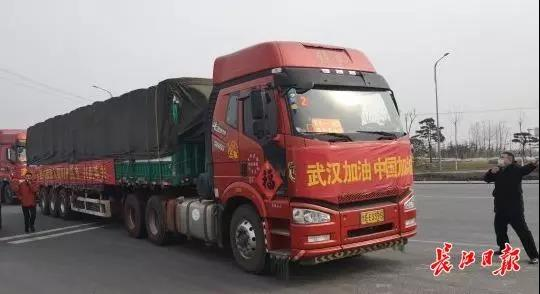

##正文

2018年8月24日凌晨，中国铁路武汉局吴家山、卫家店两个车站接力开出一列救灾专列，日夜兼程赶往山东青州市火车站。

车上装载了3000顶帐篷，15000床棉被以及20套场地照明灯，目的地，是中国的蔬菜之乡，山东寿光。

就在几天前，寿光遭遇了自1974年以来的最大洪峰，交通刚刚被抢修恢复后，这列来自武汉的救灾火车就披星戴月的飞奔而去。

洪水无情人有情，武汉以及全国各地的同胞们，纷纷伸出援手帮助寿光灾区重建，共抗天灾。

 

寿光重建的15个月之后。

2020年1月28日凌晨12时许，正是山东“初三回娘家”的时候，寿光市孙家集街道三元朱村灯火通明，街道办正召开紧急会议，安排村民连夜采摘新鲜蔬菜。

随后，孙家集街道的菜农们纷纷回家，把刚走完亲戚累了一天的老人和孩子们也从睡梦中叫醒，连夜采摘新鲜蔬菜。

 

孙家集街道，只是这场夜间战役的一个缩影。

6个小时后，早上7点30分许，在寿光市各个街道门前，350吨的黄瓜、西红柿、茄子、青椒等新鲜蔬菜从田间连夜一颗颗的被摘出来，村民们一箱箱的往大货车上搬运。

这就是中国速度。

距离各街道开会通知村民采摘仅过去了12个小时，在308国道与羊田路交叉路口，14辆大货车装满350吨蔬菜，驶向武汉！

 

“武汉加油，中国加油”

20余名司机换人不停车，以千里加急的速度奔向武汉，将350万吨蔬菜无偿捐助给为了全国人民把自己封锁在城内的武汉人民。

相比于那些只能打嘴炮的网友，齐鲁大地的山东人更愿意去践行孟子说的那句，义之所在，虽千万人吾往矣。

不过，这350吨的蔬菜却在今天引发了广泛的争议。

早上，一则“山东寿光援助武汉350吨蔬菜，武汉市红十字通过超市低价售卖”的消息被广为流传，网友们纷纷开启了对红十字会的花式吐槽。

对此，武汉红十字会声明称，截止1月30日12时，武汉市红十字会从未接收任何单位、任何个人捐赠的“寿光蔬菜”，更没有参与该批蔬菜的分配、售卖。

虽然政事堂也不怎么喜欢红十字会，不过当我看到新闻后的，第一反应，就是幸好接收的不是红十字会。

湖北红会和武汉红会各自也就十来个人，能把全国陆续雪片版的捐赠账，算得差不多就已经谢天谢地了，让他们去处理捐赠蔬菜这么细节的问题，完全就是在跟和尚借梳子，强人所难，搞不好要烂掉一大半。

但是，被网友们抨击的武汉低价售卖蔬菜的行为，政事堂反而这一波武汉做的很漂亮。

因为目前武汉的问题，是钱和需求太多了，物资太少了。

在市场经济的供不应求之下，必然会导致价格上涨。而部分有心人必然会想办法囤货居奇，来发一波国难财。

看一下中国市场化率最高的上海，最近部分商超白菜都涨到了天价，就会明白前几天说的，随着国家队的出手，我们正在逐步从抗击病毒的战役，转向了经济战场，需要让老百姓能够买到平价的商品，来降低病毒带来经济领域的恐慌。

因此，很多网友们给出的建议，如把寿光的蔬菜直接捐给困难群众或者免费发放，其实并不具备可行性，甚至会引发巨大的混乱。

想一想那些卖保健品的骗子用一斤鸡蛋就能让中国数千万的老头老太太排着队的乖乖去被割韭菜，就会知道，免费发放只会引发巨大的混乱，混乱的长队以及年迈的老人们，反而会成为病毒最佳的传播场所。

同样，如果是免费发放给困难群众，那么发给谁的决策权将会非常的不透明，很难真的确保捐助的蔬菜真正的流入到需要的人手里，反而会导致大量的浪费。

武汉目前缺的不是钱，甚至也不是物资，武汉真正需要的是信心，有了信心，民众就不会因为恐慌而挤兑式的采购，囤货居奇的商家们也不敢趁乱去发国难财。

对比当年陈云打赢上海金融包围战，靠的就是大张旗鼓的从山东和山东移民的东北调运物资，通过一列一列插着红旗的火车开进上海，不仅缓解了上海市民的恐慌，避免成为金融炒家的帮凶，也打爆了炒家们的信心，他们纷纷抛售手头囤积的物资，让上海的物价迅速被平复。

同样，如今山东寿光的蔬菜，也将在武汉的物价包围战中起到关键性的信心作用，在中国蔬菜之乡开足马力的饱和式运输之下，坚持在武汉几百吨低于市场价格在国营商超销售蔬菜，能够迅速平复民众对于物价的信心。

只要中央政府摆出了一副“饱和式卖菜”的态势，中央通过山东的转移支付，摆出寿光的廉价菜源源不断的奔向武汉的态势，就能在武汉遏制住菜价的上涨。

毕竟，蔬菜是没办法长期保存的，这样我们不仅能让囤货居奇都会砸在手里后，就没有人再敢当空头，还能通过蔬菜领域延伸到其他领域，遏制住疫情带来的涨价潮，进一步平复市民的信心，最终形成经济的良性循环。

所以，媒体不应该盯着红会的问题，而要大张旗鼓的宣传寿光的蔬菜，所谓千金马骨，鼓励其他消费领域的龙头们为了品牌形象，一边大张旗鼓的援助灾区，一边开足马力生产以平复物价，解决疫情之后的经济风波。

最后，政事堂的小建议，寿光蔬菜的钱是山东省政府出的，卖出的钱理应进入湖北省财政，而不是已经超负荷运转的红会，这样不仅财物的支出更透明，也能普惠到更多为了控制疫情主动选择禁足家中的湖北同胞。

同样，也只有这样，才能对得起那些老人孩子齐上阵，披星戴月为支援武汉摘蔬菜的山东兄弟。

 

##留言区
 

