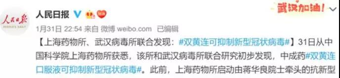

##正文

昨天深夜，人民日报用一则微博，体现出了他才是中国的带货一哥。

 

新闻发出没多久，蹲在家里不出门的网友们，连夜将各大电商的双黄连库存一扫而空，大半夜的各大24小时营业的药店门口，顶着冬季的寒风大家带着口罩排起了长队。

 

甚至干杯双黄连，也取代了茅台，成为了土豪们的秀场。

 

不过很快，双黄连治疫病便瞬间遭遇了半个中国医学界的集体打脸，今天一整天，网上到处都是调侃双黄连的段子，一度把红会的风头都抢了去。

对于双黄连究竟能不能抑制病毒疫病，这不是政事堂的专业，而跟着自媒体们骂中药赚流量，政事堂也下不去手。

这是因为，这么多天来，看到双黄连能够抑制病毒的新闻后，政事堂终于看到了媒体开始为武汉的疫情做正面贡献，非常的欣慰。

随着几天前各路援军纷纷抵达湖北，武汉紧张的医护资源得以缓解，夜以继日的英雄们，终于可以轮班了。

但是，武汉紧张的医护用品却依然极度紧张，很多与病毒奋战在第一线的大夫们，不仅要自制防护用品，甚至还冒着感染的风险能将一次性的口罩重复使用。

接下来，随着节后的复工，口罩等物资的需求将会激增，届时不排除出现挤兑与囤货居奇，使得一线医护用品继续紧张。

没办法，一方面是疫情带来的恐慌，促使民众会为了自身的安全进行“饱和式”的囤积，另一方面，在供过于求的情况下，这些口罩自然会涨价，也会促使大家把医护物资当做硬通货储存。

因此，市面上的恐慌以及口罩供应的不足，将会促使民众不断的购入和囤积口罩，导致的结果，往往就是疫病的第一线反而物资极度紧张。

所以，回过头再来看这一波双黄连的抢购潮。

首先，人类对于恐慌，最需要的不是药，而是安慰剂，就像脑白金和鸿茅药酒，你们再骂，人家依然过得很滋润。

这是因为对于绝大部分国人来说，安慰剂是一种必需品，而此时宣传双黄连的抑制病毒，就是一剂很好用的安慰剂，能够遏制住市面上的恐慌。

要知道，压住恐慌不仅能防止物资的挤兑，还能够维护好资本市场的稳定。

其次，目前政策性的按人头分配口罩限额，往往会适得其反，造成激烈的抢购，解决挤兑问题，靠的是短期内增加充足的供应，而不是限额。

就像每年双11很多人抢了几年才能用光的物资那样，背后是人性隐藏的抢购欲。

因此，我们也要创造出来一种物资，让不明真相的百姓去采购，他们在抢购过程中获得的满足感，来会大幅降低他们继续抢购囤积的欲望。

这就使得每一瓶双黄连被抢购的背后，是一幅医用口罩能够被节约下，成为武器用于武汉的一线战场。

所以呢，双黄连治的不是疫病，而是心病。

最后，考虑到双黄连是中成药，副作用应该是比较有限的，因此，政事堂既支持专业的医药媒体去挑刺儿，也支持更多的中药被爆出来能够遏制病毒。

理不辨不明。

政事堂希望在这场辩论过程中，既降低了病毒带来的恐慌，又为一线战士们空出来更多的物资。

而且，趁着民众都关注疫情，媒体来做大众知识普及，还把那些打着中医牌子的骗子们，都清扫一番。

##留言区
 

