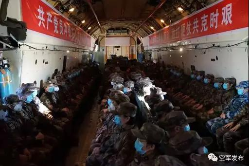
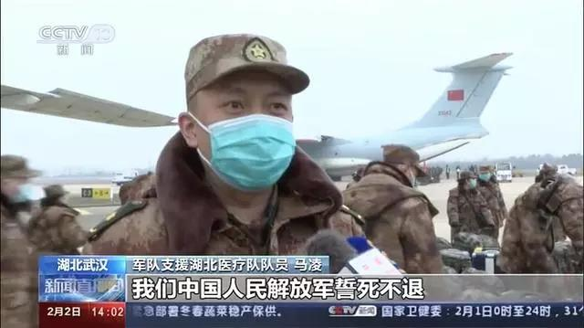
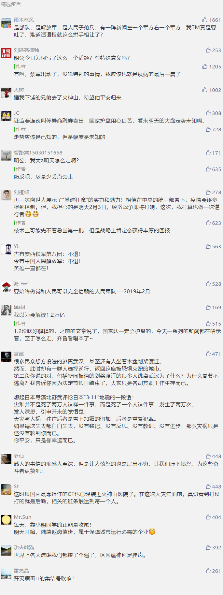

##正文

2020年1月23日，腊月二十九，上午10时武汉封城。

这一天，武汉的公交、地铁、轮渡、长途客运停运；机场、火车站离汉通道暂时关闭，全城进入战时状态。

这一天，就像好莱坞的灾难片，很多民众想方设法的逃离武汉，甚至还有人坐着木盆划桨渡江。

然而，此时却有一群人选择逆行，返回这座被恐惧支配的城市。

因为在这一天的下午，他们接到了建设火神山医院的任务。

 

2020年1月23日，腊月二十九，上午10时武汉封城。

这一天，武汉的公交、地铁、轮渡、长途客运停运；机场、火车站离汉通道暂时关闭，全城进入战时状态。

这一天，就像好莱坞的灾难片，很多民众想方设法的逃离武汉，甚至还有人坐着木盆划桨渡江。

然而，此时却有一群人选择逆行，返回这座被恐惧支配的城市。

因为在这一天的下午，他们接到了建设火神山医院的任务。

 

正是这些最美“逆行者”冲破困难，他们奔赴施工现场，与死神争夺分秒的时间，开启了这一场没有硝烟的战争。

就在隔壁香港的医生们还在串联罢工的时候，大陆的4000余名建设者的日夜鏖战，用了九天的时间，将一座3.4万平方米的高标准的战地医平地建起。

这就是中国速度，在无数逆行者的奋战下，火神山比原定计划提前一天完成。

这就是中国速度，今天凌晨1时30分，空军8架大型运输机在夜幕中飞赴沈阳、兰州、广州、南京等战区，连夜将各战区的医护人员和医药物资空投至武汉。

 

国有战，召必回，战必胜！

明天开始，随着火神山医院的建成，汇合前期抵达的部队，人民解放军接将开始集中收治病人，面对疫病我们军民同心，共同打赢这一场武汉保卫战。

回顾历史，保家卫国封狼居胥的战士们是英雄；再看今朝，抗击疫情誓死不退的逆行者们亦是英雄。

 

虽然我们无法像那些逆行者奔赴抗击疫情的前线，虽然我们无法像那些企业家们为疫区一掷千金，但是，我们可以减少出行不聚餐，抵制谣言不添乱，做好自我防护，用每一个举动，每一次发声，为武汉加油！

点击长按下图二维码，跟政事堂一起为武汉加油，为中国加油。

 

##留言区
 

