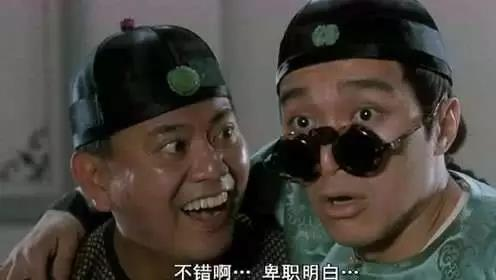
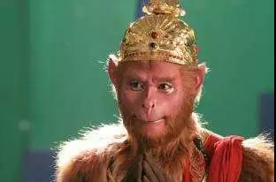
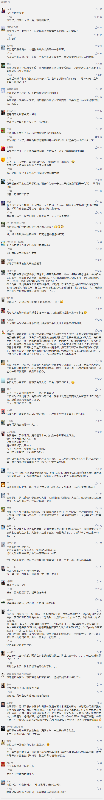

##正文

今年春节在家闲得无聊，重读了一遍中学上课时偷读的小说《鹿鼎记》。

读罢，将书合起，政事堂不仅慨叹，鹿鼎记并不是一本武侠小说，就像书名那样，“逐鹿中原，问鼎天下”，这也是一本披着武侠皮的政治小说。

书中讲的是一个不懂规矩的小子韦小宝，如何在天下大乱的局势下，通过一次次的投机，官越做越大。在天地会、沐王府、平西王府、神龙岛、台湾、青藏、蒙古、俄罗斯等各股势力之间如小白龙般如鱼得水的游走，成为清廷最杰出的外交家。

这本把在官场斗争和生存宛如教科书一般的剖析出来，把各级官员形象刻画栩栩如生的小说，如果现在出版，似乎也可以起名为《韦小宝升职记》。

 

当然，经典的小说，往往都有着相似的内核，金庸鹿鼎记里大量填充了三国演义、水浒传和红楼梦的内容作为致敬，而书中唯一一句未提的西游记，金庸却借鉴了他的逻辑架构。

就像西游记中，师徒四人凑齐后遭遇遇到的一个妖精，白骨精时，官场小白的孙悟空被三个老油条唐僧、猪八戒沙僧联合排挤出团队，小说中几位主人公寥寥的几句话，便将团队内部倾轧刻画的淋漓尽致。

可后来，随着取经过程中的不断磨合与成长，曾经愣头青的孙悟空，手腕也愈发圆滑，不仅成为后期团队的实际领导，最终还立地成佛，级别盖过了一路为他们保驾护航的观音菩萨。

 

一万个读者心目中有一万个哈姆雷特，在政事堂看来，西游记中的儒释道，不过是作者给小说批的一层外衣罢了，并没有想要传佛或者传道。

同样，回顾一下金庸系列小说，会发现这位政评家在写小说的十余年里，也把自己的小说披上儒释道的外衣。

早期作品中，《书剑恩仇录》的陈家洛与《射雕英雄传》的郭靖是中国传统的“儒侠”，他们以天下大义为重，以民族存亡为己任，为了天下苍生，虽千万人吾往矣，可以牺牲个人幸福，可以全家血洒襄阳。

 

等到了中期《神雕侠侣》和《倚天屠龙记》塑造人物的时候，金庸慢慢从入世的“儒侠”变成了出世的“道侠”，面对轰轰烈烈的反元大业，击杀蒙哥的杨过和义军首领的张无忌， 并没有像陈家洛和郭靖那样的率领天下雄群抗争，而是选择携爱人归隐、画眉。

 

等到了中后期的《天龙八部》时代，金庸慢慢从“道侠”变成了“佛侠”，段誉熟读佛经，乔峰武功出少林，和尚虚竹的父亲是方丈，连大宋、大辽、西夏、吐蕃、大理甚至后燕政权之间的恩怨，最终都通过大慈大悲的佛法来化解。

 

可以说，每一本小说，都是时政评论家金庸政治理想的一个缩影。

因此，等到金庸撰写《笑傲江湖》的时候，参透儒释道的金庸，写的已经不是侠客和武林了，云诡波谲的武林处处都是朝堂，每个角色几乎都有着对应的历史人物，每个冲突几乎都有着对应的历史事件。

 

可以说，每一本小说，都是时政评论家金庸政治理想的一个缩影。

因此，等到金庸撰写《笑傲江湖》的时候，参透儒释道的金庸，写的已经不是侠客和武林了，云诡波谲的武林处处都是朝堂，每个角色几乎都有着对应的历史人物，每个冲突几乎都有着对应的历史事件。

 

书中，虽然金庸给韦小宝找了四个师傅，儒侠的陈近南，道家的九难，佛家的观证禅师，但这个时候，一边写时评一边写武侠的金庸已经参透了世事，在他眼里，无论儒侠、道侠还是佛侠，都是解决不了现实问题的。

儒侠的师傅，糅合红花会陈家洛和抗元斗士郭靖的天地会总舵主陈近南，没有搞起来反清的英雄大会，却死在了延平郡王府的内斗。

道侠的师傅，糅合了小龙女和赵敏郡主的九公主，只教了韦小宝如何逃避，最后被撩起埋藏心底多年的情意放弃了《四十二章经》，也放弃了大明公主身上反清复明的责任。

佛家的师傅，在金庸小说里一贯独立的少林，不仅成为了清廷的鹰犬，般若堂首座澄观也迂腐的成为笑料，甚至取代了鸠摩智的西藏密宗第一高手桑吉大喇嘛，也被各种利益许诺玩弄于股掌之中。

儒侠、道侠、佛侠，在鹿鼎记里面都解决不了问题，真正能够给民众带来福祉的，是韦小宝的第四个师傅，永不加赋、“鸟生鱼汤”的康熙。

 

而这本金庸的封笔之作，不仅写的是朝堂，更是他的人生规划。

而从小立志成为外交官的金庸，在鹿鼎记封笔之后，就开始全身心的投入到他的外交政治生涯当中。

1981年，复出的小平同志邀请金庸携家人到北京，几个月后，金庸在《人民日报》发表文章，高度评价“一国两制”是“一言可为天下法”。

1982年，中英开始就香港回归秘密磋商，时任英国首相撒切尔夫人首次访华之前经过香港，邀请金庸到港督府单独会晤，希望金庸支持英国不归还香港，会谈现场，被金庸严词拒绝。

1984年，《中英联合声明》签署。两周后，胡书记接见了金庸。返回香港后，金庸把谈话整理发表，在东南亚地区引起巨大震动。

1985年，金庸加入了香港基本法起草委员会，担任政治体制小组组长。

1988年，香港基本法最终版的“武林大会”召开，金庸宛如大战少室山的萧峰一般，技压各路群雄，顶着香港各界舆论的巨大压力，确定了如今的香港基本法。

某种程度上，能够在外交领域纵横捭阖的韦小宝，就是是金庸的外交家梦想。

而小说封笔后的十余年间，金庸游走于大陆以及台湾蒋经国、宋楚瑜，英国撒切尔夫人之间，纵横捭阖，也算是实现了自己年少时的梦想。

只不过，就像西游记里面，大闹天宫的齐天大圣最终变成了维护天界的斗战胜佛，最终，那位曾经执笔为剑的少侠，也变成了自己曾经剑指的鹿鼎公。

 

##留言区
 

