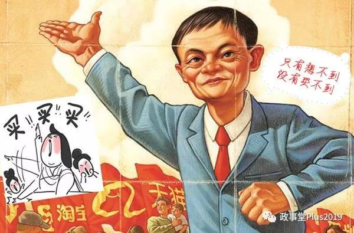

##正文

最近在家重温鹿鼎记，突然想到了一个问题，康熙时代被广泛使用火器的清廷，到了鸦片战争时突然就回到了弓马骑射，被英法的枪炮教做人。

直到太平天国运动，曾国藩李鸿章开始组建团练武装和洋务运动，火器才开始在大清的军队里面重新推广。

清廷上下不知道火器的厉害么？

当然不是，清太祖努尔哈赤是被火炮炸死的，康熙是用着大炮和火枪平三藩收台湾，硬钢罗刹远征葛尔丹，对于清廷来说，火器反正面的例子都有的。

而且，清廷延续着科举制度，除了满清勋贵之外，大臣们都是独木桥拼杀出来的人杰，对于火器之利不会不明白。

在政事堂看来，清廷火器推不动，根本的原因是弓马骑射利益集团的阻碍。

而这种阻碍，并不仅仅局限于满清朝廷。

几百年前的英法阿金库尔战役，英国的屌丝长弓手虐杀了上万的法国骑士老爷们，然后竖起了中指，让竖中指成为了日后全球通行的侮辱方式。

可即使遭遇到了如此大的耻辱，也没有遏制住法国继续发展骑兵，喜欢骑马的法国贵族老爷们回家后，研究起了更厚的骑兵装甲.....

欧洲霸主的法国跟亚洲霸主的大清做出类似的抉择并不意外，两个封建王朝国内都有着巨大的既得利益集团。

这些对朝政有着巨大影响力的骑兵老爷们，由于其城堡庄园式的经济基础，决定了他们为了维护稳定，并不愿意去攀升那些新的科技。

这背后的逻辑是人性，与国家和文化无关，就像美国南北战争时期，南方庄园主们也喜欢使用奴隶而不愿意发展工业，最后逼着一场内战，才让美国的工业出现大发展。

在危机之下，大家往往就没有那么多的顾忌，譬如英国看着宿敌法国的装甲越来越厚，便撤掉了庞大的长弓手队伍，转而发展能够射穿盔甲的火枪。

训练一个长弓手是有着巨大成本的，多年的训练会导致脊柱弯曲，这些精锐的长弓手不仅是财富，也是巨大的成本，更不要说带领着长弓手多年屡立战功的将领们，都坚决反对转型火枪。

可是，英国最终还是决定，让那些为大不列颠王国立下汗马功劳长弓手们下岗，重新招募火枪手。

毕竟，当时法国的国力远强于英国，随时面临着被法国吞并的危险，因此，内部没什么利益集团是不能打破的。

这就像历史上，曹操的83万大军和苻坚的百万人马背后，90%以上都是非战斗部队，同样，一个法国的重装骑兵的背后，不仅有着数年的苦练，还有十来个人做后勤。

如果拼后勤的话，国力弱势的英国绝无挑战法国的能力。

因此，虽然长弓手相比于骑兵不需要大量的后勤人员，可后来的火枪出来之后，连前面的多年苦练都不用了，抓个农民培训几个月，就可以一枪放到苦练几十年骑马冲刺的贵族老爷。

所以回过头来再看满清，康熙时期内有天地会、台湾、三藩、蒙古、青藏的作乱，外有罗刹荷兰的虎视眈眈，为了政权的稳定，必然对高效的火器有着巨大的需求。

而当康熙把内忧外患剿灭，进入稳定发展的时代，人人平等的火器就不再成为八旗老爷们的必需。

直到太平天国作乱和英法联军火烧圆明园之后，清廷才不得不进行痛苦的转型，重新发展火器和开办工厂。

当然，这种打破既得利益集团的转型对于清廷来说，自然是要付出代价的，经济基础决定上层建筑，主导洋务运动的汉臣纷纷执掌大权，盛宣怀取代了和珅，成为了大清新的钱袋子。

最后在过程中还玩砸了，辛亥革命一声枪响，几十年之后，溥老爷子回趟故宫不仅没大奔坐，还得掏钱买门票。

所以，我们会明白，那句危机倒逼改革的背后，是在危机面前，利益集团才会妥协，而且，在危机之下，才会以非常低的成本，让民众去改变他们多年养成的习惯。

就像搞阿里巴巴的马云，自从在2003年搞了淘宝之后，便成为了中国实体经济老板们的“公敌”，大量的企业家纷纷说淘宝把中国的实体经济逼得没有了活路。

他们说的都是心里话，如果有的选，当年实体经济的老板们绝不会选择跟马云合作。

只不过，在2003年的SARS的冲击之下，线下交易的实体经济受到重创，企业家们为了“活下去”，才把卖场搬运到线上，寻找新的出路。原本盯着马云揪问题的监管，也不得不睁一只眼闭一只眼。

至于那些对网购没有信任的网民，在恐慌之下，为了避免线下接触，也选择了原本并不信赖的线上交易。

在供销两旺和监管的放任之下，马云的生意越做越大，曾经的骂名，最后都变成了双十一的“真香”。

 

就像马云搞中供铁军那样，零售行业和军队很类似，都是用庞大的人力堆出来的，尤其是传统零售业，商品从柜台到最终的消费者手里，经历了多级的分销环节，租着柜台，养着一大批的后勤人员。

同样，就像火枪兵取代了需要的多年训练和物资的传统部队，通过互联网的新基建改造之后，一个店小二临时培训一下，就可以上岗，交易成本被大幅降低了。

大家都知道火枪比弓箭好用，但是面对面对盘踞着的传统利益集团以及需要改变民众习惯，如果没有危机带来的机遇，是需要像韦小宝那样撒银子开道的。

滴滴快滴、摩拜ofo可是砸了几百亿补贴，才砸出来如今的移动出行市场，美团与饿了么背后的资本砸了几百亿补贴，才建立起了如今的外卖骑手网络。

换句话说，如果没有那2003年一场SARS，马云和刘强东很可能就无法崛起，如今的局势会是王健林与马化腾的“共天下”。中国的电商也许需要等到十年，某多多搞起的X百亿补贴，才能建立起来。

不要觉得这很科幻，隔壁比我们早普及手机与网络十余年的日本，在各大财团的金融控制之下，就像一名不愿意使用火枪的忍者那样，如今移动支付还步履蹒跚。
 
 

危机倒逼改革，混乱亦是阶梯。

过去需要拼资本、拼关系的市场，将在2020年大幅开放。

就像影视行业，过去是没有出品方敢冒天下之大不韪，把电影放到互联网上做首播。

可今年的春节期间，危机之下，民众的习惯被改变了，就有电影顶着影视行业老爷和基层员工们的集体围剿，选择互联网首映，给了头条系突破传统利益集团，向影视领域进军的机会。

而这只是开始，在这一轮的疫情倒逼之下，大量的行业将会被改变，新能源网销汽车会对传统4S店体系造成冲击，外带式的新餐饮零售将会冲击传统餐饮，房地产的线上售楼处将大规模上线，银行将推动网上营业厅，企业将会全面推动网上办公系统.....

尤其是互联网巨头联合教育机构搞的直播和线上教育，也会对传统线下教育机构造成降维打击.......

本质，就像火枪取代了弓箭那样，在这个过程中，大量的既得利益集团都将面临科技的洗牌，大量的新兴产业也将迅速崛起。

甚至，快递业需要的无人机空域和自动驾驶审批会加速放开，各项识别监控设备的需求将会激增，医疗界一盘散沙的医院将可能推动全国联网，公益事业将会在区块链技术的推动下公正公开......

虽然在应对这一轮疫情过程中，我们会曝出一些的问题，但是这些问题暴露在汹涌民意之下，自然也驱动改革和市场的开放。更不要说，国家为了对冲消费的下行，必然会加速启动新基建的建设。

因此，未来的市场，也会出现天翻地覆的变化。

而部分骑着马的老爷和先富起来的老板们，在这一波的新基建和市场开放的冲击下，就会像骑士和长弓手给火枪兵让位置那样，被历史慢慢的淘汰。

多年后，产业升级后的我们再回顾2020年，也许会有不少人慨叹：

大人，时代变了。

##留言区
 

