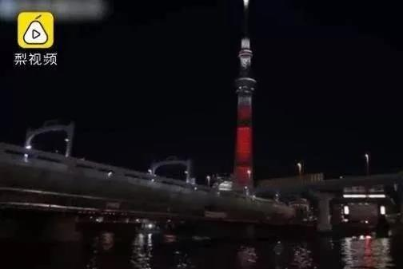
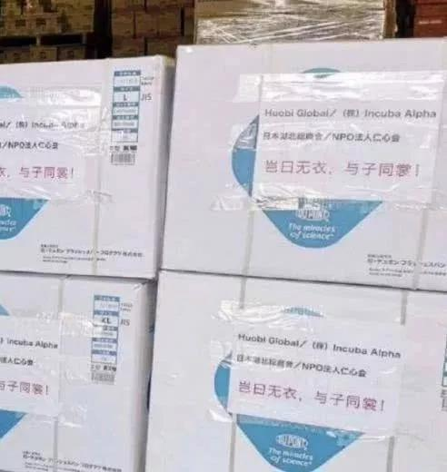
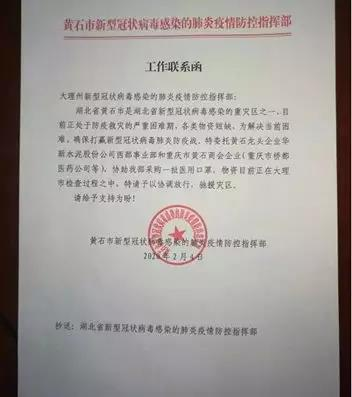

##正文

岂曰无衣，与子同裳。

武汉疫情爆发后，与我们一衣带水的日本政府立即表态，愿全力协助中国对抗疫情，并将疫情划为“指定感染症”。

这意味着数十万春节期间赴日本的中国旅客，如果得染上了冠状病毒，大部分的医疗费用都由日本政府承担。

而且，面对封城之后滞留在日本的武汉游客，日本政府也给予延长签证，没有像躲瘟神那样礼送出境。

甚至日本地标，世界第二高建筑东京晴空塔，也举行了祈祷点灯仪式，蓝色代表祈祷疫情早日结束，红色代表中国加油。

 

而民间，很多商超也打起了中国加油和武汉加油的海报，还有用中文表达了愿意为国人提供免费的口罩。

 

 

更不要说，很多国家都在封锁医护物资之际，政事堂的很多朋友都遭遇了物资被扣的情况，而不仅日本政府在武汉撤侨的日本包机上，满载防护物资支援武汉，日本各界也纷纷伸出援助之手，纷纷将救援物资快递至中国。

 

大概，这就是东亚文化中流淌的岂曰无衣，与子同裳。

不过，就在日本都在都在为疫情提供医疗物资的时候，几份“工作联络函”和“通知书”却令国人大跌眼睛。

重灾区的湖北黄石市，与毗邻湖北的重庆市，他们的紧急医护物资，在途径云南大理的时候被扣了，发函索要，但大理方面称口罩已分发使用。
 
 

 

不得不慨叹，连日本人都知道大局为重，不拆台还给援助，结果却遭遇到了咱们自己人背后“捅刀子”。

当然，一味的抨击，从来就不是政事堂的风格，我们还是分析一下背后的逻辑。

先说大理，站在大理市民的角度，市政府领导们还是负责的，毕竟大理是一个旅游城市，不仅人口流动量大，而且辖区内没有工业，估计无法自产口罩等物资。

因此，为了地方百姓的安全，为了地方经济的发展，换我去当市政府领导，也会想办法去扣一些商业途径的物资。

甚至在疫情早期，如果各个地方都能做到像大理那样积极应对，说不定对于遏制疫情扩散还是有效的。

那么，你以为政事堂要洗白大理？

当然不是，我们还是要对标一下日本。

日本今年7月要举办具有象征着国运的奥运会，上一次的奥运会之后，日本新干线、电视、轿车大规模的普及，经济开启了高速发展。

而此次日本对奥运也是寄予厚望，希望能够借着此次开启日本的令和新时代，希望日本能够实现经济与产业的大规模升级。

所以，考虑到即将召开的奥运，目前日本应该是全球最担心疫情传播的国家。更不要说，日本已经是目前除了中国之外疫情最严重的国家。

按理说，日本政府为了保住奥运安全，应该学习大理政府自扫门前雪，想办法囤积足够多的医疗物资。

但是，日本不仅是目前对武汉甚至中国最宽容的国家，还在源源不断的支援物资和提供各类援助。

当年带头闹钓鱼岛和南海的时候那么横，怎么突然就转性了？

因为日本的政治家们很清楚，中日一衣带水，经贸和人员往来非常的密切，因此，遏制日本疫情的爆发，关键是遏制住中国的疫情。

同样，日本想要发展奥运经济，那么日本最重要的出口市场，中国的经济平稳就非常的重要，东亚经济的恢复也取决于疫情的何时结束。

因此，日本无论如何都必须帮助中国打赢这场疫情战。

同理，我们回过头再看国内。

大理等全国很多地区，想要遏制住疫情的关键，是要想尽办法遏制住湖北的疫情；各地想要经济尽快上正轨，不是囤积口罩资源自保，而是要让物资汇聚到疫情重区，尽快结束疫情。

毕竟，目前全国的口罩总数是一个存量，有着巨大的缺口，短期内无法爆产能，后方截留多了，前方的弹药就会枯竭，反而会影响到正在进行的湖北会战。

我们不要重复一百多年前的甲午海战的故事，邓世昌们不惧牺牲去决一死战，而他们的战舰上却没有战争需要的精煤和穿甲弹。

岂曰无衣，与子同裳。

这一波，湖北会战赢了，我们这场疫情就赢了，日本人都明白的道理，咱们中国人没道理不懂，日本人都给一线捐物资，咱们中国人更不应该去截胡。

我们每个人、每个地方政府都应该从自身做起，把更多的医护资源，汇聚到正在决死战的湖北一线战场。

因为，我们是血脉相连的中国人！

岂曰无衣，与子同裳，修我甲兵，与子偕行！

##留言区
 

