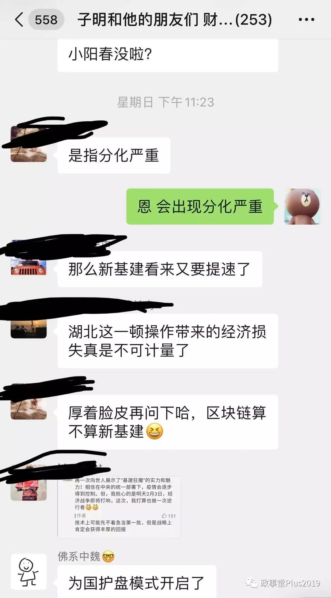
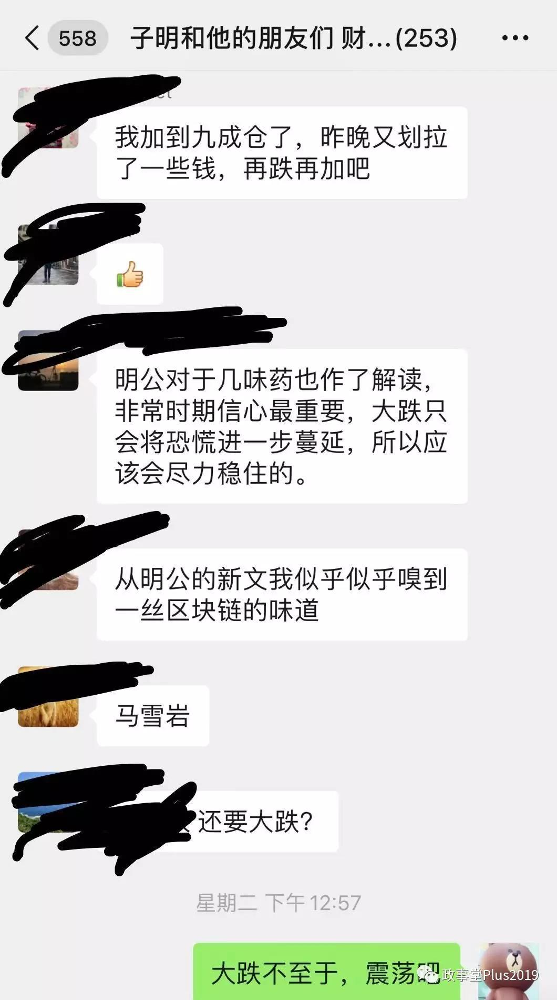

##正文

前天文章，关于股市的为国护盘，一大群人说我马后炮，不少人还纷纷点赞，于是，恶趣味的我，决定再气一下这批人，他们越生气，我就越开心。

关于我文章以及留言中关于护盘的内容太多，而且也是公开的，我就不复制了，选几则跟朋友的对话。

这个是开盘前一天夜里，关于小阳春的分化。

 

而且，还推演了第一天和第二天开盘的走势。

 

第一天北上资金在尾盘扫货的动作，虽然对于指数的拉升非常有限，不过第二天开盘后大跌后的急剧震荡，所制造出来的天地板，却是很多人两天赚了20%以上的关键。

 

很多人都在骂我的双黄连文章，既有中医迷，也有西医迷。

不过，在这一波为国护盘的过程中，吃了政事堂双黄连的，不敢说一定获益颇丰，但亏钱的怕是应该没有几个。

这背后，就像本山大叔说的，别看广告，看疗效，无论是对股市还是疫情，在我们短期内力量有限的时候，安慰剂是最有效的治疗方式。

“这种行为其实并没有错，就像当年曹操带兵出征，靠着一片梅林，最终取得了胜利。”
 
 

 而今天，如果我是湖北主要领导的话，会想办法尽快开出一则全国人民需要的双黄连.......

##留言区
 

