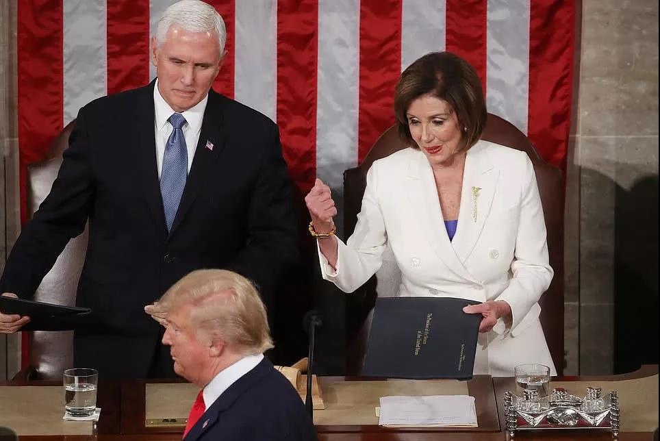
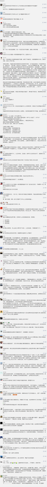

##正文

昨日，《纽约邮报》曝光一段视频，显示那场引发了全球轰动的美国国情咨文大撕逼中，众议院议长佩洛西早有计划要撕毁演讲稿副本。

 

在特朗普演讲时，她先将手中的文本拿起，偷偷移到桌下，在文本侧边撕了一个小口，再将其放回原位。

 

对此，5日，美国副总统、坐在佩洛西旁边的彭斯在接受特朗普铁杆的福克斯电台采访时，也证实了这一点。

他说，他坐在佩洛西旁边时就感觉对方计划撕毁复印件，“那感觉就像是一个紧迫的时刻”。

 

而如果我们回顾那场国情咨文，佩洛西开场的时候故意趁特朗普转身时伸手握手被拒，以特朗普粗鲁的无视，显然也是在她的计划之中。毕竟，当时特朗普连他的死党参议院议长彭斯都没握手，也不可能有计划跟佩洛西握手。

也就是说，这场国情咨文的撕纸，不是因为听到特朗普国情资讯的激愤导致，而是佩洛西早已计划好的一场秀，用来挑起民主党选民们反特朗普的情绪。

果不其然，伴随着佩洛西撕毁国情咨文，全球的互联网上也第一时间出现了针对特朗普国情咨文的逐项批驳，涌现了各式各样针对特朗普的骂声。

不得不慨叹，美国两党白热化的撕逼，也真是史无前例了。

昨天夜里，大洋彼岸的我们这里也发生了一件类似的事情。

2月6日晚上九点半左右，出处为《生命时报》、《湖北日报》、《新京报》等媒体有关“李文亮医生病逝”的消息，在瞬时引发了全网的刷屏。

而被传言去世的李文亮医生，此时正在ICU里面进行抢救。

政事堂一直等到凌晨四点多，等到了武汉中心医院的官微，李文亮经全力抢救无效，于2020年2月7日凌晨2点58分去世。

此刻，政事堂的心情，也从痛心慢慢变成了愤怒。

李文亮医生从1月12日下午住进科室病房，到两天后转到呼吸科隔离病房，再到病重再到住进ICU，这么长的时间里面，为什么没有媒体去报道和关心？

可是，当李文亮医生正在进行抢救的过程中，提前蹲点的媒体们却纷纷抢起了人血馒头，竞相提前宣布他的死亡。

令政事堂愤恨的是，对于李文亮医生这位疫情的吹哨者，相信全国人民如果听到他也在抗击疫情的过程中被感染病毒，必然会像当年支援志愿军那样，全国人民有钱出钱有力出力，跟丫的拼了！

病毒他妈的再厉害，有当年的联合国军厉害？

可是呢？

那些跑得比谁都快的媒体们，20多天的时间里，没有给全国民众任何的预警，只是等在病房外翘首以盼他的死讯，搞个大新闻，好能够把当政者批判一番。

媒体一边批判着政府对吹哨者消息的"封锁"，又一边“封锁"着吹哨者患病的消息，这才是现实的可悲之处。

而正是在这些等着吃人血馒头媒体们的引导下，全国人民的对英雄们的敬仰与一腔热血，都变成了对政府的无尽愤怒。

历史没有如果，但是我们假设一下，如果全国民众和医务工作者们从媒体处知晓李文亮医生患病的情况，那么从全国饱和式资源的涌入，会带来什么？

我们不仅能增加救活英雄的机会，那些已经在湖北一线日夜奋战两周的医护人员，他们的物资紧缺也能得到相当大的缓解。

疾风知劲草，全国数万医务工作者汇聚湖北展开一场与病毒的决战，少有媒体报道他们的风采，而李文亮医生的死讯，却成为了全国媒体的狂欢与盛宴。

可悲，可叹，而这也是历史的必然。

在中国上下五千年的历史长河中，每逢民族危难之际，真正的英雄从不是那些躺在大后方，做的一手漂亮文章的书生，而是那些面对未知死神，依然血战到底的勇士。

就像之前李文亮所在医院召集大夫奔赴防疫一线，此时，已经病毒缠身的李医生是这么说的：

「我好了也报名」。

「好了就上一线，疫情还在扩散，不想当逃兵」。

 

但使龙城飞将在，不教胡马度阴山。

没有什么岁月静好，只因有人负重前行。

##留言区
 

