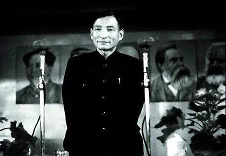
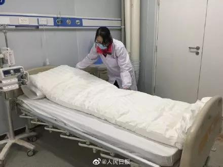
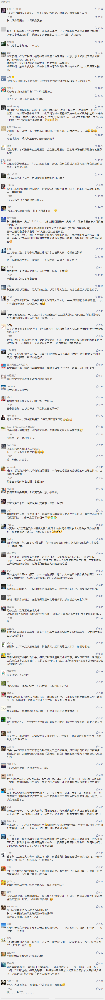

##正文

1949年11月12日深夜，一份十万火急的绝密电报被送到了西花厅，周总理读罢后，在电报上批示，“如主席未睡，请即送阅，如睡，望先发，发后送阅。”

如此紧急，是因为我们正在跟时间赛跑。

当时，上海刚刚解放，新中国刚刚成立，在战争阴云的恐慌之下，棉纱就像如今的口罩一样，价格在不到一个月的时间里上涨了3.8倍，迅速拉动了全国的物价上扬。

投机囤积的资本家甚至叫嚣，只要控制了棉纱、粮食、煤炭这两白一黑，就能置上海于死地。

不过，他们低估了对手的动员能力。

那份陈云发给中央的绝密电报，是要把中国棉纱织布中心武汉的库存，秘密运至上海。

11月25日，随着物资的抵达，凭借从武汉运来的弹药，中央政府在上海、北京等大城市同时饱和式的抛售棉纱。

一开始，投机者们还认为这是囤货的好机会，可面对国营公司源源不断的抛售以及价格的下跌，让擅长制造恐慌的他们，也开始恐慌了。

 

为了抢在其他人抛售前高价格出货，上海的投机者们在囚徒困境之下，只能不计成本抛售手中的库存。

凭借着这一轮的饱和式的物资投放引发的“恐慌”，上海市面上最紧俏的棉纱价格在供过于求之下迅速下跌。

棉纱价格的恢复，不仅稳定住了上海的物价和民众的信心，也为这一年的物价三大战役开了一个好头。

1949这一年，不仅国共调集了数百万军队动员了上千万的民众打了三大战役，华北地区又遭天灾庄稼歉收，全国各大城市都面临粮荒，上海甚至都无法支撑民众一个月的口粮。

棉纱等日用品影响的是物价，煤炭等工业品影响的是开工，而粮食决定的是民众的生死，更决定着新政权能否屹立下去。

面对全国性的缺粮，为了避免多线同时开战，陈云在上海打棉纱战之前，决定先稳住粮价。

经中央批准，陈云电令驻地辽宁的东北局，每天发一个列车的粮食到北京，在老百姓都能看得见的天坛建仓储粮。

看着东北大米一车车的进京，储量的仓库越建越大，北京民众和商人的恐慌被遏制了下来。

但是他们并不知道的是，北京天坛的粮仓不过是给民众的“望梅止渴”，陈云玩了一出“增灶减兵”和“声东击西”，这批堆积如山大米真正的目的地，是资本家汇聚的上海。

1950年2月21日，农历正月初五开市，因国共内战而屯了一年粮食，等着涨价发财的投机商们，这一天却纷纷傻了眼，节后的粮食价格不但没有报复性的上涨，反而像几个月前的纱布那样迅速下跌。

下跌的背后，是从东北源源不断运来的优质大米充斥着各个国营粮店，价格便宜量又足，香喷喷的东北米饭迅速赢得了上海老百姓们的青睐。

 

有了上一次纱布折本经验，投机商们看到不妙，这一次他们跑得更快，恐慌式的抛售让上海粮价迅速回稳。

资本汇聚的上海稳了，很快，全国粮价也跟着稳定，天坛空粮仓的历史使命也就结束了。

粮食稳了，人心就稳了，在东北大米、煤炭，武汉棉纱的支持下，“两白一黑”的三大战役我们赢了，全国人民对物资的恐慌式抢购渐渐的散去，开始了集中力量建设新中国。

对于70年前陈云的这一战，毛主席认为其意义不下于决定国共走向的淮海战役，从此，共产党人才真正接过了共和国的控制权。

 

而70年之后的这一波疫情，又把武汉和东北这对70年前就并肩奋战的老兄弟，拽到了一起。

前几天，国家公布了全国一省包一市的新闻，很多朋友看着江苏十三太保的争先恐后的身影，纷纷在纳闷，共和国长子的辽宁去哪里了？

结果答案马上给了出来，2月8日，全国第一支千人级的队伍，辽宁驰援湖北第四批医疗队抵达武汉。

 

截止目前，辽宁总共驰援武汉医护人员1382人，东北三省合计2340人，相比于国内很多省份人口奔亿的大省和经济富庶的强省，平时毫无存在感的东三省，此次却凭借一己之力，提供了全国五分之一的援护人员。

而且，“东北军”拥有的不仅是数量，还专门打硬仗，啃硬骨头。

此番辽宁不仅承担了疫情最严重的的襄阳，而且，此次辽宁第四批的1000名医护人员，直接成建制的“承包”了刚刚建成了雷神山医院。

2月8日，随着“辽宁队”的抵达，与死神赛跑的雷神山医院正式收治疫病确诊患者。

 

去面对最危险的敌人，去啃最难啃的山头。

这就是共和国的长子，这就是国家危机面前，那些挺身而出的东北人。

而且，很多人并不知道的是，在火神山那支先期抵达的队伍，在与疫病死神正面搏杀的主力，正是原沈阳军区总医院的战士们。

一手拖火神山，一手拖雷神山，两座医院的背后，是一群竭力死战的东北人。

以往人们都说，投资不过山海关，而今年的春节，也许疫病患者听着最亲切的，就是东北话。

 

的确，在很多国人眼中，东北人是喜欢吹牛的大忽悠。

但是，在这一轮的疫情援助中，面对那些已经确诊的疫情患者，东北人没有多说一句废话，而像一位大哥哥那样，向最危险的地方发起了冲锋。

 

而且，东北出的不仅仅是人。

武汉疫情爆发后，虽然全国人民都在捐款，可是第一线的医院依然物资匮乏，就像很多人买不到口罩那样，医院有钱也买不到医药物资，而只能选择在网上发布紧急求救的消息。

这个时候，那些被广为诟病的东北企业却开始展现出力量，黑龙江的消炎和去疫药品，吉林的消毒水和医用酒精、辽宁的CT机和防护用具......一个个东北的国企，一支支飞奔的车队，为同胞们筑起一条挽救生命的长城。

 

别看东北人喜欢看春晚，今年很多东北人为了跟时间赛跑，整个春节都是在工厂里面度过的。

相比于很多南方工厂临时找不到工人，疫情触发应急响应机制之后，大连石化一线生产岗位全部取消休假，全力保障装置24小时安全平稳满负荷生产，仅在武汉封城的前一天，就紧急运出600余吨医用口罩必需的H39S-3。

而这些加班加点生产出来的H39S-3，不仅将成为保护一线医务工作者的口罩，也将成为开工后，中央政府再一次打赢物资挤兑战的关键。

很多人看不起东北，觉得东北赶不上时代，可正是东北老铁们准军事化爆出来的产能，让我们有底气喊出来：我有熔喷布，谁有口罩机？

 

正是东北爆发式的产能底气，让某些垮掉的省份突然反应过来，遇事儿还是需要找爸爸。

 

在过去一百年里面，饿着肚子在白山黑水坚持打鬼子的是东北人，从冰天雪地的黑龙江打到海南岛赶走老蒋的是东北人，抗美援朝保家卫国冲在第一线的是东北人。

建国之初源源不断送煤炭送钢铁推动工业化的是东北人，从长江洪水到唐山汶川地震提供救援粮食的还是东北人。

甚至疫情吹哨人的李文亮，也是身份证2107开头的东北人。

而此次此刻，上百名李文亮的锦州老乡们，正在雷神山医院奋战，继承李文亮抗疫的未竟事业。
 
 

东北人好面子爱吹牛，但是在民族大义面前从未怂过。

自从疫情爆发之后，三省省内最优秀的队伍一批批的抽调赶往湖北，奋战在全国最危险的地方，甚至大连和沈阳的门诊也已经前后全部停诊。

这，就是真实的东北老大哥。

拼了70年的老大哥如今老了，身体也远不如当年硬朗，但只要是看到同胞们有危险，就算腿不利索了，却也是刀山敢上火海敢闯。

因为，他们是共和国的长子。

##留言区
 

