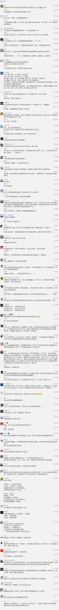

##正文

最近，“散装江苏”一词突然就火了。

原因是全国其他援助湖北的医疗队，都会打着统一旗号出行，而江苏的十三个地级市不仅各自为战独立出征，还都打出五颜六色各自的旗号。

且不说江苏麾下的那些“独立团”，县大队和区小队们也把大家弄得一头雾水，县级市的昆山前面不打“苏州”，连云港的赣榆区不靠搜索，没人知道他们来自江苏。

 

一系列的闹剧，搞得网友们纷纷开起了“大内斗省”的玩笑，甚至有心人还画了一副“江宁苏维埃联盟”的地图。

 

不得不说，把江苏的地图横过来一对比，还真像.....

 

恐怕江苏的领导们怎么也没想到，凭借着网友们编撰的“十三太保”段子，江苏的救援队在这场疫情中拿了头彩。

对于江苏为何成为“大内斗省”，各界都有过很多的分析，如果站在政治的角度，则很容易理解，因为江苏从建省开始，就是地缘制衡的产物。

中国在元朝之前，行政划分区域一般是遵循山川形便，气候水文的相似往往人群的语言习惯也比较相似，对于中国古代“皇权不下县”的中央政府来说，按照风俗习惯和山川形便划分行政区，内部冲突较小，便于中央政府的管理。

可是到了元朝，随着领土面积迅速扩张，中央政府管理着远超“汉地十八省”的土地，这使得民族冲突迅速成为了主要矛盾。

因此，元朝政府进行了重新地域行省的划分，将中原那些的兵家必争之地故意划分出来，在各省之间形成地缘上的相互制衡。

而其中制衡的关键点，就是将中国划分为南北方的秦岭淮河一线。

在这条线上，陕西、河南、安徽、江苏四省被拦腰斩断。

 

对于为什么这么划分，用三国时期规模最大的一次全面战争，能够很好地解释。

在这场南北方的大战中，有三个主要战场：

西线战场，四川的刘备率领着张飞、马超、赵云、黄忠对抗曹操率领的夏侯渊、曹休、曹真、张郃、徐晃、郭淮。

中线战场，湖北的关羽父子对抗着曹仁、于禁和庞德。

东线战场，江浙的孙权率领着吕蒙、陆逊、周泰、甘宁、徐盛、凌统，对抗张辽、乐进、李典。

这一战，蜀国的五虎上将与吴国的两大都督一起对抗魏国的五子良将，可以说是三国最精彩的全明星之战。

 

而这一战的背后，满满的都是一场南北方之间的地缘博弈。

西线战场的汉中，是天府之国四川的门户，无论是北伐中原还是南下取蜀，都必走汉中。

曹操取汉中后，刘备在蜀中“一日数十惊”，怎么杀人都无法安定人心。最后，靠着诸葛亮在成都启动了“男子当战，女子当运”的全民皆兵才把曹操击退。

而获得了汉中这个跳板，诸葛亮、姜维依靠着天府之国的物资和蜀道的天险，不断的骚扰北方，最终活活把曹魏给拖垮了，给了驻守陕西的司马家做大的机会。

所以，根据地缘制衡的逻辑，即使汉中和和陕西的长安之间隔着八百里秦岭，气候人文全然不同，可秦岭以南的汉中，还是划归了陕西省。

中线战场的南阳，是九省通衢湖北的门户，就诸葛亮在出师表中说的那样，荆州北据汉、沔，利尽南海，东连吴会，西通巴、蜀。跟四川一样，都是帝王之资。

于是，关羽水淹七军威震华夏打通南阳通道之后，定都于河南大平原的曹操无险可守，慌得一比，差点被逼着滚回了河北，全靠吕蒙背后捅刀子才干掉了武圣关羽。

甚至后世历史，岳飞的北伐也是从湖北出发，拿下了南阳和信阳之后，吓得无险可守的金国只能靠学吕蒙的秦桧在战神背后捅刀子。

所以，虽然襄阳和南阳同属一个盆地，南阳和信阳都在秦淮以南，但根据地缘制衡的逻辑，还是把湖北门户的南阳和信阳划归给了北方的河南省。

至于东线的江淮战场，就像中国古话说的，守江必守淮，历史上只要丢了淮河，南方政权就完犊子了，淮海战役就是最近的例子。

因此，在明朝原本是江南省一个整体，到了清朝就被分为了江苏和安徽两省，而且，这次不像对四川和湖北横着切，而直接来一个竖切，把江淮领域的一刀为二。

 

这一刀下来，江淮的防御体系就被彻底废掉，从南北天堑变成了东西对抗，再也无法形成威胁。

而这一刀的结果，就是原本江淮地缘中心的南京，反而成为了偏远地区，江苏人认为他是安徽的省会，安徽人认为他是江苏的省会.......

不过，虽然江苏被一刀切丢了安徽，但是却因为同样的地缘制衡，失之东隅收之桑榆，拿走了北方第一强省山东进军中原的门户，属于中原文化体系的徐州.....

而且，加上近年来上海经济的异军突起，江苏的苏南地区从经济上向上海靠拢，文化的差异，经济的不平衡，也就使得江苏成为了“散装江苏”。

 

当然，这种地缘制衡体系，本身就是一项统治的基本功。

师承搅屎棍大英的美国，自然也学的贼溜。

譬如美国在1971年把中国拉入伙的同时，就把中国太平洋门户的琉球群岛和钓鱼岛交给了日本。

同样，1948年韩国李承晚政府在美国的扶持下成立时，美国也把日本与亚洲大陆跳板的独岛交给了韩国。

而且，美国在《旧金山和约》、《琉球诸岛协定》中故意留下的空子，让钓鱼岛和独岛成为了中日、日韩之间的地缘制衡筹码。

 

不过，地缘制衡之术虽然巧妙，可地缘相近带来的文化相近人文互通，却是无法改变的。

就像建国以来，汉中成为了陕西与四川交流的通道，南阳和信阳打通了河南与湖北之间的往来，徐州也让中原文化与江淮文化互通有无。

那些一衣带水的邻居之间，虽然有时候为了三尺墙的小事儿打得头破血流，可是一旦面对危机，则会吴越同舟共济，携手共同面对。

就像当年援助汶川时那样，全国人民地不分南北，人不分老幼，凝结成了一股绳那样，这次像江苏“十三太保”的背后，并不是所谓的“散装江苏”，而是这些中国经济发达的东部地区，看到同胞的苦难，都会一个个挺身而出。

大内斗的江苏省如是，曾经三国演义战成一团的东北亚亦是如此，相近的文化习惯，一脉的文明起源，让我们在面对危机的时候总会摒弃旧怨携手共同面对。

就像今天大连街头日本捐赠医疗物资上印的那句唐诗：

“青山一道同云雨，明月何曾是两乡。”
 
 

黄河之所以是中华民族的母亲河，不仅是因为哺育了我们，其频频的水患，更是将不同语言，不同风俗习惯的华夏儿女团结在一起去应对。

同样，武汉的这一场疫情，虽然让我们损失惨重，但是全国人民凝结在一起，东北亚人民凝结在一起，我们爆发的力量，必将让全世界震惊。

##留言区
 

