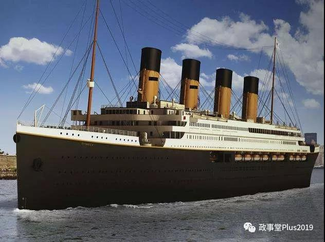

##正文

今天，讲两个故事。

故事1：

在一个平行宇宙，资本市场有个专家，他每过几年，就要发布一次股市要崩了，大家再不跑就没机会了。

因为之前的每一次发布，之后都没有股灾，因此很快就会被大家忽略。

可是，突然有一天，资本市场接连出现暴跌，这位专家又一次跳出来，说大家赶紧跑吧，再不跑本都没了。

几天之后，果真就像专家说的，股市血流漂杵。

于是，一群韭菜们就把这位专家奉若神明，后悔没有听这位专家的话跑路。

而他们却忽略了，这位专家在股市崩盘的前一天，还在鼓吹一万点不是梦。

这是专家么？这是投机分子罢了。

故事2：

很久很久以前，有一帆船航行的过程中，底仓突然漏水。

正在船长组织船工们抢修，这个时候突然有个船工大喊，船漏水了，大家赶紧抱快木板求生吧。

然后这个船工率先坐着救生船就跑了。

船上的船工和旅客们看到后，也纷纷争抢救生船。

船上有10000人，可救生船只够2000人的，而最可恶的是，最先逃跑的那些人，往往一个人就开走了能救10个人的救生艇，于是，抢不到救生船的乘客们就拆卸船上的木板。

而此时的船，又缺船工又缺木板，修船的速度根本比不过船漏的速度。

更惨的是，不仅争夺救生船和木板的过程中造成了巨大的伤亡，那些向周围游去的救生船对救援船的登船，也造成了附近救援船迟迟无法大规模的抵达。

最终，恐慌造成的伤亡远远超乎了大家的想象。

上面说的不只是故事，正是历史上数万次的类似事件的不断重复，使得高铁上的车窗无法被打开，船上的救生船只能由船长下令才能使用，飞机上甚至直接取消了降落伞.......

目的就是要避免大家恐慌式的“跳船”........

 

而两个故事讲完，相信大家对于恐慌的后果也就有了理解，因此，也会明白为什么这次不会出现四年前那样连续的千股熔断。

因为装载了14亿人的船，不可能有足够多的救生艇，其他的船也没能力来救我们，我们只能自力更生的自救，并尽可能的消除恐慌。

而每一家上市公司，不仅上下游带动着庞大的就业，他们的产能，更是我们完成生产自救最重要的生力军。

而这也是和大人“救民先救官”背后的逻辑。

 

##留言区
 

