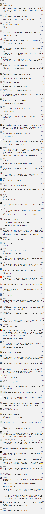

##正文

今天，破产代理公司Epiq网站显示，贾跃亭老婆甘薇发起了离婚诉讼，并向老贾贾索赔5.71亿美元，约人民币40亿。

文件显示，相关协议生效后，债权人应在任何司法管辖权下，放弃对甘薇的债务的追索。

考虑到下周回国的老贾最近都被债主们堵到了美国，不可能再说“下周回球”，这个离婚分财产的动作，自然引起了网友们的群嘲。

而群嘲也搞得今天甘薇都不得不发微博，劝大家多关注疫情，别关心他家的那点八卦。

 

贾跃亭是商业人物，他的道德评价就不多说了，但从实践来看也是没办法，因为他和他的债主们陷入到了一个囚徒困境之下。

债主集体的利益最大化的方式，是贾跃亭把法拉第未来搞起来，债主们就有可能回本甚至赚的更多。

但是，介于贾跃亭目前已经资不抵债，从个体的利益角度，每一个债主个人利益最大化的方式，先对贾跃亭资产进行查封，抢在别的债主动手前，把自己的钱拿回来。

因此贾跃亭的这一招，一方面，是尽可能的给老婆孩子留足够的资产作为退路，另一方面，也能用离婚分财产作为手段，迫使债主们允许老贾能够保留住法拉第未来的控制权，接受不把公司进行破产清算，防止囚徒博弈下的多输结局。

不过，政事堂对此并不乐观，贾跃亭自从16年开始遭遇危机，他就不断的陷入到囚徒困境当中，而且可悲的是，他每一次都把博弈变成了双输的结局。

第一次跟孙宏斌的合作，他原本有机会以牺牲控制权的代价保住乐视网，第二次与许家印的合作，他也有机会以牺牲控制权的代价保住法拉第未来。

可结果呢，囚徒博弈之下双输，乐视网让位给了优爱腾，法拉第让位给了特斯拉，贾跃亭积累的先手优势被他自己消耗殆尽，孙宏斌和许家印也被贾跃亭搞得痛苦万分，本来的好事儿最后都搞得稀碎。

当然，贾跃亭每次都能走出双输的结局并不偶然，因为囚徒困境的背后，也是人性的使然。

譬如假设某个地区如果爆发疫情，那么个人利益最大化的方式必然是尽快逃离。但如果大家都四散逃离，那么必然导致疫情四散，使得其他地区的援助物资和医护能力被大大削弱，反而造成了系统性的紊乱。因此尽早封城是集体的最优解，四散逃逸是集体的最差解。

同理，其他地区的群众面对疫情的个人最优解是尽快囤积各类物资，可如果大家都在囤积，必然会导致疫区中心的医疗防护能力变得脆弱，反而延长了疫情和复工的时间，损害了所有人的利益。因此从集体的角度来看，不囤积物资是最优解，抢购物资反而是最差解。

站在集体的角度，很容易看出来哪个决策更符合所有人的利益，但是站在个人角度，大家则往往会反其道而行之。

这是因为最优解往往都是非常反人性的，因此大家往往都会像老贾那样，最终搞成双输甚至多输的结局。

所以，我们再来看最近日本的那一系列的骚操作，从钻石公主上的病毒泛滥以及官员的自杀，就知道日本政府承担了多大的压力。

可是，日本各界还是不停的往咱们这送物资，议员们带头捐款，甚至现在日本街头也随处可见中国加油，武汉加油。
 
 

看看全球其他国家，再看看日本，我们能够很容易判断出来，日本的做法是非常反人性的。

而安倍反人性的下了这么大的血本，自然是有所图的，就像政事堂之前的判断，安倍想要实现日本的国家正常化，并推动东北亚新局面。

为了这个目的，安倍从特朗普上台后就不断去美国装乖孙子，面对特朗普所有的不合理要求，从贸易到军费，都在想尽办法去满足。

更不要说他对中国的态度简直就是180度的大变脸，一系列的卑躬屈膝到了令人发指的程度。

而这背后，则是想要抓住这个历史性的机会，跳出昨天文章中，美国制造的东亚地缘制衡的囚徒博弈，以实现东北亚的共赢。

所以，对比一下极致的梦想家贾跃亭和极致的政治家安倍，也就会明白，为什么有人总是跳不出囚徒悖论，而有人却在其中游刃有余。

嗯，换句话说，这就叫做术业有专攻。

当然，熟悉囚徒博弈的朋友们都明白，想要跳出这个博弈，光靠一方是不够的，需要各方的一起努力，才能够跳出陷阱，让实现各方的利益最大化。

日本上下的诚意，如今都展现了出来，相信接下来，很快就该我们出牌了。

##留言区
 

