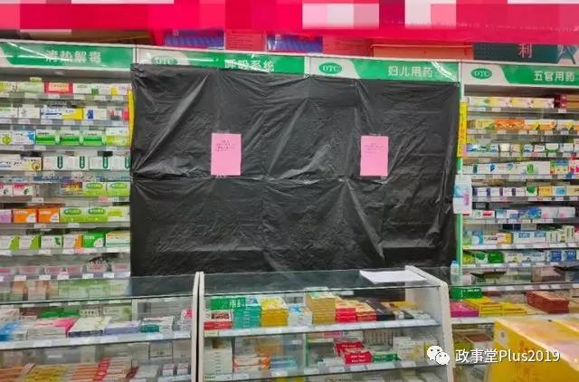
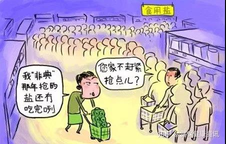

##正文

最近，随着不少企业开始纷纷复工，口罩成为了紧俏之物，不少商家纷纷囤货居奇，把口罩炒出了天价，可即使如此，很多疫情严重的地区，民众有钱也买不到口罩，憋在家里出不了门。

在这种情况下，近日湖北的洪湖市却闹出了一个大笑话，一家药房“善心大发”，按照1元的价格销售了一批口罩，可结果，被当地市场监管部门以涉嫌哄抬价格之名罚42630元，并被没收违法所得14210元。

 

处罚的理由也很无厘头，根据举报，这家药房的口罩进价为0.6元一个，而照当地的行政规定，售价超过进价15%就算哄抬物价。

看到这一则新闻，我突然有点想明白了，为啥全国的物资都往湖北走，可湖北依然缺乏物资了。

按照当地“15%一刀切”的原则，0.6元的口罩最高只能卖0.69元，也就是说，只要商家加价一毛，卖七毛钱，就构成了哄抬物价。

现在全国还有多少按毛计价的商品，这不是逗我么？

严格卡线，就是逼着药房卖个口罩还得亏本卖。

而且，其他城市的口罩都炒成什么价格了？更别说疫情中心最匮乏物资的武汉了，1块钱的口罩对于微商来说，有多少他们就买多少，转手就是净赚。

反观由于疫情期间，药店的上游进货成本以及人工消毒成本都出现了激增，湖北15%一刀切的结果，很容易导致省内的商家们卖的越多亏的越多，市场这个看不见的手，会推动商家们不去销售而转去囤积和投机倒卖。

而且，这不仅仅是口罩，在15%的一刀切之下，大量医药物资在湖北是不赚钱甚至是亏钱的，但是只要运出省就能价格翻几倍。

就像马克思说的，如果有100％的利润，资本家们会挺而走险，巨额的利润空间会促使投机者从湖北采购物资，往外省销售。

而就在此时，全国无数牵动武汉的同胞，都在以高于市场数倍的价格购买物资援助武汉。

于是，部分从湖北加价卖出省的物资，经历了层层转手又回到了湖北，开始了一轮又一轮的循环。可物流转来转去，就是转不到需要物资的抗疫第一线。

而反过来看，那个被行政处罚的药房老板，花费着人工、房租、水电、消毒等一系列的成本，不赚钱去销售1块钱的口罩，本身就是作为一个湖北市民在对自己的城市做贡献，遏制了炒作，把口罩卖给那些真正需要的市民。

对照疫情来势汹汹时，全国各地商铺纷纷关门，可药店却刚好相反，纷纷放弃春节休假，冒着风险开门。无他，都是居民的迫切需求。而民众的需求如果得不到满足，必然会引发恐慌。

我们就拿老百姓大药房来说，20天内全国5000门店卖了两千万个口罩。这些药店们，不仅能够平抑物价，还极大缓解了民众恐慌，贡献其实也是很大的。

这事儿背后的逻辑其实很简单，就像那句经典名言说的，“谁是我们的敌人?谁是我们的朋友?这个问题是革命的首要问题。”

目前病毒是我们最大的敌人，在我们医护能力紧缺的情况下，全国五十万家药店，数百万有着专业培训的从业人员，是我们重要的补充力量。

可是，在上游价格猛涨的情况下依然坚决执行15%的红线，不给一些弹性的执行空间的话，只会逼着更多的药店在疫情期间冷眼旁观，把我们的朋友变得少少，把所有压力都集中在那些医疗工作者和基层公务员身上。

其实，相比于那些不好打击的投机商，药店都是有店铺长期经营的重资产，不仅不容易跑路，也得顾忌邻里邻居的态度，涨价太离谱也会把客户都得罪了，以后没法做生意。

因此，只要地方政府划了一个相对可以接受的盈利线，并说好一旦犯规秋后算账，那么全国广泛分布的药店，以及数百万丰富经验的从业人员，将是政府平抑挤兑，科普教育，遏制恐慌，甚至统计甄别最好的帮手。

中国早就已经是市场经济体系，我们要尊市场和供求关系，管制之下做好正向激励，这样才能将政府和市场的力量都充分发挥出来，形成合力，寻求两者的平衡，才是中国特色社会主义的发展道路。

只不过，很多医疗系统已经非常紧张的地方政府却想不明白这件事儿，甚至还搞出了一刀切，禁止药房售卖感冒药的政策。

 

这个政策跟15%限价一样，出发点是好的，希望患者能够集中到市属医疗，对可能的冠状病毒进行一网打尽，确保地方政府能够对辖区内的疫情得到绝对的掌控。

但是，这种地方政府拍脑袋式的一刀切，如果没有一个温和的执法尺度和成体系的动作，其违背市场规律的行为，反而会造成巨大的混乱。

首先，智商税的保健品横行中国那么多年，可数以亿计的老百姓依然甘之若饴，宁愿吃药和保健品，也不愿意去医院。

因此，当在药店无法购买感冒药之后，隐忍惯了的他们多半会选择强忍着病痛不去医院，导致不仅地方政府手头的数据失真，这些“瞒报”的群众更成为了巨大的不稳定因素。

 

对于很多中老年朋友来说，上面这个改名换姓先后卖蒙药、藏药、苗药、中药的骗子专家，比钟南山还知名还可信 

其次，钟南山院士反复强调了减少人员流动和聚集对防控疫情的重要性，中央政府为了尽量做到这一点，甚至全国范围号召推迟复工时间。

反观看中国每年感冒的人群中，选择去医院的不过十分之一，此次药店禁售治疗感冒症状药品，等于把所有感冒的人都一股脑赶到医院去了。

目前很多大医院的呼吸科都去援助湖北了，如果没有事先万全的准备，瞬间涌入的发热患者将会使得各地医院迅速过载，大量的患者汇聚密闭场所，反而大幅增加了交叉感染的风险。

 

武汉红十字会医院实景

最后，平抑物价、降低恐慌的最佳手段，不是看着15%的限价但是却买不到货，而是在家附近的药店里面，可以随时买到药品和口罩。老百姓看得到，买得到，心里就不慌了，安全感也就有了。

可假如老百姓跑遍全市都买不到感冒和退热药，一旦宣传工作没做好，必然引发民众的恐慌，不仅抢购和挤兑各类物资，还会在网上制造大量的谣言，对没有辨别能力的群众必然会引发一系列恐慌。

 

所以呢，政事堂看来，目前各地的公务员系统，尤其是医疗系统，都是超负荷运转，因此，想要实现对疫情的绝对可控，不是靠关闭药房让患者们“投案自首”，而是发动群众，让根植于社区的药房也跟政府一起建立联防机制。

电视里的那些地方老油条们的套话，大家都听腻了，但是家门口药店都是日常打交道的老街坊，他们说的话，老百姓更相信。

药房里的大夫不仅能够缓解已经过载的医疗系统，对老百姓科普卫生知识，他们对疾病的初步辨别能力以及信任度，也能够更容易说服那些疑似患者去医院就诊。

而且，药房的工作不仅是买药，还要对所有来购买感冒和降温药的民众进行详细的问询和实名登记，他们远比专业的医生更容易辨别小区里面谁是常驻用户，谁是从湖北返回的。

相比于一刀切不允许药店卖感冒药，我们如果就像把支部建到连队上那样，每个小区的药房都建立了疫情防控机制，对体温异常、疑似度高的人员实施立即上报。

这样，根据药房的服务半径和详细的患者调查，全市任何一个社区出现发热激增，或者从武汉返回人员密切关系的人，政府都能够将范围缩小到以小区为单位，及时触发预警，那么全市就真的形成了一张网，让病毒陷入到被围剿的境地。

这背后的逻辑很简单，面对疫情，我们各级政府不能只靠医院和公务员，还要把社区的药房、诊所力量都联合起来，这样才能做到全国的一盘棋。

中国革命的胜利，不是在办公室里面打电话下指令，不是靠几个所谓的主力师，而是要下基层，跟群众们站在一起，团结一切可以团结的力量，去赢得人民战争的最终胜利。

##留言区
 

