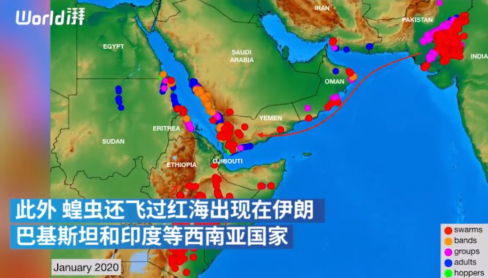
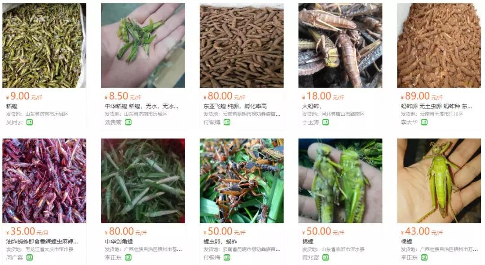

##正文

近日，联合国粮食及农业组织（FAO）向全球进行了预警，称希望全球高度戒备现在正在肆虐的蝗灾，防止被入侵国家出现粮食危机。

 

据悉，这群引起东非70年以来最严重蝗灾的蝗虫们，目前已经飞过阿拉伯半岛，到达了巴基斯坦和印度西海岸。

 

面对4000亿蝗虫，刚刚号称12天打败巴基斯坦，70万部队大军压境的印度，瞬间怂逼，不得不低调的撤军。

屋漏偏逢连夜雨，印度即将面对的不仅是蝗虫，本月24-25日，全球搜刮的特朗普将首次以美国总统身份访问印度。

之前，特朗普先是对印度的钢铝产品征收的高额关税，后又撤销的印度普惠制待遇，如此的大棒挥舞，也意味着特朗普此次访印的胃口不菲，不仅要签署大额的军火订单，也会迫使印度扩大农产品与医疗设备的市场准入。

尤其是美国大选的初选已经拉开帷幕，印度要是不买个几十亿的美国军火和农产品进口，正遭遇蝗灾的印度，怕是送不走特朗普这个瘟神。

不过换个角度来看，这同期到来4000亿的蝗虫倒是帮了莫迪一把。

特朗普要求的购买额度对于印度来说并非无法完成，主要是主打民粹主义的莫迪不能显得被特朗普打压的太厉害，开放过多的市场，否则，骄傲的印度民众会让莫迪丢失大量的丢选票。

就像去年的RCEP，莫迪本人还是想签的，但是国内反对势力的呼声实在是太大了，莫迪不得不最后时刻违约。

而此次蝗灾一来，却给莫迪创造了一个非常好的机会，他有了充分的理由从美国购买大量的飞机用于消灭蝗虫，还可以购买大量的农产品对冲蝗虫造成的农业减产。

这样还是得特朗普在印度的形象，瞬间就从一个敲诈者变成了为印度雪中送炭的好朋友，协议的草签反而能够拉升莫迪的支持率。

因此，接下来的美印会面，必然会亲热无比，哥俩之好，仿佛异父异母的亲兄弟。

 

毕竟，特朗普也能从中大赚，在美印度裔的选民高达400万，由于普遍从事科技领域，基本都是民主党的支持者，但是印度人骄傲的民族情怀，很容易为了支持莫迪转而支持莫迪的好朋友特朗普，来一场大规模的倒戈。

嗯，可以说一场蝗灾，间接促使了印度裔、农场主和军火商都去投票特朗普。

想到这里，政事堂脑海中浮现的，是一群来自东非的蝗虫一边不辞辛苦的翻越数千公里的沙漠和海洋，一边比划着剪刀手高呼“Make American Great Again”。

 

当然，看到美印交好，我们也不必慌张。

虽然特朗普能够实现对印军火的大单，可这对美国来说未必是好事儿，印度用了半个多世纪的苏制装备，军队上下都被俄罗斯人渗透成了筛子，估计飞机没飞几次就得坠毁，然后零部件就不知所踪。。。。

而且，看到印度购买军火了，巴铁估计也得攀比一下，从老大哥那里购买一波先进武器增强国防力量，继续紧跟老大哥。

此外，随着特朗普打赢了参议院的弹劾，自信无比的他在国内以及国际，都将开始洗牌，对于支持民主党的各股势力进行打压，对于支持自己的势力进行扶持。

因此，所有正在准备跟特朗普签署协议，或者是准备超额缴纳军费的国家，其实不自觉的都会被特朗普划到一个阵营当中，给予一定的保护，这些亚洲国家之间的关系反而会加速回暖。

这使得今年反而是亚洲外交界洗牌最好的机会，能够开创很多前人不敢想的事情，这也是为啥中日两国最近都在暗送秋波。

至于那4000万亿已经席卷了东非的蝗虫，我们也不必担心，冰封的青藏高原不是吃素的，气温就是对蝗虫们最大的杀手。

至于某些零散绕道缅甸入境的，我们也不必过于担心，在我们“大吃国”，只要能食用的，多半是需要养殖来维系物种的生存。

 

因此，那群漏网之鱼有可能轮不到广东人，云贵川渝的吃货们就把他们灭绝了......

所以呢，政事堂倒是希望印度友人开放空域，让我们的飞机去帮忙捕杀蝗虫。

毕竟，随着野生动物坚决不能吃了，蝗虫则有可能在中国，成为另一种每年都要被吃掉数百万吨的小龙虾....

 

##留言区
 

