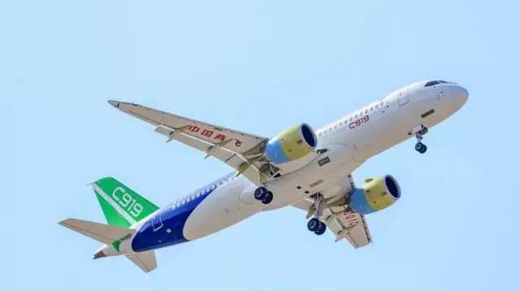

##正文

最近很多券商朋友们被折腾的异常苦逼。

先是为了4000亿的印度蝗灾，各家连夜召开电话会议，研究蝗虫概念股，出具蝗灾深度报告，甚至还有券商画出了勤奋的蝗虫如何绕过喜马拉雅来东土大唐取经的路线图。

 

结果，券商集体推荐的蝗虫概念股的研报刚连夜出来，都没来得及琢磨蝗虫如何飞过6000米的冰川，昨天一早印度方面就传来了蝗灾已基本结束的消息。

看着蝗虫概念股一个个股掉头向下，A股"飞蝗腾达"的梦想瞬间窒息，各位券商大佬们也纷纷无奈的调侃“这届蝗虫不行”。

而另一边，据外媒报道，美国商务部介于国家安全考虑，正准备提案阻止GE为中国的的大飞机C919提供发动机，于是券商们又是连夜分析空动力产业链概念，推出各种大飞机国产化将提速的研报。

可结果特朗普跟那些”Make American Great Again”的蝗虫一样不靠谱，这位推特治国的美国总统，直接推特宣布否决了可能阻碍向中国提供发动机的提议，并表示他已指示其政府防止此类举动。

 

于是，连夜撰写赶出来的研报刚发出来，又一次被特朗普给硬塞了回去，估计这几天肿着眼袋加夜班的券商大佬狂躁的内心都要发出怒吼：“唯特朗普与蝗虫难养也”。

 

而此次不解的不仅有券商大佬，很多国际关系专家们也是一脸懵逼，很多人文章都写好了，大骂美国趁着疫情搞偷袭我们的飞机产业。

结就在昨天，特朗普批准对好基友普京钱袋子的俄罗斯石油公司实施制裁，引爆了黄金等避险资产，却没想到对中国的大飞机“网开一面”。

更不要说，今年是每逢四年中美关系大姨妈式恶化的一年，搞得大家一头雾水。

不过，相信政事堂的读者们普遍不会觉得意外。

看看最近在德国举行的慕尼黑安全会议就会明白，刚刚打输了弹劾案的佩洛西，如今都把跟特朗普的矛盾全球化了，公开表示要团结一致，确保特朗普没有第二个任期。

曾经需要树立共同敌人以弥合选举裂痕的美国，这次根本不需要这个共同的敌人了。

而同样，也是在慕尼黑的安全会议现场，面对佩洛西呼吁美国的欧洲盟友为了安全屏蔽华为，傅莹女士一句“您真的认为民主制度是这么脆弱么？会被华为这样一个高科技公司所威胁？”怼得佩洛西哑口无言。

 

这句话忍了这么久，放在佩洛西惨败给特朗普之后，没有去怼蓬佩奥但是却怼了佩洛西，似乎也有一点巧合。

当然，另一方面，现场妙语的背后，本质还是外交牌桌上胜利的附属产品，在本次安全会议前后，英法德以及欧盟均明确表示不会排除和歧视华为。

而这些欧洲的外交老油条们做出这个决策的背后，也是对美国如今深陷两党殊死搏斗的情况门清，知道华盛顿越来越难形成统一的意见。

尤其是在特朗普轻松打赢了弹劾案的情况下，民主党的代理一号人物佩洛西说话到底还有多少分量，大家心里面也都有数。

而随着特朗普已经开始了为今年大选进行的全国巡讲，面对民主党候选人的集体攻讦，以及税单等一系列“地雷”，特朗普只需用三个字就能怼回去，那就是“看经济”。

特朗普上任的这几年，股市、房市、就业的数据都是一路高歌猛进，绝大部分的美国人不管是否喜欢特朗普，都在特朗普景气中获益颇丰。相信真到了选举的时候，恐怕很多人也是嘴上骂着特朗普，但身体却会很诚实的投给他。

而特朗普能够实现景气的背后，一方面是国内通过各种政策的组合拳，大规模的放水进行经济刺激，另一方面是对富裕的亚洲各主要经济体进行经济压榨，为美国谋求利益。

从中日韩印的关税与购买协议，到日韩的天价军费，甚至沙特的巨额军火生意，那些特朗普在亚洲的外交动作背后，不少为能在2020年实现一波经济的强刺激而服务。

所以，类似于停止对中国大飞机停供发动机，跟特朗普的竞选规划是完全相悖的，必然会被否决。毕竟737连续坠机后，全球停购让美国航空产业链的众多企业损失惨重，就指望着中国大飞机的投产带动订单和就业。
 
 

甚至未来美国对华为和中兴的限制也可能有类似的情况，如果我们能体现出2020年加速建设5G会大规模从美国采购芯片等设备，估计特朗普也会考虑今年先放一马。

更不要说这一波的冠状病毒了，疫情影响最严重的就是中日韩印这四个全球经济的发动机，而这四个国家的经济引擎将会决定今年的全球经济形式以及美国产能的购买情况。

所以，昨天特朗普突然批准制裁普京的钱袋子俄罗斯石油也说得通。

毕竟，中日韩三国因为疫情石油需求锐减这一项，所引发的连锁反应，就够特朗普和他正准备IPO的大金主沙特萨勒曼家族喝一壶的，更不要说疫情扼杀的消费需求有多大，谁心里也没有数。

因此，别说什么大飞机的引擎了，估计特朗普这位中国人民未来的老朋友，比不少中国人还急迫的关心这一波疫情能否尽快好起来。

毕竟，对于这位交易的艺术大师来说，嘴里喊得都是主义，心里装得都是生意，一切要为他的总统连任而服务。

##留言区
 

