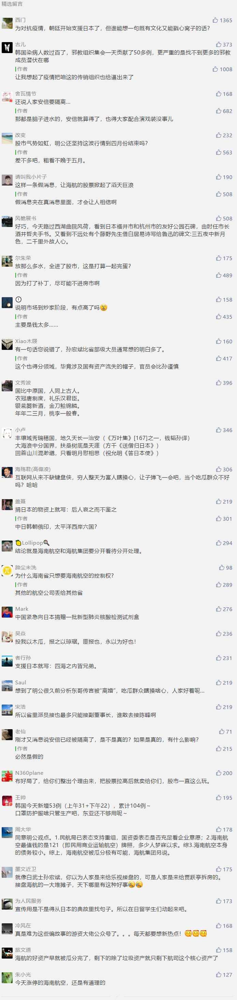

##正文

昨日，新冠肺炎攻破日本首相官邸，成为了中国网友们讨论的话题，很多人纷纷调侃，日本内阁是不是应该被集体隔离了。

起因，是18日日本官方长官在记者会上披露，因乘坐肺炎确诊病患驾驶的包车，日本最大通讯社共同社有10名工作人员已被要求在家隔离，其中有1人为担负首相官邸采访任务的政治记者。

考虑到这名安倍的跟班记者，每天都可以出入首相官邸，甚至可以跟在安倍身旁一米的距离，吐沫星子都可能喷到安倍的脸上，仿佛安倍就要一传十十传百，成为日本病毒爆发的一个新里程碑。

尤其是根据共同社刚刚公布的舆论调查，安倍2月的支持率下跌了8.3个百分点，很多刚刚替印度操心完蝗虫的朋友们，又开始替日本关心首相是不是要换人，甚至还有媒体鼓吹病毒是“安倍将迎来执政最大危机”。

但实际上，这些都是瞎操心。安倍支持率的下滑，是因为“赏樱会”，和病毒的关系并不大。

而且，虽然日本是全球患者第二多的国家，但实际上患者主要都集中在国际邮轮上，就算加上中国游客，在日本本土患者都不足百人。

甚至就算民众不满，日本的政治体制也决定了民意对国策的影响并不大，因为日本跟美国不一样，他是跟英国类似，首相都是最大党团的党魁出任，今年日本参众两院都没有选举，安倍对民意并不过分关心。

更不要说近年来安倍的自民党在日本一家独大，安倍的努力方向都已经是拉着2/3的议员推动修宪，可以说，只要今年的东京奥运会成功，前面支持率的短暂下滑也对他没有任何影响。

所以呢，虽然病毒对日本的冲击很大，但实际上对安倍的首相大位的影响是非常有限的，估计就跟印度的蝗虫一样，纯属在家闲得没事的中国媒体和网友们瞎操心。

而昨天还另一个刷了朋友圈的消息，说的是海航被分拆重组，陈锋更是让出了海航集团的董事长大位。

这消息的确看起来像真的，就像陈锋经常说，航空是一个利润很薄，但是风险很大的行业，就像他去年接受媒体采访时说的，“要是遇到非典这样的情况，那真是颗粒无收”。

结果一语成谶，刚从老对手王健手里拿回海航控制权的陈锋，把2020年定为海航化解流动性风险的决胜之年，结果就遭遇了一轮新的病毒冲击，海航围绕着航空布局的各类资产几乎无一幸免。

本来海航还可以通过预售机票来缓解一下现金流，可是这一轮不仅票卖不出去，之前预售的钱还得根据政策无条件推给用户。

于是，很多人都觉得海航这一轮撑不过去，大家对于朋友圈的消息也都表示相信，甚至今天一早资本市场也因此搞起了一波海航流。

不过，在政事堂看来，就像媒体认为安倍遭遇所谓的“最大危机”那样，资本市场对于政治的理解同样堪称可笑，政府怎么可能会接管海航集团呢？

海南省政府有兴趣的是影响未来海南全球化的海南航空，而不是拿着杠杆去收购的海航集团，就像孙宏斌对贾跃亭感兴趣的是乐视主营的电视和影业，对王健林感兴趣的是主营的旅游地产，而不是他们搞出来的那些全球化的衍生品。

孙宏斌都能想明白的事情，省部级的地方大员们想不明白么？

海航这几年的野蛮发展，换了好几拨人，埋了那么多的地雷，海南省政府不可能傻到以国资身份去介入海航集团的债务处理，否则，到时候全球的债主们都围在省政府门口讨债，谈解决方案，海南还怎么发展国际旅游岛？

因此，政事堂认为，海南省政府只可能以获取海南航空实际控制权的条件，帮助陈锋去协调解决一些问题，而不会傻到去趟海航集团的烂摊子，接任董事长，把海航集团接手过来。

所以，面对昨天读者轰炸式的询问，政事堂的回答就两句，海航受病毒的冲击异常严重，但集团被托管的事儿还没听说。

##留言区
 

