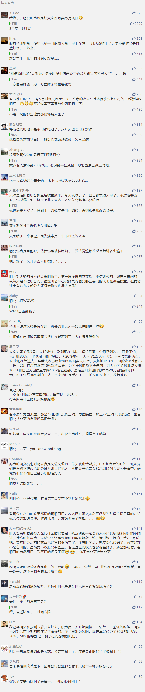

##正文

随着最近A股重上3000点和恒大的全国套路75折，不焦虑工作的朋友们都开始焦虑资产了，也让我这几天的微信也被股市和房市的询问所侵扰，索性都不拿手机，专心教育孩子去了。

但是，考虑到这种问询只会越来越多，因此还是写一篇文章，把股市和房市的逻辑和具体的应对措施写一下，因此，也请大家最近一个月留言区别再刷屏式的询问，别搞得我都没法正常回复留言。

首先，去年下半年的时候，政事堂就提出一个逻辑，2020年的一季度房地产和股市都会出现小阳春，随着今年年初疫情的爆发，政事堂也对这个逻辑进行了部分修正。

结论是，股市的小阳春依然会出现，但是会比原先设想的分化，主力会变为政府希望推动的新基建。但是，房地产的小阳春会逆转，房产销量会下滑，而土地成交有可能会提升。

判断的文章为一个月前写的：《冠状病毒是否会改变一季度的小阳春？》。

大概，在那个资本市场极度恐慌的时候，跟政事堂一起站在“多头”一方的，好像也只有“万年多头”的李大霄等寥寥几人。

小阳春的逻辑基础，政事堂在之前的文章中分析的很清楚，简而言之一句话，国家财政将在一季度把弹药集中打出来。

而冠状病毒不会影响股市小阳春的逻辑基础，则是体制优势的我们会利用调集财政力量进行“饱和式防御”，财政+货币政策的集中，不可能拉不起来。

所以，我带着兄弟们又来了一次“为国护盘”。

而最近几天，又有很多眼红的韭菜询问我，现在是否可以为国护盘。

这话听起来，就像有人去了个陌生的城市，脸红扑扑的问出租车司机：有啥值得推荐的按摩么？

如果不熟的话，我一般一句话就给怼回去，你去接盘吧。

因为很简单，只要完成了九年义务教育，为国护盘期间几乎不可能亏钱，而接下来的小阳春，虽然股指应该还会震荡向上，但是那些问我还能不能护盘的人，估计十进去九个都是亏。

因为我们现在已经进入到轮动的阶段，券商的研报，热点的事件，背后是啥？不都是为了拉高出货让韭菜们接盘么？

就像市场上为啥一股脑的鼓吹印度的蝗虫？搞得像燃烧军团入侵一般，甚至还有画好了入侵的路线图。

还不是为了推高相关的股票？

还有之后的美国制裁飞机引擎以及特斯拉的钴电池，虽然事后证明都是扯淡，但还是都被市场狠狠的炒了一番，甚至用微信截图编了个段子，说海航集团被接管董事长换人，更是搞得整个概念股集体上涨。

说白了，都是套路。

这个时候追涨类似于跟着庄家炒空气币，只不过是刀头舔血，赌赢了了也不过是最后没砸在自己手里罢了。

接下来的一个月，无论是搞个什么新品，还是举办个发布会，甚至老板闹出点绯闻，都是炒家们做概念的好帮手。

相信聪明点的大老板，这个时候相信已经开始联系明星的经纪人了......明

正所谓男人的嘴，骗人的鬼，接下来怎么走跟基本面没啥关系，所谓的涨停股，完全只是看大忽悠们在忽悠啥。

 

只不过，唯一比较欣慰的是，新基建仍然会是拉涨的重点，毕竟概念新，仍会是大家炒作的重点，毕竟，那些赚得盆满钵满的大忽悠们自己都搞不明白，更不要说那些股民了......

 

本质，跟信双黄连没啥区别.....赚钱的是药厂和药房......

但是，再怎么忽悠，一季度的小阳春，最后还是要结束的，李大霄的所谓的地板论，用不了太久就得被打脸。

很简单，因为集中在一季度的财政子弹，是要打到大基建和新基建里面的。只不过，由于春节以及今年的疫情，传导机制受阻，一季度的财政子弹以及应对疫情的货币子弹，由于饱和式的攻击，过剩了导致没地方可用。

毕竟，房地产锁死了进不去，因此饱和式的子弹就只能去股市转一圈。

但是，这笔钱是必须要花出去的，而不是作为长期资金放在股市里面的，因此，股市的流动性过剩引发的小阳春，必然也会随着潮水的褪去而复原。

而这也是政事堂说的，这一轮小阳春估计最迟5月也就结束了。

当然，年中大家都缺钱了，那时，反而是价值投资群体们，买股票和房子的好时候。

##留言区
 

