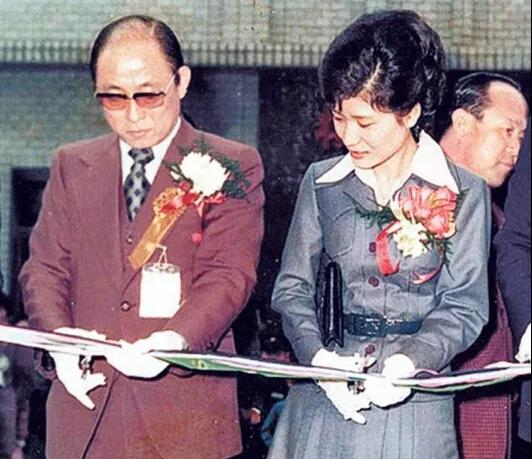
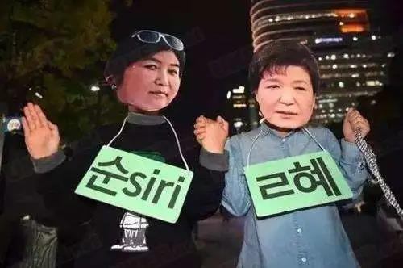

##正文

韩国的病毒，怕是很难控制了，截止今早，韩国新增123例新冠病毒感染病例，累计确诊病例增至556例。

如果不把国际邮轮上的病例计入日本，那么韩国早已取代日本，成为全球疫情第二严重的国家。而且，继安倍首相官邸的随行记者被隔离，文在寅青瓦台的十余名内部警卫也因可能接触过患者而被要求自行隔离。

此刻，中日韩这一衣带水的兄弟三国，还真有点难兄难弟的感觉。

而值得关注的是，目前韩国的五百多确诊病例中，有三百多都是源自韩国的著名邪教“新天地”教会。

这个邪教成立于1984年，教主李万熙仿佛义和团大师兄一般的自称“肉身不坏”，又仿佛洪秀全那样以《圣经》为基础传教，号称救世主，麾下拥有20万教众。

而有趣的是，这个教会的传教模式跟病毒入侵人体很像，他们经常会让先遣队伪装成正常的教徒，潜入正常的基督教会，然后通过各种手段排挤走原来的牧师，获取控制权后开始RNA复制般的大规模传教，继续入侵其他的的教会。

就像病毒的不好控制那样，该宗教如病毒般的扩散性不仅令韩国政府防不胜防，其狂热程度更是让政府在打击过程中头疼不已。

就像此次引发韩国病毒扩散的超级感染者，就是一名61岁的女教徒，她在出现症状后仍坚持频频参加教会活动，导致潜伏在大邱市的数千名“新天地”教徒也成为难以被监管的传播对象。

 

不过，虽然这个病毒邪教传播了病毒，但是很可能也要被病毒搞得团灭了。

一方面，韩国国内的舆论能压死他，患病的教众也会丧失信任，众多的教徒会看清楚邪教的真面目而脱教。

另一方面，在国际疫情危机面前，韩国政府有了充足的理由，能顶着国际干涉的压力而去顺藤摸瓜，彻底挖了邪教的根子。

就像生物学中不断出现的轮回那样，一种病毒发展起来之后，他往往是被另一种病毒灭绝的........

而值得关注的是，日韩邪教的能力都非常强大。

就像当年日本奥姆真理教搞出来震惊世界的沙林毒气案那样，韩国的邪教不仅多如牛毛，而且与政治集团也有着密切的往来，甚至前总统朴槿惠“精神上的丈夫”，就是韩国永生教的教主。

 

而朴槿惠也因为这一层关系引发的闺蜜干政门导致如今仍身陷囹圄。

 

说来，东亚各国除了朝鲜之外，都深受基督教的各类邪教分支所困扰，而且很多教派还经常往返于三国之间相互传教。

譬如在日韩拐骗了无数少女的摄理教教主，就在中日韩的联合追捕之下落网，刚被中国取缔的全能神，前段时间则试图转移到韩国去传教......

甚至就在前年，咱们公安部就针对这次在韩国传播疫情的新天地邪教进行了严厉的打击。

 

只不过，新天地教没有放弃，还继续安插卧底在中国潜伏，直至上月底新天地’大邱教会领导人的哥哥去世，负责中国地区业务的传教士回韩国时，把病毒也带了回去.....

好了，就不继续调侃了，政事堂很少去一味抨击一件事儿，因为任何事情的存在，其背后都有着合理的理由。

东亚各国邪教的泛滥，尤其是精英层信仰邪教的情况，在全球都是比较罕见的，而这，背后也有着比较深的历史原因。

东亚各国被儒家文化统治了千年，顶层的精英由于受儒家“子不语怪力乱神”的影响，因此在全球基督教和伊斯兰教引发宗教战争不断的中世纪，东亚的宗教力量被压制，反而无力干涉政治。

但是，随着工业革命和鸦片战争，全球的经济文化中心从东方向西方转移，在亚洲人不断的被打击和羞辱之中，顶层精英们的儒家信仰也开始崩溃。

因此出现了一个局面，一方面随着基督教势力的传播，信仰空缺的亚洲普通民众开始接受基督信仰，而另一方面，各国的精英阶层也在根据各自的历史寻求新的精神依托。

于是，在十九世纪，随着基督教的传播，远古时代的自然神信仰也纷纷在东亚的大地上重现，日本选择了神化天皇的神道教，被日本殖民的朝鲜精英们捡起了传统的巫术，而当时的中国大地，清廷也选择扶持起了扶清灭洋的义和团大师兄.....

 

不要嘲笑他们，面对工业化这千年未有之大变局，丧失了儒家正统的东亚各国精英们，都不得不试图寻求属于自身民族的超自然力量。

而随着二战结束，雅尔塔新秩序之下，日本和韩国被纳入美国的势力范围，朝鲜被纳入苏联的势力范围，韩国李承晚政权几乎一色都是基督信仰的美国留学生，日本神道教的天皇也被请下了神坛，基督信仰开始在日韩迅速铺开。

因此，也不必过分斥责日韩的精英阶层对那些基督教的邪教采取纵容的行为，因为就跟朝鲜搞神化类似，也是另一种脱离雅尔塔秩序，寻求民族独立的手段之一。

因为，他们做的事情，都决定了必须要去团结更多的人，而信仰“双黄连”的主体民众，普遍都是愚昧的。

而从这个角度，我们也会对雅尔塔双极之一的苏联解体期间，钱学森带头练中国传统气功，金庸的武侠被解禁有另一种理解，也会明白为什么在特朗普彻底终结雅尔塔体系之际，中医突然就被重视了起来。

而懂了这些，也就懂了什么叫做历史洪流之下的历史进程，也就能更好的选择自己的道路。

就像一百多年前，亚洲的各路精英们面对时代洪流时，都在从本国乃至亚洲的历史上探寻文化，去寻找能够团结更多力量的新方式。

如今，面对这一场百年未有之大变局，我们也要“山川异域,风月同天”，无论中日、中印、中韩，也都在从历史文化角度切入，寻求我们之间的共同点，“把朋友变得多多”。

写到这里，对照昨天雅尔塔体系撕裂的文章，大家也许就能更深刻理解，重塑我们文化体系的意义，以及今年教育部的“一号文件”。

在长远的未来，中国在战略上需要一大批能够讲好中国故事，讲好亚洲故事的年轻人。

而短暂的目前，为了降低疫情对东亚各国关系回暖的阻碍，我们需要推动一个共同的敌人来团结大家，而这个要被病毒团灭的旧时代教会，也许正是一个绝好的目标。

链接：

刚刚，教育部“1号文件”发布，开启百年未有之大变局

青山一道同云雨，明月何曾是两乡

中日友好，机遇都在哪里？

4000亿蝗虫和特朗普，都要去印度了

治理蝗虫，还得靠东土大唐

##留言区
 无留言