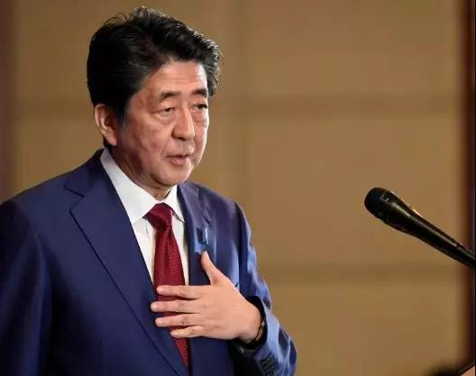

##正文

今天一早，“东京奥运会或将取消”的消息引爆了社交网络。

据环球网援引美联社，国际奥委会最资深的委员庞德放了一个大炮，称若新冠肺炎疫情在5月下旬仍然得不到控制，2020年东京奥运会可能将会被取消，而不是推迟或换城市举行。

 

很多人也开始跟着分析可能性，甚至搞不好券商都要连夜出一个取消影响的股票列表......

当然，这种新闻政事堂是不会相信的，不过，新闻背后的博弈，倒是值得跟大家分享一下。

这次放炮的庞德曾经两次担任国际奥委会副主席，当年左手管市场，右手管反兴奋剂，一手胡萝卜一手大棒，权力之大在仅在萨马兰奇一人之下，甚至后期已经主持了奥委会的工作。

不过，在萨马兰奇时代结束后，2001年竞选国际奥委会主席选举中，庞德这位得到了美洲国家的全力支持的加拿大人，最终输给了欧洲国家支持的德国人罗格。

竞选失败后，庞德自然遭到了清算，这位掌握着市场和反兴奋剂两个最大权力机构的大佬只能交出权力，黯然辞退居二线，出任奥运研究委员会的主席。

而2013年，被“”钦定”的德国人巴赫从老乡罗格手中接过了奥委会主席，也意味着代表着美洲利益的庞德在奥委会中继续边缘化。

所以呢，虽然庞德是奥委会最资深的委员，但是他的表态不仅不能代表奥委会的态度，甚至可以被视作奥委会态度的反面教材。

**他既然说“或将取消”，那么就意味着，无论疫情多么严重，东京奥运会都不会取消。**

当然，这种大佬级别的人自然不会乱说话，明年奥委会又将迎来新一届的竞选，届时，又将是全球各个国家合纵连横的舞台，庞德此举很可能是提前挖了个坑，等着欧洲人往里面跳。

试想一下，如果东京奥运正式举办，但是却引发了病毒扩散，那么“奥运吹哨人”庞德也就将迎来咸鱼翻身的机会，美洲势力将有机会从欧洲人手里夺取奥委会的控制权。

看看，借着疫情为自身牟利和布局，这才是国际级大佬的风范。

当然，趁机布局的不仅有奥委会这样的国际组织，那些疫情重灾区国家也都在进行汹涌的博弈。

譬如目前正在进行议会选举的伊朗。

就像政事堂之前预测的，特朗普斩首苏莱曼尼之后，会导致伊朗今年的议会选举和明年的总统选举，保守派会全面上台。

目前，虽然在伊朗宗教势力的操控下，亲伊斯兰革命卫队的保守派正在议会中取得了压倒性的优势。但是，操纵也导致了巨大的反弹，此次议会选举也创造了伊朗投票率最低的历史记录。

更不要说，保守派上台后，短期内就不要指望美国解除封锁了，受到疫情冲击的伊朗，经济问题只会更加严峻。

于是，面对这波疫情，伊朗的保守派顺势将矛头全部指向了美国，将所有的死亡都推到美国的封锁上面。

一方面，这将使得选举期间保守势力将亲美议员取消竞选资格引发的巨大民意反弹遏制住。另一方面，也将为以人道主义为由，打开部分美国的封锁。

而内政方面，伊朗的公共医疗体系是美国在伊斯兰革命之前帮忙建立起来的，因此也是美国力量渗透最厉害的地方。搞不好接着这一波疫情爆发，伊朗保守势力正好接着民意的支持，清洗国内的亲美势力。

再加上，很快议会也被保守势力控制，伊朗总统鲁哈尼在大政方针以及外交领域很难有所作为，不出意外也将提前告别权力中心。

也可以说，奥巴马花了两个任期苦心培养的伊朗亲美势力，两个月内就被毁于一旦.......

 

而亚洲的另一边，奥巴马政府苦心扶持了两个任期的韩国保守派，也将遭遇到病毒的攻击。

下个月15号，韩国即将迎来的国会议员选举，进步派的文在寅如今正深陷经济增长乏力的危机，想要有所作为，甚至趁着今年特朗普大选年把半岛和平向前推进，就必须拿下议会。

而不知道是不是文在寅的运气好，这次疫病集中爆发的大邱市和庆尚北道，恰巧也是韩国亲美的保守势力大本营，之前骂我们最狠的就是这里。

毕竟，当年奥巴马搞的萨德系统，可就是落在大邱市旁边的庆尚北道。甚至两位被文在寅送进监狱的前总统也都是这里人，朴槿惠出生在当时还下辖在庆尚北道的大邱市，李明博则是庆尚北道的“庆州李氏”。

作为亲美的保守派大本营，之前韩国举国民意滔滔弹劾朴槿惠的时候，只有大邱一个市选择无条件支持朴槿惠。更不要说大邱和庆尚北道的那些基督教宗教组织，也都是朴家的铁杆。

结果，大邱和庆尚北道跑到首尔，为朴槿惠伸冤的游行，反而成为了疫情扩散的重要途径，更不要说，宗教组织新天地更是集中了韩国大部分的疫情患者。

如此的巧合，相信这也意味着，文在寅的韩国进步派跟哈梅内伊的伊朗保守派类似，面对经济和疫情的双重冲击，给国民树立一个敌人，来团结民众。

于是，文在寅政府24号把对大邱及庆尚北道列为特别管控区，实施“超强防控措施”和“最高级别的封锁”，今天开始，更是对全国约21万名教会的信徒进行强制测试.....

这意味着，亲美的韩国保守势力，在这一轮疫情中，操作得当，很可能也被站在韩国人民的对立面上，给文在寅一个机会，让他能够在今年毕其功于一役，开启半岛和解的大门。

 

以上只是随便跳的几个例子。

我们回顾一下，在特朗普上台的四年里，俄罗斯、韩国、土耳其、沙特、伊朗、伊拉克、叙利亚、菲律宾、乌克兰、阿富汗......

那些奥巴马时代花费了巨大代价扶持起来的各国国内亲美势力，都在特朗普的一系列眼花缭乱的交易过程中被牺牲掉了，某种程度上来说，特朗普本人恐怕也能算是西式民主的病毒。

而现在特朗普面临的问题，则是突然爆发了一波可能干掉他的病毒。

就在从印度往回赶的特朗普表示疫情可控，股市是因为桑德斯而暴跌的时候。美国的医疗系统也已经开始当“吹哨人”了，今天，美国疾病防治中心的高级官员坦言疫情扩散不可避免，"只是时间的问题"。

两者谁对谁错目前还不得而知。但看着特朗普提名的国土安全代理部长一问三不知的状态，如果接下来特朗普再继续对民众拍胸脯说可控，那么我们就要担心危险了。

 
[Zst_LINK_20200226_1](https://v.qq.com/x/page/p3072u9wock.html)

因为死对头民主党的策略，可能正是文章开篇中提到的奥委会庞德的套路。

庞德那属于投机，但做一个极端的假设，如果白宫的数据统计方式有误，让“没有人比我更懂病毒”的特朗普误以为疫情可控，那么今年的国际局势以及金融环境，就将变得异常可怕了......

##留言区
 

