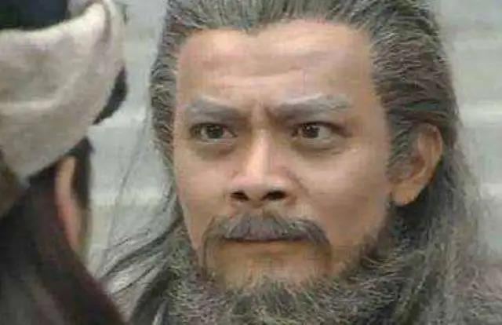
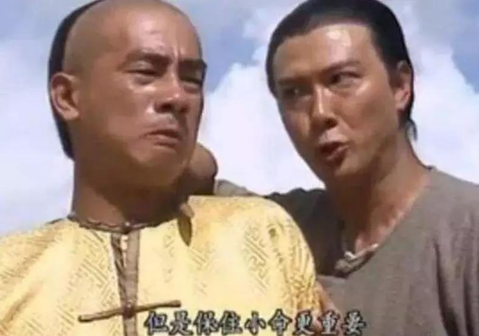
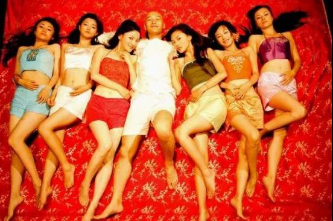

##正文

今天，跟大家聊一下金庸在构筑他武侠世界的过程中埋的一些彩蛋。

很多人都知道，在射雕英雄传当中的五绝，东邪黄藥师属青木，西毒欧阳锋属白金，南帝一灯属于红火，北丐洪七公属黑水，中神通王喆属黄土。

 

对传统文化造诣颇深的金庸不仅在造型中，喜欢将桃花岛众人身着青衫，白驼山众人一身白衣，甚至连武功之间都存在五行相克。

譬如，火克金，南帝一灯重创了西毒欧阳锋；金克木，西毒欧阳锋重创了东邪黄药师并杀了梅超风；木克土，东邪黄药师把中神通周伯通困在桃花岛多年。

而且不仅是武功，小说人物之间也存在着五行相生相克的联系。

譬如郭靖黄蓉杨过三人，水生木，所以郭靖的似水柔情能俘获青衫黄蓉的少女心，金生水，所以西狂杨过多次舍命救北侠郭靖一家，但是金又克木，所以木系的黄蓉总被金系的西毒欧阳锋害，也一直对西狂杨过百般提防。

而一见杨过误终生，“被斩”后终身不娶的妹子，还都是木系的。

陆无双是黄药师徒弟陆乘风家的孩子，程英是黄药师的徒弟，郭襄是黄药师的孙女，唯一一个不是随黄药师的，名字还叫公孙绿萼.....

 

而除了五行之外，阴阳相生的理论，也让很多人物和剧情之间，有如镜像一般的对应。

譬如，神雕的男主杨过就是神雕男二号杨康的对立面。

杨康出身小王爷，杨过出身小乞丐，杨康谋求上位，杨过归隐山林，杨康多次谋害郭靖一家，杨过多次救郭靖一家，杨康杀了江南五怪，杨过多次救柯镇恶，杨康阴谋夺取丐帮献给外族，杨过则破坏了外族夺取丐帮的阴谋......

甚至很多情节中都能够体现出金庸的偏执。

譬如杨康强奸了秦南琴，杨过的小龙女就被玷污，杨康杀了欧阳锋的儿子，杨过就反过来给欧阳锋当儿子，郭靖的爸爸郭啸天为救杨康的爸爸杨铁心断了一臂，杨康的儿子杨过则把一只胳膊还给了郭靖的女儿郭芙。

 

可以说，这种激烈的冲突不仅满足了金庸的宿命感，使得人物形象鲜明，还推动了故事剧情的发展。

就像大家都知道的，“恶紫夺朱”，天龙八部里面阿朱和阿紫俩人从性格到命运，都处于对立面之上，最终一个死的时候抱着心爱的人，一个死的时候被心爱的人抱着。

同样，主人公乔峰也有一个对立面，那就是游坦之，从名字上就能看出来，一个是“峰”，一个则是对应的“坦”。

乔峰在贫困的乔家被养大，游坦之出身锦衣纨袴，乔峰行事果断，游坦之毫无主见，两个南辕北辙之人，在一场聚贤庄大战后，被联系到了一起。

 

阿朱盗取后送给乔峰的易筋经，最后落到了游坦之手里，游坦之心里只有阿紫，可阿紫心里却只有乔峰。

少室山长大的乔峰为了姐姐阿朱独闯聚贤庄，聚贤庄长大的庄聚贤为了妹妹阿紫聚众大战少室山。

乔峰被全冠清的阴谋之下丢掉了丐帮帮主之位，而游坦之却在全冠清的扶持之下接过了丐帮帮主大权。

游坦之为父亲报仇，一路追着大恶人乔峰，最终却爱上了乔峰的小姨子，而乔峰寻找了整部书的大恶人，却最终发现竟然是自己的父亲......

 

最终，两人在同一个悬崖，结束相互之间的历史宿命。

这种剧烈的反差在金庸小说中有很多，不过，普遍是用反面人物来衬托正面人物。

 

而有趣的是，到了金庸封笔之作的鹿鼎记时期，主人公韦小宝却是个反面人物，他的各种特质，几乎是站在了其他各部书主人公的对立面之上。

陈家洛才貌双全，韦小宝大字不识，胡一刀光明磊落，韦小宝卑鄙无耻，杨过痴情一片，韦小宝滥情渣男，张无忌包容宽厚，韦小宝睚眦必报，乔峰英雄豪迈，韦小宝虚伪油滑，令狐冲重情重义，韦小宝贪财好色.......

很多主人公选择No的情节，到了韦小宝这里就变成了Yes.......

也可以说，韦小宝身上几乎集结了所有的武侠世界所不齿的臭毛病。

因此，金庸自己也说过，鹿鼎记是一本反武侠的小说。

不过，看着被师门驱逐的杨过和令狐冲，被武林围剿的乔峰和张无忌，被朝廷通缉的陈家洛和袁承志，最终殉城襄阳的郭靖一家.....

金庸小说每一代的主人公一路走来都挺悲剧的，但是，反武侠的韦小宝却是金庸武侠世界里面混的最开的。

康熙大帝是他的发小死党，康亲王、明珠、索额图等权臣都跟他称兄道弟，御前侍卫总管多隆是他的小弟，“皇太后”听他差遣，平西王吴三桂拍他马屁，闯王李自成是他老丈人，第一美女陈圆圆是他丈母娘。

明朝九公主和天地会的总舵主是他师父，征台湾的大将军施琅和平吴三桂的四悍将张勇、赵良栋、王进宝、孙思克是他的小弟，清朝建宁公主和明朝的沐小郡主是他老婆，俄罗斯女皇的他女朋友，西藏的大喇嘛桑结和蒙古的葛尔丹王子是他的结拜兄弟.......

 

而且，整部小说中最爽的片段，是杀龟大会之后，为了争夺美女阿珂，韦小宝调动了天地会、清廷御前侍卫、沐王府和平西王府等四大势力，帮着他轮番蹂躏延平郡王郑克塽。

要知道，四股势力之间两两之间都是死对头。

唐桂之争的天地会和沐王府多次刀兵相向，不少人死在对方手里；沐王府和平西王府是血海深仇，老王爷就是被吴三桂杀的；吴三桂正准备造清廷的反已经路人皆知；清廷的康熙也正在谋划对天地会一网打尽，而就在此时，天地会又在组织杀龟大会，要直捣平西王府......

在这种情况下，韦小宝还能在剑拔弩张的四股势力之间来回游走.......然后让各股势力为自身所用，来帮他.......泡马子。

那么，韦小宝如此之牛逼，靠的是运气么？

既是，也不是。

金老爷子后期借着韦小宝自己的口中说了，无论清廷那些高官还是天地会里面的兄弟，不过都是在利用他而已。

譬如韦小宝刚当上青木堂香主的时候，堂内为了香主位置斗了许久的关李两股势力都是很不爽的，因此接下来遇到了沐王府与青木堂的冲突时，他们的伎俩就是带着不会武功的韦小宝去拜访沐王府，试图借沐王府之手除去韦小宝。

以至于韦小宝通过手段缓和了跟沐王府的冲突后，他们又把沐小郡主绑了送进宫里。当时执掌青木堂大权的关李二人，并不像读者那样开了上帝视角，知道韦小宝在宫内通天般的能量，他们把大活人送进宫放到韦小宝房间，多半也是没安好心。

青木堂这些兄弟看似傻大黑粗，但做事还是很有套路的，先是用韦小宝这个便宜香主去抵堂内兄弟徐天川杀了白寒松的命，后来又把小郡主绑进宫，接清廷的手替他们收拾沐王府，到时候不仅报了仇，还能把外来的韦小宝推出去送死，回头哥几个再来争夺堂主之位。

只不过，就像金庸在借韦小宝之口旁白说的，天地会兄弟也是上屋抽梯，不过没那么快罢了。

 

那么，韦小宝是如何从青木堂兄弟们给他设的死局中逃出来的呢？

首先，带队去沐王府的时候，韦小宝就不吝撒钱，以200两每人的价格请了京城一众知名的武师陪同，这使得沐王府翻脸要捏死韦小宝的时候，虽然青木堂众人都在冷眼旁观，但是拿了韦小宝银子的武师们却纷纷站出来说了公道话。

而接下来韦小宝能够将青木堂分化，靠的依然是撒银子。

青木堂众人去沐王府之前，小宝就以需要买衣服的名义，给了堂下几人共计撒了3500两银子，而实际上，办置韦小宝一身富贵人家的行头才花了3两6钱。

正是看到了韦小宝展现出来的强大财力，以及请的众武师破坏了既定的计划，让之前一直隐藏自己的投机分子风际中跳了出来助力韦小宝，了解韦小宝能量的钱老本更是迅速站队。（有趣的是，这俩最早站队韦小宝的，也是最早背叛天地会的）

 

后来，随着韦小宝这个超级提款机作为后台，富冠天地会的青木堂内的各个山头很快就被瓦解，韦小宝也得以全面掌控青木堂，成为真正的香主，获得了堂下兄弟们的效忠。

上面其实都是一个小例子，回顾韦小宝从底层屌丝走向鹿鼎公的一生，几乎就是一路撒银子的一生。

小宝最早能有机会跟康熙搭上关系，靠的是在海大富的谋划下，不断通过牌九送银子给皇帝身边的温家兄弟，有机会跟皇帝成为一起杀鳌拜的好兄弟。

而小宝能做到在宫内能够人见人爱，躲过一次次的劫难，并不是单纯靠着康熙的重新，而是在抄家鳌拜之后，不仅索额图帮他将几万两银子分送给宫内嫔妃和有权势的太监、侍卫，而他手里的那些银子也让他屡次躲过假太后的刺杀。

所以韦小宝虽然贪财，但实际上自己却不怎么花钱。

吴应熊入京后送给韦小宝的银子，被他转送给骁骑营的兄弟们，吴三桂送他的几十万两，他也全部分给了宫内宫外的朋友们。

从郑克塽那里搜刮的几百万银子，一半都是给以多隆为首的御前侍卫。

从东南官员那里搜刮的银子，送给俄国公主的总督，不仅避开了神龙教的追杀，也建立起来了与俄国的关系。

从台湾官员那里搜刮的银子，更是都分给了台湾的老百姓，用于收复台湾之后战后的抚恤和赈灾。

甚至，韦小宝把一度准备跟吴三桂联手的俄罗斯、蒙古和青藏势力都变成了大清的朋友，一路靠的也是撒银票和预期的银票。

所以呢，别看韦大人收银子的时候收不住手，但其实都花在康熙的最重要的事情上面了。

 

想来如果鹿鼎记拍一个后传，韦小宝回朝当官跟康熙搞微服私访，恐怕最合适的演员非王刚老师莫属了.....

 

回顾整部小说，而正是凭借着数百万银子的撒钱，韦小宝才能够跟内外各股势力达成默契，一路扶摇直上，把敌人都变成了自己的朋友。

而且，也只有钱包里鼓鼓的，才能养得起他七个疯狂剁手的老婆。

 

千里之行始于足下，想要迎娶白富美，走上人生巅峰，一方面要找到那个到处撒钱的韦爵爷，另一方面也得先从自己做起，先把钱给省下来。

^^^^******************************************^^^^

以下为拼多多广告

##留言区
 

