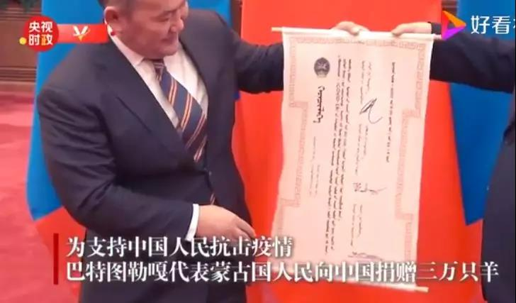

##正文

记得小时候，对过年印象最深的，有两件事儿。

一个是每年春节都要跟着爷爷一起拎着礼物走亲戚，另一个则是能从叔叔伯伯们领到被精美红包包着的一份份压岁钱。

对于前者，我总是很懈怠的，总觉得没有在家玩得开心，而对于后者，却总是很喜欢的。虽然压岁钱对于成年人并不是一个大数字，但对于小孩子们来说，却是能够看得见的糖果和玩具。

后来，随着年龄的逐步增长，进入到了叛逆期，开始觉得过年走亲戚是一件非常浪费时间的事情，那些“三请三辞”式的送礼更是透着虚伪。

甚至掌握了一点所谓的经济学原理之后，也觉得曾经梦寐以求的压岁钱，不过是一笔钱在一个大家族里面来回旋转，徒增“名义GDP”而已。

当然，叛逆期总是短暂的，随着成长和阅历的增加，也逐渐明白了，正是这些当年看不起的过年送礼和压岁钱，维系着血缘越来越远，交集越来越少的亲戚关系。

而所谓家国天下，其实很多事情逻辑上也都是相通的。

今年春节中日韩三国之间，就在疫情之中来了一次走亲戚式的送礼。

先是“山川异域,日月同天”，日韩两国伸出友谊之手援助中国口罩等医用物资，而随着一衣带水的日韩疫情先后爆发，“道不远人，人无异国”，一大批中国制造的口罩等医用物资，也成为了日韩两国抗疫的先锋。

 

 

说起来，这些口罩在中日韩三国之内相互流转，就像我小时候拜年时，大人们总是给对方小孩包的红包那样，总量并没有增加，甚至还增加了大量的中间成本，从经济学的角度并不是一个合适的买卖。

但是，接受物资的都是各国的群众。

就像小孩子从叔叔伯伯手里收到压岁钱之后总会开心，这种经济上不合适的方式，反而却能以最低成本，给年轻人内心深处种下的“我们是一家人”的一颗种子。

这样，别管长辈之间有什么豪门旧恩，下一代们依然可以重新建立起亲密的关系。

因此，给压岁钱的过程中，钱的多少并不重要，重要的是包装和寓意。

就拿中国传统文化巅峰的红楼梦来说，第53回宁荣二府除夕祭宗祠，两府就准备了220份压岁钱，虽然这些钱并不多，但是却做成了富有寓意的样子，“有梅花式的，也有海棠式的，也有笔锭如意的，也有八宝联春的。”

还有凤姐初会秦钟，送的“压岁钱”也是两个“状元及第”的小金锞子。

 

这就像日本的援助物资虽然并不多，但配上了几句“山川异域，风月同天”、“岂曰无衣，与子同裳”、“青山一道同云雨，明月何曾是两乡”，瞬间就会显得高大上，反之俄罗斯那种傻大黑粗的丢下几十吨救援物资就走，虽然真的很铁，但并不符合东方儒家传统，所以我们反而很难记住。

甚至昨天蒙古国送的三万头羊，也深深的体现出了东亚人的价值观，正所谓千里送羊毛，礼轻情意重，更何况送的是羊呢？

 

而且，这种给孩子们发“压岁钱”的方式，更能够拉近相互之间的关系，有利于推动政治行动上的一致。

就像中国史书上有两次记载长辈给晚辈发压岁钱，一次是唐玄宗为了拉拢安禄山攻略辽东，让杨玉环收其为义子，把50多岁的大胖子打扮成小孩子一样领压岁钱，一次是宋神宗为了拉拢王韶熙河开边，赐给他孩子压惊。

推动对方下决心做事情，光靠砸钱是不够的，要把眼光盯着下一代。

所以，就像前几天文章写的，选择通过给孩子加分以及调机等方式奖励湖北一线的医务工作者，才是真正能够激励他们的方式。

而这种路子，作为儒家文明的发源地，如今自然也不会甘于人后。

就像最近日本社交网络上突然走红的一位中国女孩，她在东京街头，头戴一个小鹿玩偶头套，手捧写着“来自武汉的报恩”日语字样的纸箱，不断从纸箱里掏出口罩分发给路人。

 
[Zst_LINK_20200228_1](https://v.qq.com/x/page/d3073byug6d.html)

发口罩才能花几个钱？

引发日本千万网友的点击观看，看到我们年青一代的态度，不断的增加互信，推动感情和文化交流，才是东北亚发展的未来。

 

同理，昨天，有读者看到深圳为香港援助口罩颇为不满，但实际上，这才是换将之后的高超手腕。

我们把乱港分子和普通市民分开来看，乱港分子就像某个不孝顺的儿子，在他的挑唆下，几个孙子也不尊敬老人。

那么聪明的老爷子做的不是绝不是惩罚孙子，这样会导致叛逆期的孙子更叛逆。

而成熟的做法，应该是一边拿大棒揍不孝的儿子，一边拿胡萝卜讨好孙子，这样才能分化他们父子俩。

深圳给香港市民的口罩花不了几个钱，但是在孙子们眼中，却是叔叔伯伯们给的压岁钱，里面透露的都是温情。

反之，捣乱的成年儿子做错了，就应该让他站着挨罚，让感受到爷爷温暖的孙子们，此刻也明白什么是对什么是错。
 
 

就像古人说的，家国天下，管理好了自己的家庭才能够管理好国家，管理好自己的国家才能够管理天下，正在向人类命运共同体迈进的我们，还要多多修炼内功，未来任重而道远啊！

##留言区
 

