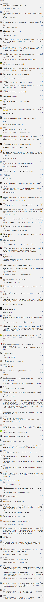

##正文

上周，美国三大股指一路暴跌，创下了次贷危机以来的最大跌幅，也顺利挤进了1900年以来周跌幅排行的前十名。

 

这一轮暴跌，不仅全球投资者损失惨重，也让吹起“3000点是地平线”集结号的多军总司令李大霄同志挖了个坑，把自己埋在了地平线之下。

甚至很多人借此挤兑特朗普，伪造出一系列诸如道琼斯单日跌幅超过1000，总统就应该被弹劾或者用大炮射出去之类的段子。

而特朗普也开启了他的甩锅神技，把美股的暴跌丢给了他的竞争对手之一，民主党的总统候选人桑德斯。

 

不过，也许很多人都没有想到，这一场突如其来的全球疫情，有极大的可能，在2020年改变历史的进程。

因为自特朗普任期以来，他就一直要试图推翻前任的奥巴马医保，而且，在本财年的联邦预算中，遵循共和党传统小政府的特朗普，也大幅削减包括医疗补助计划，其中就包括针对疫情的美国国家卫生研究院和疾控中心。

而这也意味着，如果美国没有在这一轮全球疫情爆发能够像当年一战二战那样独善其身，那么致力于压缩医疗预算的特朗普，就可能要摊上大麻烦了。

对比我们就就知道，只有经历了这一场疫情，才会发现公立医疗的可贵，私立医疗体系之下，根本不可能让全国最优秀的团队开赴武汉，也不会拥有火神山和雷神山。

同样，对于美国人民来说，一旦引发了恐惧，那么其薄弱的公立医疗体系根本不足以执政底层挤兑式的医疗需求，恐慌之下的民众就会对一个“全能大政府”有着强烈的需求，这对共和党是极其不利的。

而美国民众经此一役也会明白，公立性质的奥巴马医保虽然让美国普通民众医疗支持有所提升，但是却能救之前没有医疗保险的美国公民一命，因此，舆论很可能就会倒过来，开始怀念特朗普的老对头奥巴马。

当年特朗普能够打赢希拉里，有个重要的原因，就是因为奥巴马卸任前的竞选年，为了他的历史地位，不顾党内竞选利益，在锈带州强推医保引发了巨大的反弹，使得很多原本民主党的票仓出现了倒戈。

因此，四年前特朗普的利刃，如今反而有可能成为他的软肋，一旦疫情在美国扩散，民意势必引发巨大的反弹。

而且，特朗普的铁杆支持者主要是中老年的白人，一方面，中老年人是本轮疫情的直接冲击对象，另一方面，老人们的养老金可都是放在股市里面的，疫情对资本市场的冲击，更是会把特朗普往火上面烤。

这可就麻烦了。

就像政事堂的研究距离钱很近，但却很少去讨论股票，是很多因为你赚钱并奉若神明的人，一旦因为你亏钱了，就会把你从揪出来往地上死踩，没办法，这就是人性。

同样，之前三年因为股票身价翻了几番的美国人，一旦在最后一年身价大幅缩水，必然也会从铁杆川粉变成倒唐先锋。

历史书读多了就会明白，前一秒明朝众人还在为袁崇焕回援击退清军而对他感激涕零，后一秒大家算了算损失，就把他煮了，一人一口吃得渣都不剩。

所以，就像政事堂之前说的，特朗普目前对股市其实不着急，疫情期间跌一跌挺好，挤一挤水分之后再拉也方便。

而对于我们来说，年中民主党确认特朗普的竞选竞争对手之后，我们也要准备Red Card。

不过，与去年判断Red Card时不同，今年随着疫情得出现，局面可能会出现巧妙的变化。

之前，民主党方面几个主要候选人之间选票几乎相当，桑德斯的优势并不大，但是，随着今年上半年疫情在全球的爆发，如果美国也泛滥了，那么主张建立公立医疗体系的桑德斯必然能大规模的收割恐慌带来的民众选票。

看看最近俩月自媒体们割了多少流量和韭菜们就知道，之前缺钱缺媒体支持的桑德斯，在接下来肯定不会缺话题，大量支持免费医疗的底层志愿者和理想主义者们，会倾尽全力去推桑德斯造势和拉选票。

因此，政事堂判断，如果民主党党内不作弊，桑德斯将能够以压倒性的支持率拿下民主党的党内候选人提名，甚至不排除能够提前开始与特朗普角逐总统大位。

不过，民主党怕是不会轻易让桑德斯上位。

因为2016年的美选对抗，建制派们的原计划是让布什家族的杰布对抗克林顿家族的希拉里。结果特朗普的异军突起，把计划搅得稀烂，让俩人灰溜溜的离开，重挫了冷战结束之后，两党建制派轮流控制美国政坛的传统。

而2018年的中期选举，虽然民主党夺回了众议院的控制权，但是特朗普却借机清洗掉了参众两院的那些共和党建制派的力量，干掉了民主党建制派们的议会盟友。

可以说，正是特朗普的一场“美版三湾改编”，把共和党变成川普党，也使得佩洛西刚刚搞的弹劾，在共和党议员竟中无人响应，演成了一场闹剧。

民主党对特朗普的恨是有道理的，但眼睁睁的看着特朗普的所作所为，民主党的建制派和金主爸爸们自然也担心桑德斯一旦当选总统，那么也会在2022年的中期选举中，把民主党改造成为了社会主义政党........

一旦桑德斯带领着社会主义者们占据了议会，开始通过免费医疗、免费教育，甚至免费住房来争取底层青年民众的选票，届时，特朗普那种通过增加就业和贸易换取选票的套路恐怕不堪一击。

届时，少数族裔逐步占据主流的美国，只会越来越开始拼福利，走社会主义道路。

这玩笑就开大了，社会主义的蝴蝶从资本主义的灯塔中破茧而出，估计马克思和恩格斯两位地下有知也会笑得合不拢嘴。

因此，民主党、桑德斯、特朗普三方之间反而陷入到了一个博弈之中。

之前说过一个判断，2020年，民主党的金主们有一个杀手锏，是确定好竞选人，通过引爆金融危机，直接干掉特朗普。

可如果现在没有阻碍，桑德斯赢得民主党的党内初选，那么民主党的全球金主们反而不敢去发动经济危机去干掉特朗普。

因为一旦爆发危机，那么桑德斯不仅将顺利赢得总统改组民主党，还会带领着愤怒的底层青年们直接端了华尔街，届时损失无法想象。

反之，虽然特朗普是民主党的公敌，但特朗普本人同样跟共和党的各位大金主之间有着密切的联系，甚至可以大作交易，对于这位生意人来说，没有什么不能卖的。

而且，虽然民主党大佬们看特朗普不爽，但是特朗普的一系列经济刺激计划，收益的不仅有共和党，也让民主党背后的大金主们三年之内资产翻了好几番。

反之，桑德斯这位社会主义者，根本不收金主爸爸们的捐款，无从收买。

届时，依靠着最底层民众和年轻人上台的桑德斯，必然会把矛头指向最有钱的阶层，而美国最有钱的阶层，大多都是民主党的金主。

而这也意味着2016年的局面可能重现，虽然特朗普对建制派的伤害巨大，桑德斯也是能跟特朗普掰手腕的人，但是民主党建制派并不敢去尝试推动桑德斯上台。

所以，从主观意愿上，两党不太会让2000年互联网泡沫的戈尔和2008年次贷危机的麦凯恩，这两位众望所归的人栽在经济危机的情况再重演。

毕竟，天上飞着空军一号，地上美国总统桑德斯带领着学生们华尔街，画面实在是太美不忍直视。

所以，对于民主党内来说，现在最重要的是解决掉桑德斯，否则失败后，就只能转而跟特朗普合作。

而对于特朗普来说，最优选却是支持对自己最有威胁的桑德斯，因为一旦桑成为了民主党的候选人，那么特朗普就会得到美国两党的支持，解除了下台后的后顾之忧，可以建立传世特朗普政治家族。

所以，接下来的美国的资本和政治局面都会变得特别复杂。

之前一直担心股市下滑的特朗普，反而此刻并不需要做什么去提振，防止住暴跌就好，没必要跟民主党继续撕逼，只要把屎盆子合力扣在桑德斯身上就好，手牌留等着下半年再打。

而对于疫情，究竟美国疫情的一些真实情况，我们恐怕是无法知道了，为了防止桑德斯成为民主党的候选人，那么在参选确定名单之前，配合特朗普不惜一切代价遏制住疫情以及疫情的舆论，反而是国际资本家们的最优解。

只是不知道，是否会机关算尽太聪明，反误了卿卿性命.......

##留言区
 

