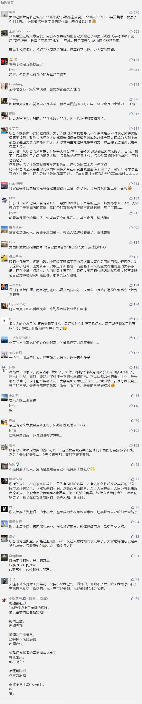

##正文

从长远来看，一个人很难赚到自己认知能力范围之外的钱。

其所赚的每一块钱，都是对这个世界认知的变现。

偶尔赚到超出认知范围的钱，多半是靠运气。

只不过靠运气赚到的钱，往往最后都会凭实力亏掉。

这个周末，好多朋友哭诉，新年为国护盘拿到的20-40%的浮盈，本周基本都亏了进去。

对于他们，我习惯性会把上周末的文章甩给了他们。

>小阳春的逻辑基础，政事堂在之前的文章中分析的很清楚，简而言之一句话，国家财政将在一季度把弹药集中打出来。

>而冠状病毒不会影响股市小阳春的逻辑基础，则是体制优势的我们会利用调集财政力量进行“饱和式防御”，财政+货币政策的集中，不可能拉不起来。

>所以，我带着兄弟们又来了一次“为国护盘”。

链接：《一季度的股市小阳春还会持续多久？》

>而最近几天，又有很多眼红的韭菜询问我，现在是否可以为国护盘。

>这话听起来，就像有人去了个陌生的城市，脸红扑扑的问出租车司机：有啥值得推荐的按摩么？

>如果不熟的话，我一般一句话就给怼回去，你去接盘吧。

>因为很简单，只要完成了九年义务教育，为国护盘期间几乎不可能亏钱，而接下来的小阳春，虽然股指应该还会震荡向上，但是那些问我还能不能护盘的人，估计十进去九个都是亏。

>因为我们现在已经进入到轮动的阶段，券商的研报，热点的事件，背后是啥？不都是为了拉高出货让韭菜们接盘么？

在我眼中，这些打着为国护盘名义，幻想着资产翻倍的人，就跟打着做正规按摩名义，幻想着去耍“大宝剑”的嫖客没啥区别。

 

说白了，绝大部分人口中的为国护盘，不过是要为自己嫖股票的行为，包装一个光明正大的理由罢了。

诱人的股票收益，就像身材曼妙的美女，很多人看着看着，就把持不住了。

政事堂是研究政策的，偶尔凭借着对政策的预判，每年在一些重大节点，无风险的赚点小钱，从不敢说自己对股票有什么研究。

对于我来说，在资本市场赚的钱都是在我认知范围之内的钱。

而为国护盘期间赚的是政策性的钱，随便买都不会亏。

而进入到割韭菜的时间，这是超出我认知范围之外的事情，对于我这种菜鸟，之前凭本事挣到的钱，最终也得凭运气输回去。

我一介书生，没有镰刀，也没有下地的本事，老老实实落袋为安才是最安稳的，就像之前我跟我的读者们说的，不赚最后一个铜板。

既然每年能够动脑子赚到无风险的收益，又何必去刀口舔血呢？

 

 

而世界上的韭菜往往是没有记性的。

因为小阳春也还没有结束。

不出意外，下周新基建和炒作股的一波拉涨，让上周还在懊悔自己没听我的话跑路”，赔了夫人又折兵的“九个人”，又一次压上全家的家当，吃着火锅唱着歌，去搏一把富贵了。

嗯，然后就又被黄老爷麾下的假麻子打劫了.....

没办法，这就是人性。
 
 

 

你是真麻子吗？当然不是，那么就得按照汤师爷的路子来走。

政事堂的大部分文章，都是在观察的过程中，不断提升自身的认知能力。

就像近期文章分析了日本、韩国、伊朗，甚至美国，很多人后台留言，说为啥不写点大家愿意看的。

其实，真的跟着几年的老读者，在看我分析这些国家的时候，都能看到大家想看的东西，很多人物和势力，也都能看到原型，因为经济环境虽然变化，但是人性却是不变的。

这就像很多的招数也会在股市中不断的重复，但也总有一波波的韭菜前赴后继的被割，让历史总以另一种的方式不断重演。

没办法，这就是人性。

最后，关于孙杨，分享一篇我朋友的文章：为什么孙杨和杨安泽会被ban？

##留言区
 

