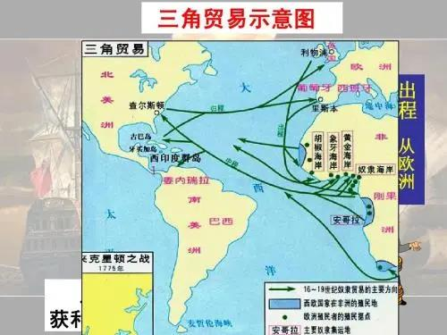

##正文

最近，全球的宗教好像都惹上了麻烦。

昨天夜里，罗马教皇方济各出席传统布道会时宣布，因患感冒，自己将无法参加即将到来的传统精神静修周活动。

今天上午，伊朗最高领袖哈梅内伊顾问委员会的一名委员，因身患新冠肺炎在医院去世。

今天下午，造成韩国新冠肺炎泛滥的罪魁祸首，新天地教会会长李万熙终于露面谢罪。88岁的教主也顾不得其神圣地位，跪地向韩国民众行大礼道歉。

 

宗教在疫情面前首当其冲，纵观历史这事儿似乎并非巧合。

譬如中世纪爆发的黑死病，从意大利登陆后传遍欧洲后，就把统治欧洲的天主教折腾的够呛。

一方面，教众看着大量的主教逐一死亡，直接动摇了信仰，另一方面，大家纷纷面对死亡，也想明白生前痛苦追求死后天堂的不合理。

于是，一场疫情，在欧洲的某些地区，把统治者欧洲的神权拉下了马，引发了天主教会统治体系的解体。

当然，解体的过程中，必然也会诞生新的事物。

从小的来说，面对无法阻挡的疫情，天主教会只能去寻找一些安慰剂来平复民众，恰巧，当时刚传到欧洲的白糖，不仅看起来很有圣洁的仪式感，使用后也会带来巨大的满足感，于是便被选中。

这样在教会的主导下，各地宗教纷纷开始推动食用白糖，后来，也就有了法版双黄连的马卡龙，英版双黄连的布丁，尼版双黄连的松饼，葡版双黄连的蛋挞.......导致了欧洲的传统美食几乎一色都是甜食。

 

而从大的来说，宗教思想控制的解体让意大利爆发了文艺复兴，为新兴的资产阶级提供了启蒙思想和理论基础；而疫情摧毁了旧的生产关系，也迫使欧洲人向未知世界开拓，哥伦布从意大利启航，新大陆为资本主义的发展寻找到了原材料和市场，建立全球贸易体系。

 

因此，从国内的角度看，各种“家庭联产承包责任制”式的小本买卖哀号遍野，和代表着互联网化的阿里系全线高速扩张，这种产业升级本身就是符合历史的进程，属于疫情必然会带动产业的升级。

所以，国人无论是选专业、找工作、跳槽还是买房子，接下来都要跟着产业的升级来走，否则就会成为新版的90年代下岗职工。

而放在国际的角度，如果疫情出现大规模的扩散，那么必将冲击现有的国际贸易和供应链，而能在这一波疫情中率先缓过来的国家，也会像哥伦布那样发现新大陆，重塑全球的贸易体系。

所以，尽快安全不复发的复工，对于我们也是非常的重要，将是很多中国制造，中国标准出海最好的时机。

当然，与产业结构重要度相当的，则是意识形态。

在黑死病泛滥的中世纪，欧洲的北德意志地区和波兰地区，这里原本是中国的西周时期那样，诸侯国林立，当时并不存在所谓的德国人和波兰人。

不过，随着疫情引发的宗教肢解 ，德意志诸邦国中出现推动宗教改革的马丁路德，他翻译的平民版德语版圣经，随着印刷术的普及，成为了相互攻伐数百年的德意志邦国文化统一的基础。

正是有了这个文化基础，再加上试图令Make France Great Again的拿破仑的极限施压，血海深仇的德意志诸邦国们摒弃前怨团结了起来.......

嗯，后面的历史，大家就都知道了。

而德意志诸邦的邻居，波兰的领主们，没有那么德国人那么有文化，则简单粗暴的制造了一个共同的敌人犹太人，将黑死病定性为犹太人的投毒，在民族和宗教的双重仇恨之下，波兰民族也逐步建立。

而在此基础上建立的民族共识，使得五百多年后的今天，波兰不仅是整个欧洲最坚定的天主教信仰国家，更是最强烈的反犹国家，虽然这个国家已经几乎没有犹太人了。

所以呢，多读历史就会明白，一旦疫情在西方大规模扩散，那么民众对政府的失望，必然会导致上层建筑的洗牌，在这个过程中，我们有危，也有机。

危是科研工作者们必须要证明，病毒并不是中国首发，使得我们手握一张极其重要的手牌，以防止西方某些仇华势力，重复当年波兰黑化犹太人，将我们树立为共同敌人的甩锅行为。

机是文化工作者要努力，以中国传统文化为基础，创作出一大批通俗易懂的文创作品，就像马丁路德的圣经那样，成为凝和东北亚甚至人类命运共同体的文明共识。

所以呢，最后只剩下一个问题，经过上一轮影视洗牌之后，有哪家影业公司能够异军突起，借助“新版印刷术”的互联网，拍出一版权利游戏POV模式的三国演义呢？

 

##留言区
 

