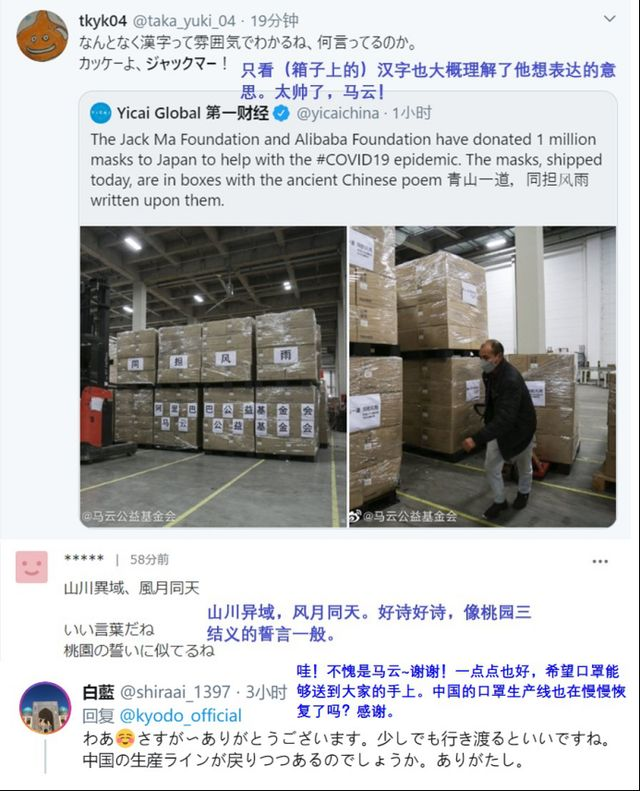
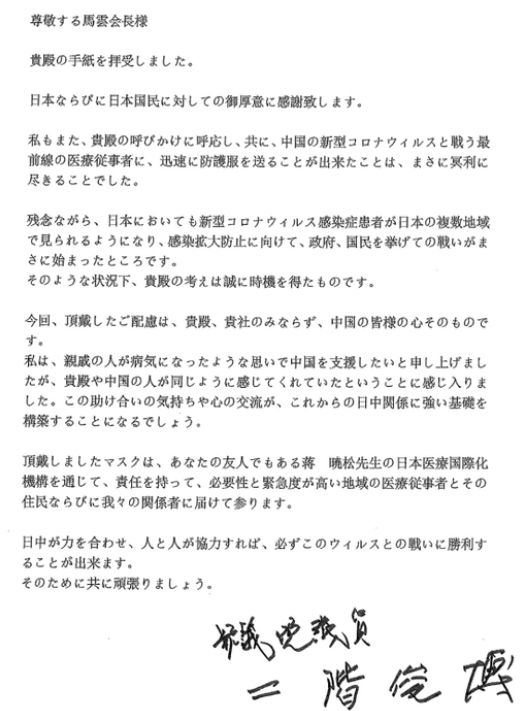

##正文

青山一道，同担风雨。

昨天，马云成为了全日本最炙手可热的人物，在日本最受欢迎的门户网站Yahoo日本，霸占了头条位置长达8个小时。

 

起因，是这位中国最成功的商人，为了感激过去一个月日本朋友们对中国的无私帮助，宣布向日本捐赠100万只口罩。

 

一时之间，“马云捐赠100万只口罩”不仅成为了中国的微博热搜，也引爆了日本社交媒体，在雅虎、日文推特上，“马云”“口罩”也成了网络热门搜索关键词。

数十万日本网友纷纷留言，为中日之间互相关怀、守望相助的温暖情怀点赞，更有日本网友留言回忆与中国人相处的温暖往事，瞬间拉近了中日两国的距离。

 

不少日本网友也留意到了捐赠物资上“青山一道，同担风雨”的诗句，对应之前的“山川异域，风月同天”，感慨中日文化渊源之深。

甚至还有一些比中国人还熟悉中国历史的日本网友，将其比作三国演义中的“桃园の誓”。

 

不得不慨叹，马云能够成为中国首富真心不是靠运气，人家的头脑真心不是其他商人们所能比拟的。

我们可以算一笔账，100万口罩的货值，不过是阿里在机场投放几块广告牌的钱，但是，这次捐赠在日本引发的轰动效应，获取的日本民众好感，可是砸几十个亿的广告都换不来的。

 

而且，很多人还没有注意到，马云这笔捐赠，是通过二阶俊博先生捐出去的，两人还公开交换了亲笔信。

 

 

二阶俊博是谁？

可不要光看他签名的众议院议员，就像当年那位向希望工程捐款的“一个老共产党员”那样，作为自民党干事长的二阶俊博，相当于我们的书记处第一书记，在日本执政的自民党内是安倍一人之下万人之上的实权派。

二阶俊博不仅拥有自己队伍“二阶派”的志帅会，在自民党内也拥有极强的协调和号召能力。之前自民党每人扣5000日元援助武汉，就是这位干事长牵头的。

嗯，这才是马云口罩外交的段位。

 

这位让几亿人去抢支付宝五福红包的大佬，跟日本自民党的二号人物之间，轻轻松松搞起了过年发压岁钱的活动。

救灾物资不过是在两国转来转去，但两国人民的友谊和互信却在这一来一往之中，潜移默化的被建立了起来。

当然，作为日本政坛目前位置最高的亲华派和中国人民的老朋友，有两个问题我们是要明白的。

一方面，每当日本政坛有对华关系升温的时候，这些中国人民的老朋友们就会被短期重用，这也是为什么麾下在自民党党团内只能位列第五的二阶俊博，却能在2018年年底，抢了安倍接班人的位置，坐上了自民党的二号位置。

另一方面，中日关系的提升和日本民众对中国的喜爱程度，也会决定日本的议会选出更多亲华的议员和政治势力。对于稳固中日之间的经贸与地缘合作，民众的喜爱才是长久之计。

回过头来看，这些天里面，从奈良街头的中国小鹿，到马云爸爸的百万口罩，其实都是我们在用杠杆的方式去争取日本人民的民心。

毕竟，接下来中日这两个全球三大经济体之二的国家，将要开启大规模的经贸投资合作，我们像马云那样在文化方面多做一点，经贸方面的实惠就会多得一点。

而这位跟马云互发压岁钱的二阶俊博，就是我们学习的典范。

17年之前，北京爆发SARS的时候，二阶俊博顶着日本国内极端势力巨大的压力访华，使得跌至冰点的中日关系开始回暖，小泉纯一郎得以在圣彼得堡与中国领导人实现会面。

也是这一年，二阶俊博从一艘2000多年前沉没在日本的中国古船中发现的3粒莲籽化石，将其开出的莲花命名为大贺莲带到了中国，与一群日本小朋友们一起，将象征着中日友好的种子撒在了博鳌亚洲论坛的荷塘中。

 

在中日的文化中，并蒂莲花代表着“执子之手，与子偕老”，“百年好合、永结同心”，而从2000多年化石中开出的莲花，更是象征着中日之间没有解不开的宿怨。

把中日两国比作并蒂莲花的二阶俊博，把两千年前中国传入日本的友谊，再次带回重返中国，不仅开启了中日关系的蜜月期，也让2007年刚当上首相就要访华的安倍，在组阁时将二阶俊博任命越级提拔为自民党三驾马车的总事务长。
 
 

所以呢，我们再看一下今天的新闻。

奥委会表示，东京奥运可以在2020年内进行延期，这很显然是再驳斥之前庞德的取消论，表达了宁可办成冬奥会，也不会改址的决心。

那么，今年不仅有国事访问，势必也要有数百万的中国人访问日本共享奥运盛宴，对于我们来说，就必须要提前做好准备。

就像论语中说的，三人行必有我师，东亚三国中，咱们当了两千多年的老师，如今我们也要向日本人学习，搞出2003年的中国版“大贺莲”，通过共同的文化，借助奥运盛会，在日本人心中种下一颗中日友好的种子。

上次踩中历史进程的是二阶俊博，那么这次踩中的人会是谁呢？

##留言区
 

