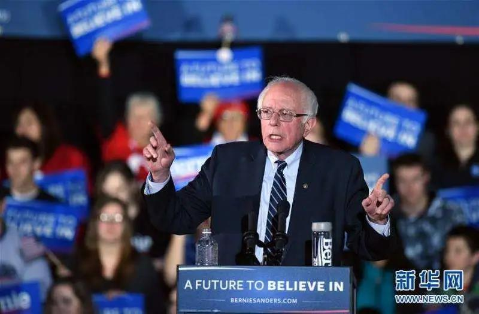
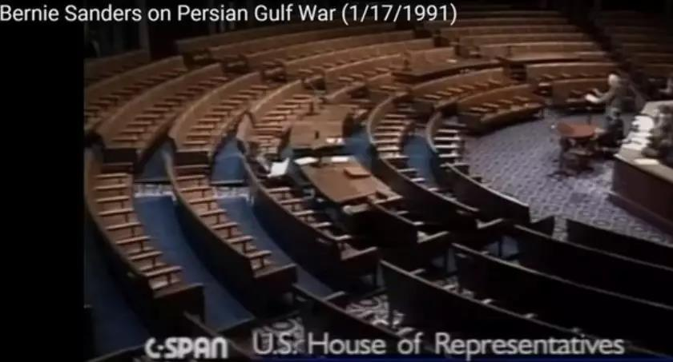
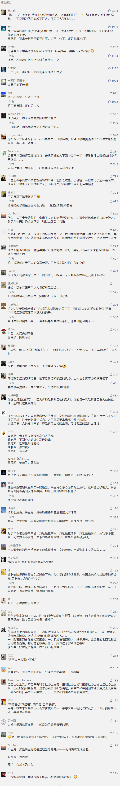

##正文

大幅降息救不了全球经济，但是，狙击桑德斯可以。

过去12个小时，全球的资本家们一起用行动投票，向超级星期二的美国选民们展示，你们敢选桑德斯，股市就敢死给你们看。

昨夜夜里，美联储在盘中紧急宣布降息50个基点，幅度与时间均远超市场预期，在如此大的利好之下，美国三大股指却随着当天桑德斯初选中拿下大票仓加州而重创3%。

收盘后，随着其他州选举数据逐步公布，尤其是在德州拜登反超了桑德斯，美股期货也开始由跌转升，硬是装出了一副欣欣向荣。

一贯跟特朗普不对付的华尔街，此番却也在配合特朗普的“桑德斯股灾论”，证明桑德斯才是美国股市下跌的真正元凶。

能跟死敌特朗普如此步调一致，不得不慨叹，在民主党高层眼中，桑德斯这个“异端”，远比特朗普这个“异教徒”更可怕。

 

说起来，2020年的美国大选走势并不复杂。

美国这么多年的选举经验充分证明了，如果没有足够大的突发事件，民主党建制派的候选人绝无可能掀翻特朗普。

但是，不仅资本家们在股票市场上操纵指数引发恐慌，最近两天，民主党的一众候选人也纷纷在金主爸爸们的支持下弃选，把票导给怎么看都是战五渣的拜登，目的，就是避免桑德斯上位。

金主爸爸们如此一致的动作，是因为这位老爷子的口号，就是要“发动革命”。

 

从四年前与希拉里对阵的时候开始，桑德斯就准备在美国掀起一场政治革命，去彻底政治生态之下的经济基础，搞出美版的“打土豪分田地”。

所以，拜登也跟当年老蒋类似，打着剿灭桑德斯的旗号，迅速就得到了美国资本家们的倾力支持，各位民主党建制派大佬纷纷跳出来给拜登拉票，一众候选人纷纷弃选给拜登背书。

在极短的时间，就将一盘散沙的民主党名义上统一了起来。

 

一时之间，拜登仿佛四年前的希拉里一般身边迅速聚拢了大量的支持者。

不过，在政事堂看来，市场可能还是低估了桑德斯老爷子。

在初选方面，民主党跟共和党机制上是不一样的，共和党初选跟总统选举类似，是赢者通吃全州的选举人票，而民主党却是按照投票比例分配。

而且，民主党高层还有一个杀手锏，就是执掌大权的建制派们手里还握有超级代表票，可以干掉他们不想要的候选者。

因此，两相比较，共和党内建制派下黑手比较困难，2016年他们推出来的杰布布什输给特朗普，但是，民主党却可以很好的平衡内部，之前就是通过超级代表票帮助希拉里做掉了桑德斯。

但是，民主党这种稳妥的机制，要进行充分的勾兑，因此必然也要付出时间的代价，没有初选赢者通吃的机制，使得四年前就使得桑德斯一直跟希拉里拼到了初选的最后，浪费了希拉里大量的时间。

而且，民党建制派使用超级票做掉桑德斯也给自己埋下了恶果，大量桑德斯的支持者转而投票给了特朗普，使得玩票心态的特朗普竟然逆袭了希拉里，让民主党在总统和参众两院的2016选举中都迎来了惨败。

所以，回顾了四年前的历史，虽然目前舆论出现了一边倒支持拜登的情况，甚至开始判定赢下超级星期二的拜登将拿下民主党内的初选。但是，在政事堂看来，比赛却刚刚开始。

民主党内龌龊的交易，虽然短期有利于选票，必然也会导致内部大量的年轻选民对建制派们失望，开始关注和讨论桑德斯，因此，民主党党内的候选人竞争，大概率会跟四年前一样，一直持续到最后。

而且，资本家们其实并不理解社会主义者的桑德斯。

对于这位想要革命的总统来说，当不当总统其实并不重要，把这场党内初选坚持到最后，宣传到最后，就是他的胜利。

当年这哥们比郭德纲还很，当年台下一个观众都没有，他还在那里宣扬自己的主张。

 

就像老爷子说的，竞选远不仅为了选举出下一任美国总统——它有着更为重要的意义，变革从不是自上而下的，自下而上才会带来变革。

老爷子参与竞选的目的，是在选举的过程中吸引到足够多的目光，以便于把平等的思想注入到美国青年的心里面，种下一颗种子。

就像四年前老爷子选战时主张的全民医保和公立大学免费，当时美国人以为是天方夜谭，但是经过了半年多全国瞩目的论战之后，美国民众也开始逐步认可，甚至今年部分候选人也将其列为了竞选主张。

同样，四年前民主党建制派还通过超级票牢牢控制着民主党的总统候选人，可是经历过上次的选举黑幕，民主党的选举规则也被放在阳光下被大幅修改，建制派也受到重创，大量新鲜血液进入民主党。

甚至共和党建制派这些年被特朗普血洗的背后，也有桑德斯的因素，当年共和党没有强推杰布布什而让特朗普上台的原因之一，就是让能号召民意的他给希拉里做一个双保险，防止桑德斯上台。

所以，资本主义者用资本主义的思维，是很难理解社会主义者的，从彭斯到彭博再到特朗普，他们竞选总统都是在投机，无论走到哪一步都是在做交易。

但是对于桑德斯这个社会主义者来说，当总统并不是目标，他的每一次的公开演讲，建制派对他的每一次打击，都是他散播平等理念的最好方式，对他的打击越狠，那么美国民众心中被种下的种子就越多。

甚至特朗普从上台就担心自己成为被枪击的肯尼迪第二，可对于桑德斯来说，“各国变法，无不从流血而成，今请从余始”，真要是被枪击了，那么他的理想反而就实现了.......

所以，这一场大选，别看资本家们在赢得德州之后一片狂欢，但从长远来看，他们所有“军事上的成功”，都会缔造同等规模舆论场上的惨败，竞选打得越漂亮，民心就会丢的越厉害。

尤其是特朗普执政的四年，美股被拉得已经令全球的瞠目结舌，一旦再有一个雷曼兄弟出事儿，对美国造成的冲击只会比08年的经济危机更加严重。

届时，美国青年绝不是十年前前那样，只会去占领华尔街，经过了桑德斯的“打土豪分田地”思想充分武装之后，也许，他们会让美国的资本家们领略到什么叫做星星之火可以燎原......

最后，关于热议的永居条例，分享一篇我朋友的文章：

链接：为什么外国人永居会有那么大反应？

##留言区
 

