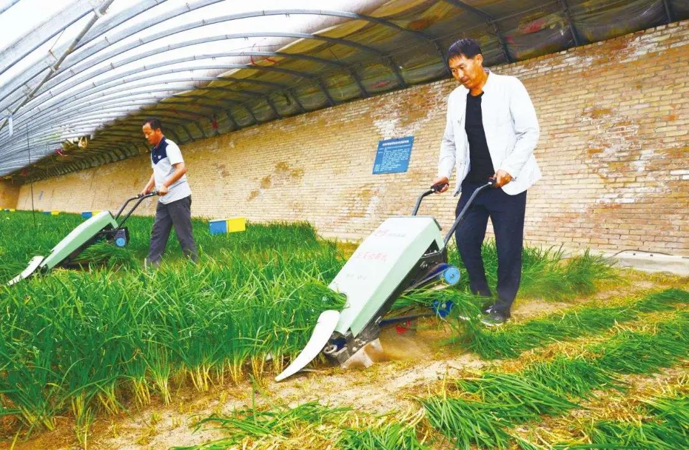

##正文

最近，随着“新基建”被政治局会议提出，几乎所有的券商和财经媒体都在加班加点的写“新基建”研报和新闻，穷尽所能想要去挖掘“新基建”中酝酿的机会。

 

还有好事者，去统计各地发布的所谓“新基建投资计划”，整出来个放卫星式的40万亿投资版图。

 

甚至还有一些喜欢吹牛逼的，把之前文章中例如“新一轮基建”愣是解读成了“新基建”的，包装成政治局的决议是他们引导出来的。

看着这些事后诸葛亮们，政事堂总是忍不住想笑。

相信作为政事堂的读者，对于“新基建”三个字不会陌生，从2018年开始，政事堂就用十余篇的系列文章论述了什么是新基建，什么是旧基建，并详细的说明了我们投资新基建的，是为了发展新动能。

甚至政事堂2019年的国内文章，一半以上都是围绕着这一轮政治局提出的七大投资领域，其中除了实在是不懂的人工智能之外，其他六个领域的哪个都不少于五篇去分析。

以至于不少喜欢开玩笑的读者，刚给我起了“顾进程”的外号，又改成了“顾基建”........

不过，虽然“顾基建”看起来很紧跟风口，其实我还是更喜欢“顾进程”。

因为政事堂研究的，从来都是历史的进程。

譬如，继预判了2019年初的小阳春之后，去年年底，政事堂也预判了2020年一季度资本市场会出现新基建主导的小阳春。

甚至年初还专门撰文表示，即使强悍如新冠肺炎，也改变不了这一波新基建小阳春的历史进程。

 

因为，历史进程既然被称为历史进程，自然就不是那么容易被轻易修改的。

而借助历史进程来奋斗的人，往往也会像历史进程一样不可阻挡。

就像孙子兵法中说的：“激水之疾，至于漂石者，势也。”08年之前买房子的人，根本想不到后来房子的增值远超于他们个人的奋斗，因为他们是坐在了历史进程的势能之上。

同样，在历史进程的范围之内，做事情并不需要太多的纠结，只要控制杠杆率，不用担心价格的波动，傻子躺在家里，都能开开心心的把钱挣了。

 

就像07年之前买房子的，不用担心08年的那一轮暴跌；今年一季度买新基建的，也不用担心肺炎带来的股指重创。

因为，在历史的进程的滚滚车轮之下，事物都是按照波浪式前进和螺旋式上升，即使被意外打断，历史也会凭借强大的惯性推动他继续前进。

甚至，大家还记得政事堂在2018年经过分析给出的操盘建议，“国际原油期货2019年不买跌，2020年不买涨”吗？

虽然油价在这一年多来波动起伏很大，但按照上面思路操盘期货的朋友，基本都可以别墅朝大海了。

说起来，政事堂从写公众号以来，写作的领域不断的变化，但有一个初心没变，那就是去探寻历史进程以及其背后的逻辑。

而研究中顺带着，在探寻到进程的“底牌”，知道了未来一定会发生的一些事情之后，接下来“打牌”的时候，也最起码可以立于不败之地。

不过，就算知道了历史的进程，每个人的资本和能力，决定了他们的操作却不尽相同。

譬如马云捐日本100万口罩，霸占了日媒头条还搭上了自民党二号人物；“鹿鹿侠”在日本街头发了1000个口罩，获得了央媒狂轰滥炸式的报道；而绝大部分普通人，却只能在家里远程感受着东京热。

甚至很多时候，同一个历史的进程，政事堂也会根据不同人群，不同的资金体量，给出完全相悖的操作方案。

譬如，政事堂2017-2018年的时候建议有钱人卖出多余的房子，但是同时却说2019-2020是刚需买房子的时机。

譬如，政事堂一边在2月20号左右反复呼吁护盘的朋友们清仓撤退，另一边却反复坚称小阳春不会那么快终结，怎么也能坚持到三月。

世上往往没有放之四海而皆准的行动方案，这是因为，同样的历史进程，对于不同的人，往往境遇却是截然不同。

这就像烧油的收割机和需要化肥的韭菜，他们所需的养料就截然不同。

 

因此，最近那些券商和财经媒体鼓吹的新基建标的，也不要将他们神化，当地球人都知道了，基本距离尾声也就不远了。

毕竟，基建就是基建，就像韭菜们滋润了新基建那样，未来新基建也是为新动能提供发展的土壤。

而我们多读书，多动脑的意义，就是能踏上历史的进程，避免成为代价。

最后，推荐一组书单。

这组书单以美国人研究的日本为主题，在中日走向回暖前，让我们了解二战之后西化的日本，更进一步了解美国是如何对他这个用致命威胁的竞争对手。

《菊与刀》

##留言区
 

