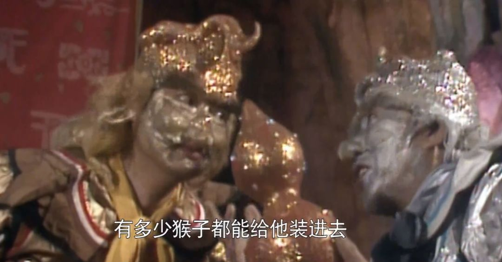
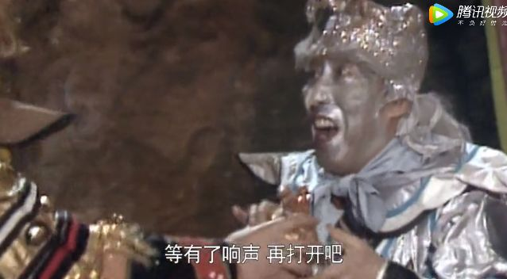
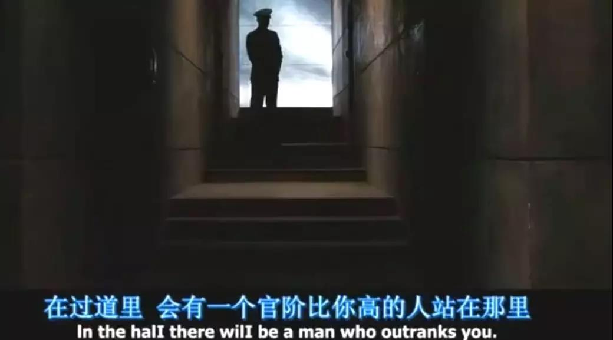
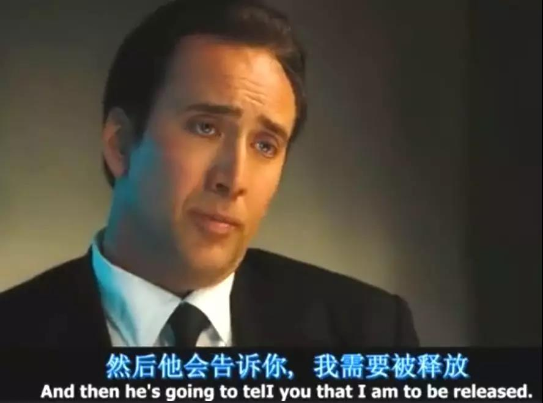
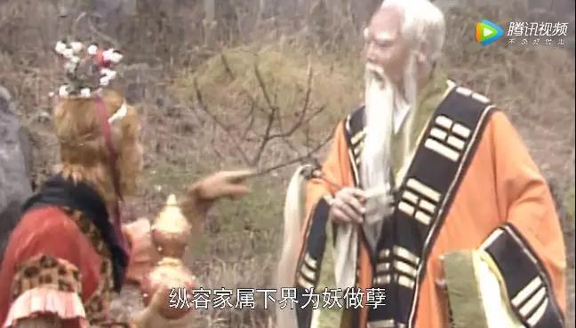

##正文

应读者们的强烈要求，更新一下久违的西游记。

大家看西游记，普遍会有一个认识，那就是师徒四人一路遇上的妖精中，有背景的都没事儿，没背景的都被打死了。

其实，这里面还是有一些误解的。

譬如这一路上，背景最强的妖精之一，太上老君麾下的金角银角大王，就曾被孙悟空用紫金红葫芦化成了一滩水。

 

而且，悟空八戒等人，跟金角银角恶斗了数场，见识到了他们的宝物，非常清楚他们是天庭一哥太上老君的人，但即使如此，他们在收拾金角银角的时候也毫不留情面，亲戚和小怪全杀，洞也一把火全烧了。

只不过，太上老君事后来向师徒一行讨要宝物后，直接动用他强劲的功力，把金角银角从葫芦中的一滩水中复活罢了。

 

金角银角只是其中一个影子，如果大家西游记读得仔细的话，就会发现，唐僧师徒这组一个正式工加上几个临时工组成的“飞检”团队，一路之上是不怕去掀桌子的，是不怕得罪人的。

甚至，天庭各方都非常希望他们去掀桌子，经常有什么山神土地给孙悟空泄漏一些关键的消息，甚至引导他们的行动。

而一路上逐步明白了这个道理的孙悟空，中后期也喜欢到处挑事儿，例如车迟国的虎鹿羊大仙根本没招惹取经团队，但却被孙猴子故意激怒，然后被一锅端了。

因此，很多小说后期我们不理解的孙猴子行为，其实，不过是他以此来给自己增加“功果”，以及跟天庭诸仙交易的筹码罢了。

那么问题回来了，金角银角为啥能够成为西游记中唯一被孙悟空打死之后，又被复活的妖精呢？

很重要的一个原因，就是没有乱说话。

那个一答应，就抓人的紫金红葫芦是不隔音的，小说中写过，孙猴子在被装进紫金红葫芦中的时候，葫芦内外是能够相互听到声音的。

 

但是，银角金角先后被抓了进去，他俩强忍着被化成了一滩水，没有向孙猴子求饶，没有说“我老板是太上老君”，也没有用老君的名字吓唬他们。

 

因此，这就给了太上老君很大的回旋余地。

金角银角被抓后，老君捞人的时候，就跟孙悟空说了两个完全相悖的故事。

一个是金角银角私下跑出来的，老君自己并不知情。另一个是金角银角是观音问老君借，考验师徒西去的真心。

>老君道：“葫芦是我盛丹的，净瓶是我盛水的，宝剑是我炼魔的，扇子是我搧火的，绳子是我一根勒袍的带。  那两个怪：一个是我看金炉的童子，一个是我看银炉的童子，只因他偷了我的宝贝，走下界来，正无觅处，却是你今拿住，得了功绩。”大圣道：“你这老官儿，着实无礼，纵放家属为邪，该问个钤束不严的罪名。”老君道：“不干我事，不可错怪了人。此乃海上菩萨问我借了三次，送他在此托化妖魔，看你师徒可有真心往西去也。”

>西游记 第35章

果然是开天辟地的老君，一秒就能把前面说的话都否定，然后编出一个新的理由，逼着孙猴子放人。

而这段剧情，跟《战争之王》大结局类似，一个非常高级别的神秘官员，也是编个理由，就把罪恶滔天的男主角给放了。

 

 

 

就跟《战争之王》电影里面，凯奇每次被抓时，啥都不会多说，只会一边销毁证据一边等待救援那样。

金角银角要做的很简单，就是在太上老君来救他们之前，不该说的坚决不能说，不该承认的坚决也不能承认。

甚至就算孙悟空和猪八戒都知道他俩是太上老君授意来的，他们也不能表露出来他们的作案动机，老老实实的在葫芦里面闭嘴就好。

因为，他们想要活命，不可能靠自己，唯一的机会，就是太上老君。

而为了创造救命的机会，最重要的就是不要自作主张，不要搞得尽人皆知，不要牵连上老板，否则神仙也救不了。

就像太上老君为了救他俩，先是偷偷把孙悟空单独叫了出去，上到万里云霄去说话。

因为取经的人可不止唐僧师徒五人，天庭和佛教还安排了四值功曹、五方揭谛和六兵六甲护教珈蓝，共计39人的辅助监督团队在身边。

对于太上老君来说，捞人的时候，每多一个人知道细节，付出的成本都会几何级的增加。

因此，老君选择了当事人孙悟空这个突破口，一对一的沟通。

 

而且，当孙悟空不吃老君“管教不严”这一套说辞的时候，太上老君马上就把前面说的话全部推翻，说这哥俩是孙悟空顶头上司观音安排的，一下子就把孙悟空憋住了，不管信不信，都只能选择相信。

毕竟，观音有紧箍咒，是能治得住孙悟空的。

再加上老君也向悟空表态了，其他打死的妖怪，已然算入师徒五人的“功果”，取经一行人的利益都不受损失，于是，糊弄了孙猴子，金角银角这事儿就这么糊弄了过去。

回头，老君只要跟观音菩萨再对一下说辞，大家暗地里交易勾兑一番，也就完事儿了。

 

但是，如果在老君出手相救之前，金角银角或者他们的干娘把不该说的都说了，那么金角银角别管以前给老君炼了多少金银，老君都不会救他们。

因为白手套本身的用途，就是隔离，一旦被染脏了，就必然要被抛弃，大佬是不会为一个已经破损的手套而付出巨额的代价。

 

而金角银角，就是太上老君安排在凡间的白手套之一。

譬如金角银角从老君那拿的五个宝贝，都是按照五行排序的，紫金红葫芦是木属性，羊脂玉净瓶是水属性，七星剑是金属性，芭蕉扇是火属性，老君道家腰带的黄色幌金绳则是土属性。

金角银角的武力也许并不是那么出类拔萃，但老君给的宝贝交错用起来，几乎可以吊打所有的一流高手，轻松多次擒拿悟空悟能悟净三兄弟。

更不要说，金角银角下界之后，就开始了走群众路线，又是拜干娘又是拜干舅舅，甚至还把附近的山神土地都控制了起来，为他们所用。

很显然，金角银角是奉老君之命在这里扎根发展势力的，给天庭的老君供金供银。

而类似的故事，在整个取西经的路上，都是非常普遍的，道家和佛家的大佬们，都有在凡间的利益代理人，而取经的团队，不过是规则之下，让各方有机会借机洗牌罢了。

取经团队把代理人掀翻了，那么大佬也得认赌服输，私下做交易捞人，同样，代理人如果牛逼，譬如后来老君骑的青牛把取经团队都掀翻了，那么如来也得暗地里拿着金子来赎人。

这就是西游世界运行的规律。

作为小怪而言，金角银角就是典范，在大佬们博弈的过程中，一方面硬撑着，尽可能给老板们留足够的交易时间，另一方面少犯错误，降低老板们救他们的成本。

只有这样，才让太上老君愿意为了他们，在桌子下面，跟其他的大佬们做一轮交易，给金角银角一次重新做人的机会。

这就像我在系列开篇文章说的那样，一部伟大的作品，从来不是他的讽刺有多犀利或者故事有多新奇，而是他所描绘的故事内核，总在以不同的形式反复上演。

只不过，这本中国妇孺皆知的小说，有人读懂了内核，有人却把他当作神话故事，只看到了“游”。

 

西游记系列的其他文章：
顾子明闲扯西游记（一）
顾子明闲扯西游记（二）
顾子明闲扯西游记（三）

##留言区
无留言